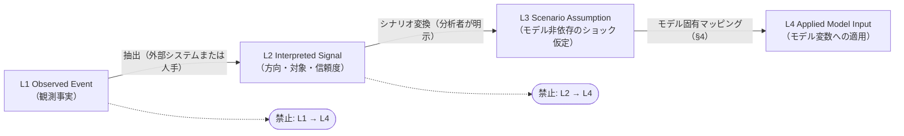
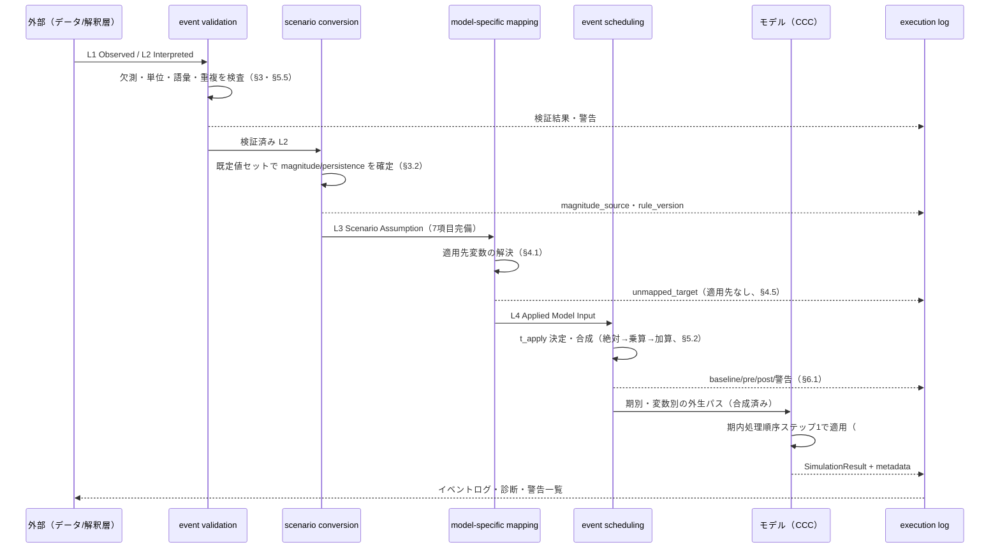

# マクロイベント変換契約

> 関連 Issue: #168（本書）・#125（ロードマップ）
> 前提: [分析契約](../models/capex_credit_cycle_analysis_contract.md)（シナリオ `Sc0`–`Sc4`・ショック指定必須 7 項目）・[因果グラフ](../models/capex_credit_cycle_causal_graph.md)（エッジ型・遅れ）・[部門境界と変数定義](../models/capex_credit_cycle_sectors_variables.md)（外生変数・`_shock_ex` 命名規則）・[ストック・フロー会計表](../models/capex_credit_cycle_stock_flow.md)（期内処理順序・CAPEX 資金調達恒等式）・[責務境界とモデル間比較契約](../models/capex_credit_cycle_model_boundaries.md)（イベント翻訳可否表・翻訳不能時の規則）
> 対になる設計: [シナリオ時間軸の意味論](scenario_time_semantics.md)（四半期時間軸・適用時点・持続形状・vintage）
> 決定記録: [ADR 0010](../adr/0010-macro-event-scenario-contract.md)
> 後続設計: #169（動学方程式）・#170（観測・検証）・#171（統合）

---

## メタ情報

| 項目 | 内容 |
|---|---|
| **対象** | 観測イベントから部門別CAPEX・信用循環モデル（`CapexCreditCycleModel` 相当、未実装。以下 `CCC`）の入力への変換契約 |
| **ステータス** | 契約のみ確定。Julia 型・変換器・`run_scenario` の実装は未着手（#171） |
| **event contract version** | `macro-event-contract/1.0.0` |
| **上位契約** | `capex-credit-cycle-contract/1.0.0`・`capex-credit-cycle-graph/1.0.0`・`capex-credit-cycle-vars/1.0.0`・`capex-credit-cycle-accounting/1.0.0`・`capex-credit-cycle-boundaries/1.0.0` |
| **基準経済・頻度** | 米国・四半期（契約 §2.1 を継承。`Δt = 0.25` 年） |

> **LLM向け要約**: 本書は「現実のイベント記述」と「モデル入力」の間に **4 層の概念階層**（Observed Event /
> Interpreted Signal / Scenario Assumption / Applied Model Input）を置き、層を飛ばした変換を禁止する。
> 観測事実や外部システムの belief を直接モデル入力へ変換しない（§2.3）。イベントの適用先は
> [変数定義](../models/capex_credit_cycle_sectors_variables.md) が確定した **`exogenous` 変数 7 個に限定**し、
> 適用先を持たないイベント型は近似・縮約せず `unmapped_target` として拒否する（§4.1・§4.5）。
> 合成は **絶対 → 乗算 → 加算**の固定順で 1 回だけ一括適用し、順序依存を構造的に排除する（§5.2・§5.6）。
> 観測値のない定性イベントで magnitude を捏造せず、`magnitude_source` の記録と感応度の併記を義務づける（§3.2）。
> 本書は時間軸（適用四半期の決定・持続形状の離散定義・vintage）を定めない。それは
> [シナリオ時間軸の意味論](scenario_time_semantics.md) の責務である。

---

## 1. 本書の位置づけと確定範囲

### 1.1 位置づけ

ロードマップ #125 は、決算ガイダンス変更・CAPEX 見直し・受注キャンセル・信用スプレッド拡大・格付変更・政策金利変更等を時系列で適用するイベント駆動シナリオ分析を目指す。しかし「hyperscaler が CAPEX 見通しを下方修正した」という**観測事実**から、どのモデル変数を・どの大きさで・どの期間変更するかは、観測とは別の**方法論的判断**である。両者を同じ層で扱うと、シナリオの前提がデータの事実として提示され、再現も反証もできなくなる。

本書は、その分離を契約として固定する。

| 本書が固定するもの | 本書が固定しないもの |
|---|---|
| イベントの概念階層と層間変換の責務（§2） | 外部システム（`finance-checker` / `economic-data-provider`）側の内部設計 |
| 共通イベント属性と欠測時の規則（§3） | Julia の `struct` 定義・フィールド名・API 名（#171） |
| 初期イベント型 9 種とモデル入力への変換規則（§4） | 変換後ショック規模の較正（#170） |
| 同時・競合・重複イベントの決定論的処理（§5） | 適用後の動学（行動方程式）（#169） |
| 再現性・監査可能性の要件（§6） | LLM によるイベント抽出・live ニュース接続（§11） |
| 層ごとの API 境界と責務分解（§7） | `run_scenario` の本実装（#171） |
| 適用時点・持続形状・vintage の**要求**（§4.3 が参照） | それらの**定義**（[シナリオ時間軸の意味論](scenario_time_semantics.md)） |

### 1.2 規律（契約）

1. **層を飛ばさない**。Observed Event から Applied Model Input への直接変換を行わない（§2.2）。
2. **観測されていない量を作らない**。magnitude・timing・持続期間のいずれも、観測または明示的な仮定のどちらかに帰属させ、出所を必ず記録する（§3.2）。
3. **適用先を持たないイベントを既存の適用先へ寄せない**。近似・代理・スケーリングによる適用を行わない（§4.5。[責務境界](../models/capex_credit_cycle_model_boundaries.md) §5.6-1 と同型の規律）。
4. **自動補正しない**。制約違反・矛盾・重複は補正せず、構造化して拒否または警告する（[ADR 0007](../adr/0007-sfc-integration-contract.md) の「不整合を自動補正せず構造化する」方針を継承）。
5. **モデル層はニュース解釈も外部データ取得も行わない**（§7.3）。
6. **上流 5 文書の決定を本書で覆さない**。矛盾・欠落を検出した場合は §8 の差し戻し事項として登録し、当該文書の改訂で解決する（#165 §7・#166 §10.2・#167 §8 と同じ手続き）。

### 1.3 表記

| 記法 | 意味 |
|---|---|
| `CCC` | 部門別CAPEX・信用循環モデル（registry 識別子 `:capex_credit_cycle`） |
| `S1`–`S5` | 部門 ID（[分析契約](../models/capex_credit_cycle_analysis_contract.md) §2.3） |
| `L1`–`L4` | 概念階層の層（§2.1）。`L1` Observed / `L2` Interpreted / `L3` Assumption / `L4` Applied |
| `MVP` / `EXT` | 初期MVPで実装 / 将来拡張 |
| `†` | 本書が新規に提案する属性・語彙。Julia 実装は #171 |

---

## 2. イベントの概念階層

### 2.1 4 層の定義

| 層 | 名称 | 内容 | 誰が生成するか | 検証可能性 |
|---|---|---|---|---|
| `L1` | **Observed Event** | 決算・統計・格付・政策発表等の**観測事実**。原文・公表日・出所を保持し、解釈を含まない | 外部データ層（`economic-data-provider` 等）または人手 | 原典と照合可能 |
| `L2` | **Interpreted Signal** | 観測事実から抽出した**方向・対象・信頼度**。「AI 向け CAPEX ガイダンスが下方向」といった構造化。数量が原文にあれば保持し、無ければ欠測のままにする | 解釈層（`finance-checker` 等の外部システム、または人手） | 原文への帰属を追跡可能。解釈の妥当性は検証対象 |
| `L3` | **Scenario Assumption** | 分析者が設定した**モデル非依存のショック仮定**。target concept・大きさ・単位・符号・適用時点・時間形状・持続期間の 7 項目（契約 §5.2）を完備する | 分析者（本リポジトリ） | 反証不能。**仮定として明示**される |
| `L4` | **Applied Model Input** | 特定モデルの**変数・パラメータ・制約へ適用された変更**。適用前値・適用後値・警告を伴う | シナリオ実行層（本リポジトリ） | 適用前後の値で完全に監査可能 |

**契約**:

- `L1` は解釈を含んではならない。「悪材料」「減速」等の評価語を `L1` に含めない。
- `L2` は数量を作ってはならない。原文に数量が無い場合、`magnitude` は欠測のままにする（§3.2）。
- `L3` は必ず**シナリオ仮定であることを明示**する（`is_scenario_assumption = true`）。`L1`・`L2` に由来する部分と分析者の判断による部分を、`magnitude_source`（§3.2）で区別する。
- `L4` は**モデル固有**である。同一の `L3` から複数モデルの `L4` が生成されうる（§7.4）。

### 2.2 層間変換の責務と禁止事項



| 変換 | 責務を持つ層 | 必須の記録 | 禁止事項 |
|---|---|---|---|
| `L1 → L2` | 外部システムまたは人手 | 原典参照（`source`）・抽出時刻・抽出ルール version | 原文に無い数量の付与。評価的な要約 |
| `L2 → L3` | 分析者（シナリオ定義） | `magnitude_source`・変換ルール version・仮定の根拠 | 信頼度の高低を magnitude の大小へ暗黙に読み替えること |
| `L3 → L4` | シナリオ実行層 | 適用先変数・適用前値・適用後値・警告 | 適用先を持たない target への近似適用（§4.5） |
| `L1 → L4` / `L2 → L4` | — | — | **禁止**（§1.2-1） |

**契約**:

- 各層のレコードは**削除・上書きせず追記する**。観測の改定は新しい `event_id` を持つ別レコードとし、`supersedes` で旧レコードを参照する（§5.5）。
- `L4` から `L3`・`L2`・`L1` へ遡る参照鎖（`provenance`）が途切れてはならない。途切れた `L4` はシナリオ実行を拒否する（`provenance_broken`）。
- 逆流を行わない。`L4` の実行結果を `L2` の信頼度や `L1` の観測値へ書き戻さない。

### 2.3 外部システムとの境界

| 外部システム | 提供する層 | DME 側の受け取り方 | 禁止事項 |
|---|---|---|---|
| `economic-data-provider` | `L1`（および観測系列） | 観測イベント・観測系列として受け取る。DME のモデル層から外部 API を直接呼ばない（#125 の方針） | 取得した系列を較正済みショック規模として扱うこと |
| `finance-checker` | `L2`（Evidence / Hypothesis / belief） | **`L2` として受け取る**。belief の確信度は `confidence` へ写し、`magnitude` へは写さない | **belief を `L4` へ直接変換すること**（#125・本書 §1.2-1） |

**契約（`finance-checker` belief の扱い）**:

1. belief は `L2` である。`L3` を経ずに `L4` へ変換しない。
2. belief の確信度（`confidence`）を、ショックの**大きさ**として解釈しない。確信度 0.8 が「`-8%`」を意味することはない。確信度は §5.4 の矛盾検出と §6 の監査に用い、magnitude には作用させない。
3. belief に数量が付いている場合も、`magnitude_source = :external_belief`† として記録し、`L3` で分析者が採否を明示する。採用したことの記録なしに `L4` へ流さない。
4. belief が更新されても、実行済みシナリオの `L3`・`L4` を遡って書き換えない。新しいシナリオ version として別に実行する（§6.5）。

### 2.4 provenance 鎖

各層のレコードは次を保持する。

| フィールド | 内容 |
|---|---|
| `layer` | `:observed` / `:interpreted` / `:assumption` / `:applied` |
| `derived_from` | 直上流のレコード ID（`L1` は空） |
| `rule_id` / `rule_version` | 生成に用いた変換ルールの識別子とバージョン（`L1` は抽出元 API の version） |
| `generated_at` | 生成時刻（UTC） |
| `generator` | 生成主体（`"human"` / システム名 / スクリプト名） |

---

## 3. 共通イベント属性

### 3.1 属性表

将来の `AbstractMacroEvent`† または同等型が持つ属性を定める。「必須」は当該層で欠測を許さないことを意味する。

| # | 属性 | 型 | `L1` | `L2` | `L3` | `L4` | 内容 |
|---|---|---|---|---|---|---|---|
| 1 | `event_id` | `String` | 必須 | 必須 | 必須 | 必須 | 層内で一意。§6.5 の hash 対象 |
| 2 | `event_type` | `Symbol` | 必須 | 必須 | 必須 | 必須 | §4 の 9 種のいずれか、または `:other` |
| 3 | `schema_version` | `String` | 必須 | 必須 | 必須 | 必須 | 本書の version（`macro-event-contract/1.0.0`） |
| 4 | `layer` | `Symbol` | 必須 | 必須 | 必須 | 必須 | §2.4 |
| 5 | `announced_at` | 日付 | 必須 | 必須 | 任意 | 任意 | 公表日。時間軸の扱いは[時間軸](scenario_time_semantics.md) §4.2 |
| 6 | `observed_at` | 日付 | 必須 | 必須 | 任意 | 任意 | 事象が発生・観測された日 |
| 7 | `known_at` | 日付 | 必須 | 必須 | 任意 | 任意 | 分析系が知り得た時刻。履歴再生の as-of 判定に用いる（[時間軸](scenario_time_semantics.md) §6） |
| 8 | `effective_from` | 日付 | 任意 | 任意 | **必須** | 必須 | 経済的効力の開始日。`L3` で必ず確定させる |
| 9 | `effective_until` | 日付 | 任意 | 任意 | 任意 | 任意 | 効力の終了日。無期限は欠測で表す |
| 10 | `source` | 構造 | 必須 | 必須 | 必須 | 必須 | 発行主体・文書 ID・URL・取得時刻 |
| 11 | `entity` | `String` | 任意 | 任意 | 任意 | 任意 | 企業・機関の識別子。集約後は空 |
| 12 | `sector` | `Symbol` | 任意 | 必須 | 必須 | 必須 | `:S1`–`:S5` または `:out_of_model` |
| 13 | `geography` | `String` | 必須 | 必須 | 必須 | 必須 | 既定 `"US"`。基準経済外は §4.4 の適用不能条件 |
| 14 | `direction` | `Symbol` | 任意 | **必須** | 必須 | 必須 | `:up` / `:down` / `:none` / `:unknown` |
| 15 | `magnitude` | `Union{Float64,Missing}` | 任意 | 任意 | **必須** | 必須 | §3.2 |
| 16 | `unit` | `String` | 条件付 | 条件付 | **必須** | 必須 | `magnitude` があるとき必須。§3.3 |
| 17 | `magnitude_source` † | `Symbol` | — | 必須 | 必須 | 必須 | §3.2 の 5 値 |
| 18 | `confidence` | `Float64` | — | 必須 | 任意 | 任意 | `[0, 1]`。**magnitude へ作用させない**（§2.3-2） |
| 19 | `uncertainty` | 区間 | — | 任意 | 任意 | 任意 | `(low, high)`。magnitude と同一単位 |
| 20 | `persistence` | 構造 | — | 任意 | **必須** | 必須 | `shape` / `duration` / `half_life`（[時間軸](scenario_time_semantics.md) §5） |
| 21 | `target_concepts` | `Vector{Symbol}` | — | 必須 | 必須 | — | §3.4 のモデル非依存語彙 |
| 22 | `target_variables` | `Vector{Symbol}` | — | — | — | **必須** | `L4` のみ。モデル固有の変数名（§4.1） |
| 23 | `application_mode` | `Symbol` | — | — | 必須 | 必須 | `:absolute` / `:multiplicative` / `:additive`（§5.2） |
| 24 | `is_scenario_assumption` | `Bool` | `false` | `false` | **`true`** | `true` | §2.1 |
| 25 | `provenance` | 構造 | 必須 | 必須 | 必須 | 必須 | §2.4 |
| 26 | `warnings` | `Vector{Symbol}` | 任意 | 任意 | 任意 | 必須 | §6.1 の警告コード |
| 27 | `notes` / `caveats` | `String` | 任意 | 任意 | 任意 | 任意 | 自由記述。数量の根拠を書く場所ではない |

**契約**:

- `L4` は `magnitude`・`unit`・`persistence`・`target_variables`・`application_mode` をすべて確定して持つ。1 つでも欠測なら適用しない。
- `confidence` と `uncertainty` は **`L4` の数値に作用しない**。感応度分析の対象範囲を決める材料として §6 の監査へ渡すのみ。
- `notes` は監査用の自由記述であり、**契約上の意味を持たせない**。`notes` にしか書かれていない仮定は存在しないものとして扱う。

### 3.2 magnitude の出所と捏造禁止

観測値のない定性的イベント（「大幅な見直しを示唆」「複数案件の延期を検討」等）で数量を作らないための規則。

| `magnitude_source` | 意味 | `L3` での扱い | 出力への義務 |
|---|---|---|---|
| `:observed` | 公表統計・市場価格から直接観測（例: スプレッドの実測変化） | そのまま採用 | — |
| `:disclosed` | 企業・機関の開示に数量が明記（例: CAPEX ガイダンスの改定額） | そのまま採用。単位換算のみ | 換算式を記録 |
| `:derived` | 開示・観測から一意の計算式で導出（例: ガイダンス額 → baseline 比 %） | 導出式と入力値を記録 | 導出式を記録 |
| `:assumed_default` | **観測値が無く、シナリオ既定値を用いた** | 既定値セットの識別子と version を明記 | **感応度の併記が必須**（下記） |
| `:external_belief` | 外部システム（`finance-checker` 等）の belief に付随した数量 | 分析者が採否を明示。採用時も `L3` で再記録 | 採用理由と、`:assumed_default` との差を記録 |

**契約**:

1. `L1`・`L2` で `magnitude` が欠測であることは正常であり、欠測のままで良い。**欠測を 0 に置き換えない**。0 は「変化なし」という別の主張である。
2. 定性イベントを `L3` へ変換する際は、`direction` と `sector` を保ったまま、magnitude を**シナリオ側の既定値セット**（[分析契約](../models/capex_credit_cycle_analysis_contract.md) §5.3 の暫定既定値）から与え、`magnitude_source = :assumed_default` を記録する。
3. `:assumed_default` を含むシナリオの結果を提示する際は、**当該 magnitude を ±50% 変化させたときに診断ラベルが変わるかを必ず併記する**（分析契約 §4.4 の閾値感応度と同型の義務）。併記なしに単一の結果を提示しない。
4. `confidence` の低さを magnitude の小ささへ変換しない。確信度が低い定性イベントは、**規模を小さくするのではなく、シナリオに含めるか除くかの二択**として扱い、両方を実行して差を示す。

### 3.3 単位語彙

| 単位表記 | 対象 | `application_mode` の既定 |
|---|---|---|
| `"%"`（baseline 比） | 水準変数・指数（`ai_exp`・`capex_plan_shock_ex`・`ext_demand_s`・`price_s1`） | `:multiplicative` |
| `"bp"` | スプレッド（`spread_shock_ex`） | `:additive` |
| `"%pt"`（年率） | 金利（`policy_rate`） | `:additive`（差分指定）または `:absolute`（水準指定） |
| `"bn USD (2017 chained)"` | 水準の絶対額指定 | `:absolute` |

**契約**: `unit` と `application_mode` の組み合わせは上表に限る。表に無い組み合わせ（例: `"bp"` × `:multiplicative`）を受け付けない（`invalid_unit_mode`）。

### 3.4 target concept 語彙（モデル非依存）

`L2`・`L3` はモデル固有の変数名を持たない。次の**モデル非依存の概念キー**を用い、モデル固有変数への写像は `L3 → L4` で行う（§4.2）。

| target concept | 意味 |
|---|---|
| `:demand_expectation` | 需要・収益の期待 |
| `:capex_plan` | 設備投資の計画額 |
| `:order_flow` | 受注・受注残の流入 |
| `:output_price_margin` | 産出価格・利益率 |
| `:credit_spread` | 信用スプレッド |
| `:lending_standard` | 貸出態度・与信基準 |
| `:refinancing_condition` | 借換条件・格付 |
| `:employment_plan` | 雇用計画 |
| `:policy_rate` | 政策金利 |

**契約**: 概念キーを増やす場合は本書を改訂する。`L2` の生成側（外部システム）が独自のキーを送ってきた場合は、対応表を `L3` で明示するか、`unmapped_concept` として拒否する。

---

## 4. 初期イベント型とモデル入力への変換

### 4.1 適用先となりうるモデル変数

[変数定義](../models/capex_credit_cycle_sectors_variables.md) §4.2 は「シナリオショックの適用先は `exogenous` 変数、または `control` 変数に対応する `_shock_ex` 外生変数である」と規定し、初期MVPの `exogenous` 変数を次の 7 個に確定している。

| # | 変数 | 部門 | 単位 | 役割上の位置づけ |
|---|---|---|---|---|
| 1 | `ai_exp` | `S1` | index（baseline 比 %で指定） | AI 需要・収益期待（`SH-EXP` の適用先） |
| 2 | `capex_plan_shock_ex` | `S1` | baseline 比 % | 計画CAPEX の外生シフト（`SH-CAPEX` の適用先） |
| 3 | `spread_shock_ex` | 部門横断 | bp | スプレッドの外生シフト（`SH-CREDIT` の適用先） |
| 4 | `policy_rate` | 部門横断 | 年率 % | 政策金利の外生パス（`SH-EASING` の適用先） |
| 5 | `ext_demand_s2` | `S2` | 10億ドル/四半期 | モデル外の半導体需要 |
| 6 | `ext_demand_s3` | `S3` | 10億ドル/四半期 | モデル外の装置・建設需要 |
| 7 | `price_s1` | `S1` | index | AI・クラウドサービス価格（初期MVPで外生） |

**契約（本書の中心的な決定）**:

- **イベントの適用先は上表の 7 変数に限る**。`control` 変数（`capex_plan_s1`・`cancel_s1`・`spread`・`lend_stance`・`rollover`・`price_s2`・`price_s3`・`emp_s`・`cons` 等）へイベントを直接書き込まない。これらは行動方程式が生成する内生変数であり、外生で上書きすると当該方程式が無効化され、どの機構が結果を生んだかを識別できなくなる。
- **`state` 変数へイベントを適用しない**。残高は #166 の残高更新式のみが変更する。初期状態の変更はイベントではなく初期条件の指定であり、別 API で扱う（#171）。
- **適用先を持たないイベント型を、既存の 7 変数へ寄せない**（§4.5）。

### 4.2 イベント型 → モデル入力マッピング表（対象・変数・方式・単位）

| # | `event_type` | 対象部門 | 適用先変数（`L4`） | `application_mode` | 単位 | 適用可否 |
|---|---|---|---|---|---|---|
| 1 | `:DemandOutlookRevision` | `S1` | `ai_exp` | `:multiplicative` | `"%"`（baseline 比） | **可** |
| 1b | 〃 | `S2` / `S3`（AI 以外の需要見通し） | `ext_demand_s2` / `ext_demand_s3` | `:multiplicative` | `"%"` | **可** |
| 2 | `:CapexGuidanceRevision` | `S1` | `capex_plan_shock_ex` | `:multiplicative` | `"%"` | **可** |
| 3 | `:OrderCancellation` | `S1`（着工前の計画取消） | `capex_plan_shock_ex` | `:multiplicative` | `"%"` | **可**（§4.4 の制約付き） |
| 3b | 〃 | `S2` / `S3`（モデル外顧客からの取消） | `ext_demand_s2` / `ext_demand_s3` | `:additive` | `"bn USD (2017 chained)"` | **可** |
| 3c | 〃 | `S1`（着工済み案件の取消） | — | — | — | **不可**（`pipe_cancel_s ≡ 0`、§4.5-1） |
| 4 | `:PriceOrMarginShock` | `S1` | `price_s1` | `:multiplicative` | `"%"` | **可** |
| 4b | 〃 | `S2` / `S3` | — | — | — | **不可**（`price_s` は `control`、§4.5-2） |
| 5 | `:CreditSpreadShock` | 部門横断 | `spread_shock_ex` | `:additive` | `"bp"` | **可** |
| 6 | `:LendingStandardChange` | 部門横断 | — | — | — | **不可**（`lend_stance` は `control`、§4.5-3） |
| 7 | `:RefinancingOrRatingEvent` | 部門横断（社債市場価格として現れる分） | `spread_shock_ex` | `:additive` | `"bp"` | **部分的に可**（§4.4） |
| 7b | 〃 | 借換条件そのものの変更 | — | — | — | **不可**（`rollover` は `control`、§4.5-4） |
| 8 | `:EmploymentPlanRevision` | `S1`–`S3` | — | — | — | **不可**（`emp_s` は `control`、§4.5-5） |
| 9 | `:PolicyRateChange` | 部門横断 | `policy_rate` | `:absolute`（水準）または `:additive`（変更幅） | `"%pt"`（年率） | **可** |

### 4.3 イベント型 → モデル入力マッピング表（適用時点・持続・合成）

適用四半期の決定規則と時間形状の離散定義は[シナリオ時間軸の意味論](scenario_time_semantics.md) §4・§5 が定める。本表は**イベント型ごとの既定**を指定する。

| # | `event_type` | 適用四半期規則 | 既定 `shape` | 既定 `duration` / `half_life` | 同種イベントの合成 |
|---|---|---|---|---|---|
| 1 | `:DemandOutlookRevision` | `:cutoff`（期後半の公表は翌期） | `AR1_decay` | 半減期 6 四半期（`SH-EXP` に整合） | 乗算合成（§5.2） |
| 2 | `:CapexGuidanceRevision` | `:cutoff` | `step_then_ramp` | hold 4 期 + ramp 4 期（`SH-CAPEX` に整合） | 乗算合成。企業別は §5.3 で加重集約してから合成 |
| 3 | `:OrderCancellation` | `:same_quarter` | `step` | 4 四半期（暫定既定値） | 乗算合成（`S1`）／加算合成（`S2`・`S3`） |
| 4 | `:PriceOrMarginShock` | `:cutoff` | `AR1_decay` | 半減期 4 四半期（暫定既定値） | 乗算合成 |
| 5 | `:CreditSpreadShock` | `:same_quarter` | `AR1_decay` | 半減期 4 四半期（`SH-CREDIT` に整合） | 加算合成 |
| 7 | `:RefinancingOrRatingEvent` | `:same_quarter` | `AR1_decay` | 半減期 4 四半期 | 加算合成。同一発行体の複数格付変更は §5.5 の重複検出対象 |
| 9 | `:PolicyRateChange` | `:same_quarter` | `step` | `effective_until` まで（無期限可） | **`:absolute` は 1 期 1 件のみ**（§5.2） |

**契約**: 上表の `duration` / `half_life` はすべて**暫定既定値**であり、較正は #170 が行う。イベントが自身の `persistence` を明示する場合はそちらを優先し、`magnitude_source` と同様に出所（`:disclosed` / `:assumed_default`）を記録する。

### 4.4 適用不能条件と記録すべき methodology metadata

| # | `event_type` | 適用不能条件（該当時は適用せず構造化して返す） | 必須の methodology metadata |
|---|---|---|---|
| 1 | `:DemandOutlookRevision` | `geography ≠ "US"`／`sector` が `:S1`–`:S3` 以外／`direction = :unknown` | 期待指数への換算式・baseline 参照期 |
| 2 | `:CapexGuidanceRevision` | `sector ≠ :S1`／年度ガイダンスを四半期へ按分する根拠が無い／`magnitude` の基準（前回ガイダンス比か前年比か）が不明 | 基準（前回比／前年比／baseline 比）・按分方式・集約対象企業リストと weight |
| 3 | `:OrderCancellation` | 着工済み案件の取消（`pipe_cancel_s ≡ 0`）／キャンセルと延期の区別が不明なまま `capex_cancel_s1` を直接指定しようとする場合 | **キャンセルと延期の配分は指定しない**ことの明記（#166 §6.1。配分は #169 の行動方程式が決める）・取消金額の基準 |
| 4 | `:PriceOrMarginShock` | `sector ≠ :S1`／マージンのみの情報で価格に換算できない | 価格指数の基準・実質化の有無 |
| 5 | `:CreditSpreadShock` | 対象がモデルの信用市場と異なる（例: 特定発行体のみの spread） | 参照系列（HY OAS / IG OAS）・内生成分と外生成分の分離方針（因果グラフ §3.4） |
| 7 | `:RefinancingOrRatingEvent` | 格付変更が市場価格へ現れていない／借換条件そのものの変更として与えたい場合 | 格付→スプレッド換算の根拠・**借換条件（`rollover`）への作用は表現していない**ことの明記 |
| 9 | `:PolicyRateChange` | 適用後の `policy_rate < 0`（#165 の符号制約違反。**クリップせず拒否**、§6.3） | 実効FF金利ベースか目標レンジベースか・四半期平均への換算方式 |

**すべてのイベント型に共通の必須 metadata**:

`event_id` / `event_type` / `schema_version` / `rule_id` / `rule_version` / `magnitude_source` / 適用先変数 / `application_mode` / 適用四半期 `t` と決定規則 / `shape` と形状パラメータ / baseline 値 / 適用前値 / 適用後値 / 警告コード（§6.1）。

### 4.5 適用先を持たないイベント型と上流への差し戻し

初期MVPの外生変数 7 個では表現できないイベント型がある。これらを既存 target へ寄せることは、[責務境界](../models/capex_credit_cycle_model_boundaries.md) §5.6-1（近似・代理・スケーリングによる適用を行わない）と同じ理由で禁止する。

| # | 表現できないもの | 理由 | 本書の扱い | 必要な上流改訂 |
|---|---|---|---|---|
| 1 | 着工済み案件の取消 | `pipe_cancel_s ≡ 0`（#166 §5.2。`B3` を完全不可逆として実装） | `unmapped_target` として拒否。「キャンセルの効果が出ない」ではなく「着工後取消を表現しない構造である」と返す | #166（`st_irrev_s` を 1 未満にする改訂） |
| 2 | `S2`・`S3` の価格・マージンショック | `price_s2` / `price_s3` は `control`（`L16` 由来）で `_shock_ex` が無い | `unmapped_target` として拒否 | #165（`price_shock_ex_s2` / `_s3` の追加） → 差し戻し `D1` |
| 3 | 貸出態度の変更（SLOOS 型の与信基準厳格化） | `lend_stance` は `control`（`L33` 由来）で `_shock_ex` が無い。スプレッドショックで代替すると、`L33`（`spread → lend_stance`）を経由した内生反応と外生入力が二重計上になる | `unmapped_target` として拒否 | #165（`lend_stance_shock_ex` の追加） → 差し戻し `D2` |
| 4 | 借換条件そのものの変更 | `rollover` は `control`（`L32` 由来）で `_shock_ex` が無い | `unmapped_target` として拒否。格付変更のうち**市場価格に現れた分**のみ `spread_shock_ex` で表現し、その限定を必ず併記する | #165（`rollover_shock_ex` の追加） → 差し戻し `D3` |
| 5 | 雇用計画の改定（人員削減発表） | `emp_s` は `control`（`L43`・`L44` 由来）。加えて人員削減は産出・CAPEX 見通し下方修正の**帰結**であり、独立入力として与えると同一の悪化を二重に数えることになる | `unmapped_target` として拒否。上流の需要・CAPEX イベントとして与えるよう返す | 追加不要（設計上の意図的な除外） → 差し戻し `D4` として妥当性のみ確認 |

**契約**:

- `unmapped_target` の返却は「そのイベントに効果が無い」ことを意味しない。**モデルが構造上その事象を表現しないこと**を意味する（[責務境界](../models/capex_credit_cycle_model_boundaries.md) §5.6-2 と同型）。LLM 説明層はこの区別を必ず明示する。
- `unmapped_target` を含むシナリオを実行してよい。ただし出力に当該イベントの一覧と理由を必ず含め、「シナリオに含めたイベントがすべて適用された」と述べない。

---

## 5. 同時・競合イベントの処理

### 5.1 決定論的な全順序

複数イベントが同一シナリオに含まれるとき、処理順は次のキーの辞書順で一意に定める。

```
sort key = (t_apply, event_class_rank, target_rank, effective_from, event_id)
```

| キー | 内容 |
|---|---|
| `t_apply` | 適用四半期（[時間軸](scenario_time_semantics.md) §4.3 で決定） |
| `event_class_rank` | `application_mode` の固定順位: `:absolute` = 1 < `:multiplicative` = 2 < `:additive` = 3（§5.2） |
| `target_rank` | 適用先変数の固定順位。§4.1 の表の並び（`ai_exp` = 1 … `price_s1` = 7） |
| `effective_from` | 同順位内の暦日順 |
| `event_id` | 最終的な tie-break（文字列の辞書順） |

**契約**: この 5 キーで全順序が定まる。同一 `event_id` が 2 件現れることは §5.5 でエラーとする。順序が処理系依存（`Dict` の反復順など）にならないよう、実装は明示的にソートする（#171）。

### 5.2 合成規則

同一の `(t_apply, 適用先変数)` に複数のイベントが集まった場合の合成を、`application_mode` のクラスごとに定める。

| クラス | 合成 | 式（`m_i` はイベント `i` の magnitude） | 可換性 |
|---|---|---|---|
| `:absolute` | **1 件のみ許可** | `x = m` | — |
| `:multiplicative` | 積 | `x = x^{base} · Π_i (1 + m_i/100)` | 可換 |
| `:additive` | 和 | `x = x^{base} + Σ_i m_i` | 可換 |

**クラス間の固定適用順: 絶対 → 乗算 → 加算**。

```
1. :absolute があれば基準値を置換    → x ← m_abs
2. :multiplicative を積で適用        → x ← x · Π (1 + m_i/100)
3. :additive を和で適用              → x ← x + Σ m_i
```

**契約**:

1. 各クラス内の合成は可換（和・積）であり、クラス間は固定順であるため、**合成結果はイベントの入力順に依存しない**。§5.1 の全順序は監査ログの並びを一意にするためのものであり、結果の一意性は本規則が保証する。
2. `:multiplicative` を加算で近似しない（`-10%` と `-15%` の合成は `-25%` ではなく `-23.5%`）。
3. **同一 `(t_apply, 変数)` に `:absolute` が 2 件以上あるとき、シナリオを拒否する**（`conflicting_absolute`）。どちらを優先するかの規則を置かない。分析者がシナリオを修正する。
4. `:absolute` と相対指定（乗算・加算）の混在は許可する。絶対指定が基準値を確定し、相対指定はその上に作用する。この解釈をシナリオ定義側で逆にしない。
5. 上方修正と下方修正の相殺は上式により自然に生じる。相殺が生じた場合（同一 `(t_apply, 変数)` に `direction` が異なるイベントが存在する場合）、`offsetting_events` を警告として記録し、**net 値と両側の粗値をイベントログに残す**（§6.1）。相殺を理由にイベントを除去しない。

### 5.3 複数企業・部門の集約

企業レベル（`entity` 付き）のイベントを部門レベルへ集約する規則。

| 項目 | 規則 |
|---|---|
| 集約単位 | `(t_apply, sector, event_type)` |
| 重み | `entity_weight`†（当該部門内での CAPEX シェア・売上シェア等）。出所と基準期を必ず記録 |
| 集約式（相対指定） | `m_sector = Σ_i w_i · m_i`（`Σ w_i` はカバレッジ。**1 に正規化しない**） |
| 集約式（絶対額） | `m_sector = Σ_i m_i`（重み不要） |
| カバレッジ | `Σ w_i < 1` のとき、集約は「部門の一部のみを観測した」ことを意味する。残りを比例拡大しない |

**契約**:

1. **`entity_weight` が不明な企業イベントを集約しない**（`aggregation_weight_missing`）。等ウェイトで代用しない。等ウェイトは「各社の CAPEX 規模が等しい」という観測されていない仮定である。
2. カバレッジ `Σ w_i` を出力へ必ず含める。カバレッジ 0.4 の集約結果を部門全体の改定として提示しない。
3. 集約後のレコードは `entity` を空にし、`derived_from` に集約元の全 `event_id` を保持する（§2.4）。

### 5.4 競合・矛盾の検出

| 状況 | 判定 | 扱い |
|---|---|---|
| 同一 `(t_apply, 変数)` に `:absolute` が複数 | `conflicting_absolute` | **拒否**（シナリオを実行しない） |
| 同一 `(entity, event_type, t_apply)` に相反する `direction` | `contradictory_update` | 警告して両方を合成。データ品質の疑いとして監査対象にする |
| 同一 `(t_apply, 変数)` に符号の異なるイベント（entity は異なる） | `offsetting_events` | 警告して合成（§5.2-5） |
| `unit` と `application_mode` の組み合わせが §3.3 に無い | `invalid_unit_mode` | **拒否** |
| 適用後に符号制約（#165 §5.1）へ違反 | `constraint_violation` | **拒否**（§6.3。クリップしない） |
| 適用四半期が分析ホライズン外（`t < -8` または `t > 19`） | `out_of_horizon` | 警告して適用しない。無音で切り捨てない |
| `confidence` が既定閾値未満 | `low_confidence` | 警告のみ（適用は行う）。閾値は診断設定として外部化 |

### 5.5 重複投入の検出

| 項目 | 規則 |
|---|---|
| `event_id` の重複 | 同一層で同一 `event_id` が 2 件現れたら**エラー**（シナリオを実行しない） |
| 内容の重複（dedup key） | `(source.document_id, entity, event_type, announced_at, target_concepts, magnitude, unit)` の正準化ハッシュが一致するレコードは重複とみなす |
| 重複時の採用 | §5.1 のソートキーで最小のもの 1 件を採用し、残りを `duplicate_dropped` として記録（削除はせずログに残す） |
| 改定（同一事象の更新） | 重複ではない。新 `event_id` + `supersedes = 旧 event_id` とし、旧レコードは `superseded_event` として適用対象から外す |

**契約**: 重複判定に `notes` を含めない（自由記述の差で重複が見逃されるため）。`magnitude` が欠測どうしの場合も一致として扱う。

### 5.6 一括適用の原則（順序依存の排除）

**決定: 同一 `(t_apply, 変数)` のイベントは §5.2 で合成し、モデルへは合成後の値を 1 回だけ適用する。イベントを 1 件ずつ逐次適用しない。**

**根拠**: `CCC` は閾値型の関数形を複数持つ（`L06` 計画修正幅のキャンセル閾値・`L15` 目標在庫比率・`L30` カバレッジ閾値・`L32` LTV・`L40` 借換条件）。逐次適用すると、同じイベント集合でも適用の刻み方によって閾値の跨ぎ方が変わり、結果が変わる。合成後の一括適用は、この経路依存を構造的に排除する。

**契約**:

1. 逐次適用モードを提供しない。
2. それでも**適用四半期が異なるイベントの順序は結果に影響する**（モデルが動学的だから当然である）。これは順序依存ではなく動学であり、§5.1 のソートは各期内の監査ログの並びを定めるにとどまる。
3. 合成後の値が閾値近傍にある場合、`threshold_proximity`† を診断側で検出し、感応度の併記対象とする（判定は #169 の診断層。本書は要件のみ定める）。

---

## 6. 再現性・監査可能性

### 6.1 イベントログ

シナリオ実行は、適用したすべての `L4` レコードについて次を記録する。

| 項目 | 内容 |
|---|---|
| `event_id` / `derived_from` 鎖 | `L4 → L3 → L2 → L1` の全 ID |
| `t_apply` / `effective_from` / 適用四半期の決定規則 | [時間軸](scenario_time_semantics.md) §4.3 のどの規則で決まったか |
| 適用先変数 / `application_mode` / `unit` | §4.1・§3.3 |
| `baseline_value` | 同一時点の `Sc0` 値 |
| `pre_value` / `post_value` | 当該イベント群の合成適用前後の値 |
| `applied_delta` | `post_value − pre_value`（加算系）または比（乗算系） |
| `composition_members` | 合成に参加した `event_id` の一覧とクラス別内訳 |
| `rule_id` / `rule_version` | 変換ルール |
| `warnings` | §5.4・§6.3 の警告コード一覧 |

**契約**: 入力イベント原本（`L1`・`L2`）と適用後入力（`L4`）を**双方保存する**。`L4` だけを保存して `L1` を破棄しない。逆に `L1` だけを保存して `L4` を再生成に委ねない（変換ルールが更新されると再生成値が変わるため）。

### 6.2 バージョン

| バージョン | 対象 | 出力先 |
|---|---|---|
| `schema_version` | イベント属性スキーマ（本書） | 各レコード・`metadata["event_contract_version"]`† |
| `rule_version` | `L2 → L3` / `L3 → L4` の変換ルール | 各レコード・`metadata["event_rule_version"]`† |
| `scenario_version` | シナリオ定義（イベント集合と既定値セット） | `metadata["scenario"]`（[責務境界](../models/capex_credit_cycle_model_boundaries.md) §5.7） |
| `contract_version` 等 | 上流 5 文書の version | `metadata["contract_version"]` ほか（同上） |

**契約**: `SimulationResult` 型を変更せず、`metadata` の予約キーに置く（[責務境界](../models/capex_credit_cycle_model_boundaries.md) §5.7 の決定を継承）。

### 6.3 制約違反と clamp

| 状況 | 扱い |
|---|---|
| 適用後の値が #165 §5.1 の符号制約に違反（例: `policy_rate < 0`・`ai_exp ≤ 0`・`ext_demand_s < 0`） | **クリップせず拒否**（`constraint_violation`）。シナリオを実行しない |
| 適用後の値が制約は満たすが baseline から極端に乖離（既定: 絶対値で baseline 比 ±50% 超） | 警告 `extreme_shock`† を記録して実行する。閾値は外部設定 |

**根拠**: 自動クリップは「指定したショックが適用された」という誤った記録を残す。#165 §5.1 と [ADR 0007](../adr/0007-sfc-integration-contract.md) の「不整合を自動補正しない」方針を継承する。負の政策金利を扱う必要が生じた場合は、制約自体を #165 の改訂で変更する。

### 6.4 乱数と seed

- 初期MVPのイベント変換・シナリオ実行は**完全に決定論的**であり、乱数を用いない。したがって seed は不要である。
- 将来、確率的なイベント生成（イベント到着過程のサンプリング・不確実性区間からのサンプリング）を導入する場合は、`scenario_seed`† を**必須 metadata** とし、seed 無しの確率的シナリオを実行しない。
- `confidence` / `uncertainty` は初期MVPでサンプリングに用いない（§3.1）。区間を用いた感応度分析は、区間端点での**決定論的な再実行**として行う。

### 6.5 再現契約

次の組が一致すれば、同一環境で**同一の数値結果**が得られることを契約とする。

```
(model_version, contract_versions, scenario_id, scenario_version,
 event_set_hash, rule_version, initial_state_id, solver_settings)
```

| 項目 | 定義 |
|---|---|
| `event_set_hash` | シナリオに含まれる `L3` レコード集合を正準化（キー順序の正規化・数値表現の固定）してハッシュした値。正準化方式は [ADR 0008](../adr/0008-real-rate-model-artifact-export.md) の RFC 8785 準拠実装を再利用する |
| `initial_state_id` | 初期状態セットの識別子（#171 が定める初期状態指定 API） |
| `solver_settings` | `SolverOptions`（[モデル共通インターフェース](model_interface.md) §3.3） |

**契約**:

- `event_set_hash` は `L3` を対象とする。`L1`・`L2` の表記揺れが hash を変えないようにするためであり、`L1`・`L2` は監査のために別途保存する（§6.1）。
- 上記が一致するのに結果が異なる場合、それは実装のバグである。#171 のテストで回帰検出する。
- 浮動小数点の再現性は同一環境・同一 Julia バージョンを前提とする。環境差を跨いだ bitwise 一致は契約しない。

---

## 7. API 境界案

型名を確定せずに責務のみを整理する。Julia 型・関数名の確定は #171。

### 7.1 責務分解

| # | 責務 | 入力 | 出力 | どの層を扱うか |
|---|---|---|---|---|
| 1 | **event validation** | `L1`–`L3` レコード | 検証結果（欠測・単位・語彙の整合。§3・§5.4） | 層に依存しない |
| 2 | **event interpretation / scenario conversion** | `L2` + 既定値セット | `L3`（7 項目完備） | `L2 → L3` |
| 3 | **model-specific mapping** | `L3` + モデル識別子 | `L4` または `unmapped_target` | `L3 → L4` |
| 4 | **event scheduling** | `L4` 群 + 時間軸設定 | 期別・変数別の合成済み外生パス（§5.2） | `L4` |
| 5 | **scenario execution** | 合成済み外生パス + モデル + 初期状態 | `SimulationResult` | モデル層 |
| 6 | **execution log / diagnostics** | 1–5 の全記録 | イベントログ・警告一覧（§6.1） | 横断 |

**契約**: 責務 1–4 は**モデルを実行しない**。責務 5 は**イベントを解釈しない**（合成済みの外生パスのみを受け取る）。この分離により、イベント変換のテストがモデル実行なしに書ける。

### 7.2 処理シーケンス



### 7.3 モデル層の禁止事項

1. モデル層は**ニュース・開示・統計の解釈を行わない**。受け取るのは合成済みの外生パス（`Vector{Float64}` またはそれに相当する時系列）のみである。
2. モデル層は**外部 API を呼ばない**（#125 の方針。`economic-data-provider` 経由でデータ層が担う）。
3. モデル層は**イベント属性を保持しない**。イベントの由来は `metadata` とイベントログが保持する（§6.2）。
4. 診断層はイベントを変更しない（読み取り専用。[ADR 0003](../adr/0003-minsky-financing-regime-diagnostics.md) と同方針）。

### 7.4 モデル間翻訳の位置づけ

同一イベントを他モデル（`Keen` / `SIM` / `NK` / `VAR`）へ翻訳できるかは、[責務境界](../models/capex_credit_cycle_model_boundaries.md) §5.5 の表が**既に判定済み**である。本書と #168 の実装は判定を再実行せず、次のみを行う。

| 責務 | 内容 |
|---|---|
| 翻訳の実行 | `L3` から各モデルの `L4` を生成する（`○` のイベント型のみ） |
| 情報損失の記録 | `△` の場合、失われた情報（部門構造・持続形状・期待形成）を必ず併記（§5.6-3 の規律） |
| 翻訳不能の構造化 | `×` の場合、`untranslatable` として理由・欠落機構・必要な追加証拠を返す（#167 §5.6-5） |

**契約**: `untranslatable` と §4.5 の `unmapped_target` は**別のコード**である。前者は「他モデルが構造上その事象を表現しない」、後者は「`CCC` 自身に適用先の外生変数が無い」を意味する。両者を同一視しない。

---

## 8. 上流ドキュメントへの差し戻し事項

本書の作成過程で、`CCC` の外生変数集合ではイベント型を表現しきれない箇所を 4 件検出した。#165 §1.2-1（本書に無い変数を後続 Issue が追加しない）に従い、本書では**適用不能として拒否する扱いを確定**し、変数の追加は #165 の改訂で行う。

| ID | 対象 | 内容 | 本書での暫定扱い | 影響する Issue |
|---|---|---|---|---|
| `D1` | #165 §5.3 | `S2`・`S3` の価格・マージンショックの適用先が無い（`price_s` は `control`） | `unmapped_target` として拒否。`price_shock_ex_s2` / `_s3` の追加を提案 | #165・#169 |
| `D2` | #165 §5.4 | 貸出態度の外生変更（SLOOS 型の与信基準厳格化）の適用先が無い（`lend_stance` は `control`）。`spread_shock_ex` で代替すると `L33` 経由の内生反応と二重計上になる | `unmapped_target` として拒否。`lend_stance_shock_ex` の追加を提案 | #165・#169 |
| `D3` | #165 §5.4 | 借換条件の外生変更の適用先が無い（`rollover` は `control`）。格付変更のうち市場価格に現れた分のみ `spread_shock_ex` で表現できる | `unmapped_target` として拒否。`rollover_shock_ex` の追加を提案。#166 §10.2 の `B5`（`ROLLOVER → CASH_s`）とも関係する | #164・#165・#169 |
| `D4` | 本書 §4.5-5 | 雇用計画改定を独立入力として持たない設計（`emp_s` は `control`）は、二重計上を避ける意図的な除外である。ただし #125 が挙げた「イベント種別」に含まれるため、除外の妥当性を上流で確認する必要がある | 適用先を追加せず、上流イベント（需要・CAPEX）として与えるよう返す | #163（イベント種別の確認） |

**契約**: `D1`–`D3` の変数を追加するかは #165 の改訂で決める。**#169 は `D1`–`D3` の未解決を理由に、`control` 変数へ外生入力を直接書き込む実装を行わない**。#170 は本書のイベント属性・記録要件を前提に着手してよい。

---

## 9. 後続 Issue への引き渡し

| Issue | 本書から受け取るもの |
|---|---|
| #169 動学方程式 | §4.1 の適用先 7 変数（**これ以外に外生入力を作らない**）・§4.4 の `OrderCancellation` がキャンセル/延期の配分を指定しないこと（配分は行動方程式が決める）・§5.6-3 の `threshold_proximity` 診断要件・§8 の `D1`–`D3` 未解決範囲 |
| #170 観測・検証 | §3.2 の `magnitude_source` 区分（`:assumed_default` の較正対象化）・§4.3 の暫定 `duration` / `half_life` の較正・§4.4 の必須 methodology metadata・[時間軸](scenario_time_semantics.md) §6 の vintage 契約 |
| #171 統合 | §3.1 の属性表（`AbstractMacroEvent` 相当の型設計）・§7.1 の責務分解 6 件・§6.1 のイベントログ・§6.5 の再現契約とテスト・§6.2 の `metadata` 予約キー（`event_contract_version` / `event_rule_version`） |
| 外部連携 | §2.3 の `finance-checker` / `economic-data-provider` との層境界 |

**LLM 説明層への必須記載事項**（[llm_safety.md](../llm_safety.md) の必須記載と併せて適用）

1. シナリオ結果を説明する際は、**どのイベントが観測に基づき、どのイベントが仮定か**を `magnitude_source` に基づいて必ず区別する。
2. `:assumed_default` を含む場合、感応度（±50%）の結果を必ず併記する（§3.2-3）。
3. `unmapped_target` / `untranslatable` を「影響が無い」と述べない（§4.5・§7.4）。
4. `offsetting_events` により相殺が生じた場合、net 値だけを提示しない。
5. 集約のカバレッジ（§5.3-2）が 1 未満の場合、部門全体の改定として述べない。

---

## 10. 限界

1. **本書は変換の契約であって、変換の妥当性の検証ではない**。「CAPEX ガイダンス `-15%` が期待需要 `-10%` に相当する」といった対応の妥当性は #170 の較正で初めて評価される。
2. **概念階層は情報の劣化を防ぐが、解釈の誤りは防げない**。`L2` の抽出が誤っていれば `L3`・`L4` も誤る。層分離が保証するのは**誤りの所在を特定できること**である。
3. **適用先を 7 変数に限定したことで、表現できないイベントが多い**（§4.5）。これは設計上の意図的な制約であり、モデルが当該事象を「重要でない」と判断したことを意味しない。
4. **`confidence` を数値に作用させない設計は、不確実性の定量化を放棄している**。区間からのサンプリング・確率的シナリオは初期MVPの範囲外（§6.4）。
5. **合成規則は可換性を優先しており、経済的な相互作用を表現しない**。同時に起きた 2 つのショックが単純な積・和では表せない場合（例: 需要ショックと信用ショックの交互作用）、それはモデル内部の非線形性が表現すべきものであり、入力側の合成規則では扱わない。
6. **閾値近傍の感応性は残る**（§5.6-3）。合成後一括適用により順序依存は消えるが、合成値が閾値を跨ぐか否かは magnitude の小さな差で変わりうる。
7. **本書は実装・実データによる検証を経ていない**。§4 のマッピング表は上流 5 文書の変数定義に基づく設計であり、実際のイベント記述で運用可能かは #170・#171 で初めて確認される。

LLM による説明生成時は、上記を [llm_safety.md](../llm_safety.md) の必須記載事項と併せて提示する。

---

## 11. 対象外

[Issue #168](https://github.com/Yuki-Watanabe7/DME/issues/168) の対象外に加え、本書で明示する。

| 対象外 | 扱い |
|---|---|
| Julia 型・`run_scenario` の本実装 | #171 |
| LLM によるイベント抽出の実装 | 本 Roadmap の範囲外（`L1 → L2` は外部システムまたは人手） |
| live ニュース接続 | 行わない（モデル層は外部 API を呼ばない、§7.3） |
| ショック量の自動推定 | #170（較正）。イベント変換層では行わない |
| 四半期時間軸・適用四半期の決定・持続形状の定義・vintage | [シナリオ時間軸の意味論](scenario_time_semantics.md) |
| 適用後の動学（行動方程式・閾値の関数形） | #169 |
| モデル間翻訳可否の判定 | [責務境界](../models/capex_credit_cycle_model_boundaries.md) §5.5（判定済み。本書は実行のみ） |
| 確率的シナリオ・不確実性区間のサンプリング | `EXT`（§6.4） |
| `control` 変数への外生上書き | 行わない（§4.1） |

---

## 12. 改訂履歴

| version | 日付 | 変更 |
|---|---|---|
| `macro-event-contract/1.0.0` | 2026-07-30 | 初版（#168）。イベントの 4 層概念階層と層間変換の禁止事項・外部システム（`finance-checker` / `economic-data-provider`）との境界・共通イベント属性 27 項目と層別の必須性・`magnitude_source` による捏造禁止規則・target concept 語彙・適用先を外生変数 7 個に限定する決定・初期イベント型 9 種のマッピング表（対象/変数/方式/単位/適用時点/持続/合成/適用不能条件/必須 metadata）・適用先を持たないイベント型の拒否規則・決定論的全順序と合成規則（絶対→乗算→加算）・集約とカバレッジ・競合/矛盾/重複の検出・一括適用の原則・イベントログと再現契約・API 境界 6 責務と処理シーケンス・差し戻し事項 `D1`–`D4` を固定 |
