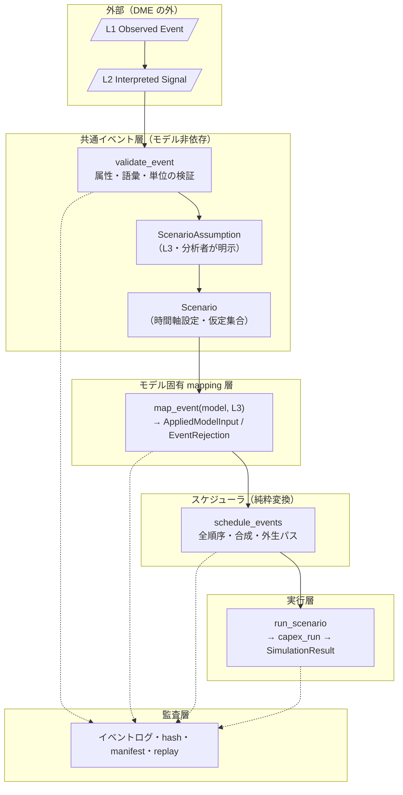

# イベント・シナリオ実行層 統合設計（整合レビュー・型・API・失敗契約・移行・再現性・作業分解）

> 関連 Issue: #196（本書）・#168（イベント変換契約・時間軸）・#171（`CCC` 統合設計）・#125（ロードマップ）
> 前提: [マクロイベント変換契約](macro_event_contract.md)（4 層・共通属性・イベント型 9 種・合成規則）・[シナリオ時間軸の意味論](scenario_time_semantics.md)（内部時刻・割当規則・時間形状）・[部門別CAPEX・信用循環モデル 統合設計](capex_credit_cycle_integration.md)（`CCC` の公開 API・metadata 予約キー）
> 決定記録: [ADR 0015](../adr/0015-macro-event-runtime-contract.md)（本書の決定）・[ADR 0010](../adr/0010-macro-event-scenario-contract.md)（イベント変換・時間軸契約）・[ADR 0013](../adr/0013-capex-credit-cycle-integration-contract.md)（`CCC` 統合実装契約）

---

## メタ情報

| 項目 | 内容 |
|---|---|
| **対象** | 観測イベントからモデル実行までを担う共通イベント層・シナリオ層・モデル固有 mapping 層・実行層の DME 内実装設計 |
| **ステータス** | 整合レビュー・型・公開API・失敗契約・移行方針・再現契約・テスト戦略・作業分解を確定。Julia 実装は未着手 |
| **event runtime version** | `macro-event-runtime/1.0.0` |
| **上位契約** | `macro-event-contract/1.0.2`・`scenario-time-semantics/1.1.0`（いずれも本書の改訂を反映した版）・`capex-credit-cycle-integration/1.0.0`・`capex-credit-cycle-vars/1.2.0`・`capex-credit-cycle-boundaries/1.0.1` |
| **継承する横断契約** | `model-interface`（`src/core/model_interface.jl` の `exogenous_variables`）・RFC 8785 正準化（`src/artifacts/json_canonical.jl`）・`comparison-v2/1.0.0` |
| **初期対応モデル** | `CapexCreditCycleModel`（registry symbol `:capex_credit_cycle`、以下 `CCC`）のみ |
| **基準経済・頻度** | 米国・四半期（`Δt = 0.25` 年）。既定ホライズン 28 四半期（助走 8 + 評価 20） |

> **LLM向け要約**: 本書は #168 が確定した契約と、実装済みの `CCC` シナリオ層（`CapexShockSpec` /
> `CapexScenario` / `capex_exogenous_paths`）を突き合わせ、イベント駆動シナリオ実行層を
> **追加の設計判断なしに実装できる形**へ落とす。(1) 契約と実装の差異 **30 件**を `Y-01`–`Y-30` として
> 登録し、各件を「上流改訂」「本書決定」「限界として保持」へ明示的に割り当てる（§2）。暗黙に吸収した差異は無い。
> (2) 4 層を **4 つのレコード型**として実装し、イベント型 9 種は**宣言的レジストリ**として持つ（9 × 4 = 36 個の
> struct を作らない、§5.3）。(3) 失敗を **例外 / 構造化拒否 / 警告**の 3 層へ分離し、`unmapped_target` を
> **既定で fail closed** とする（§6）。(4) 時点指定を**暦日基準**と**モデル期基準**の 2 基準に分け、
> 1 シナリオ内での混在を拒否する（§7.2。これにより `Sc0`–`Sc4` をイベント経由で再現できる）。
> (5) `CapexShockSpec` / `CapexScenario` / `capex_exogenous_paths` を**非推奨にせず維持**し、
> 時間形状と固定順合成のみを共通層へ移して二重実装を避ける（§8）。
> (6) `SimulationResult` 型を変更せず、イベント層の metadata 予約キー **20 個**を追加する（§9.3）。
> (7) 後続の実装 Issue #197–#205 を `E-1`–`E-9` として対象ファイル・依存・対象外・受け入れ条件つきで確定する（§11）。

---

## 1. 本書の位置づけ

### 1.1 何を確定し、何を確定しないか

| 本書が確定するもの | 本書が確定しないもの |
|---|---|
| 契約（#168）と実装（`CCC` シナリオ層）の差異とその解決（§2） | イベントの概念階層・適用先の限定・合成順序（#168 が正本） |
| 共通層 / シナリオ層 / モデル固有 mapping 層 / 実行層の責務分離（§3） | `CCC` の方程式・診断・会計（#169・#171 が正本） |
| ファイル配置・include 順序・export（§4） | Julia コードそのもの（後続の実装 Issue） |
| 公開型・公開 API のシグネチャと契約（§5） | ショック規模の較正値（#125 Phase 3） |
| 失敗契約（例外・構造化拒否・警告の境界）（§6） | `L1 → L2` の抽出実装（外部システムまたは人手） |
| 時間・実行順契約（§7） | vintage 付きデータ取得・`:as_of` 実行（実装しない。§2.2 `Y-08`） |
| 既存シナリオ API の移行方針（§8） | 他モデル（`Keen` / `SIM` / `NK` / `VAR`）向け mapping（#125 Phase 4） |
| 監査・再現契約と metadata 予約キー（§9） | LLM プロンプト本文（既存 LLM 層の契約に従う） |
| テスト戦略（§10）と実装 Issue への分解（§11） | — |

### 1.2 本書の規律

1. **差異を暗黙に吸収しない**。§2 に登録し、解決先を「上流改訂」「本書決定」「限界」のいずれかへ明示する（#171 の手続きを継承）。
2. **上流契約に無い経済的判断を本書で新設しない**。イベント型の追加・適用先の追加・合成規則の変更は行わない。必要が生じた場合は #168 の改訂として処理する。
3. **既存の公開 API を壊さない**。`SimulationResult`・`AbstractMacroModel`・`CapexCreditCycleRun`・`capex_run`・`simulate`・`CapexShockSpec`・`CapexScenario`・`capex_exogenous_paths` の型・シグネチャ・戻り値の数値を変更しない。
4. **同じ計算を二度実装しない**。時間形状と固定順合成は 1 箇所に置き、既存シナリオ層の経路は委譲する（§8.3）。
5. **層を飛ばす API を提供しない**。`L1`・`L2` から `L4` を生成する公開関数を作らない（[ADR 0010](../adr/0010-macro-event-scenario-contract.md) 決定 1）。
6. **観測されていない量を作る既定値を置かない**。`magnitude` の既定値・`entity_weight` の等ウェイト代用・欠測の 0 置換を実装しない。

### 1.3 正典（どの事項の正本がどの文書か）

| 事項 | 正本 |
|---|---|
| 概念階層 4 層・共通属性・イベント型 9 種・適用先 7 変数・合成規則・集約規則・再現契約の要求 | #168 [マクロイベント変換契約](macro_event_contract.md) |
| 内部時刻・適用四半期の割当規則・時間形状の離散式・`period` と `known_at` の区別 | #168 [シナリオ時間軸の意味論](scenario_time_semantics.md) |
| イベント翻訳可否表（他モデルへ翻訳できるか） | #167 [責務境界](../models/capex_credit_cycle_model_boundaries.md) §5.5 |
| `CCC` の公開 API・`metadata` 予約キー 20 個・`Sc0`–`Sc4` の定義 | #171 [統合設計](capex_credit_cycle_integration.md)・#163 [分析契約](../models/capex_credit_cycle_analysis_contract.md) |
| **Julia 型・関数名・失敗契約・実行順・移行方針・イベント層の metadata 予約キー・作業分解** | **本書** |

---

## 2. 既存契約と実装の整合レビュー結果

### 2.1 レビュー範囲と方法

[マクロイベント変換契約](macro_event_contract.md)（`1.0.1`）・[シナリオ時間軸の意味論](scenario_time_semantics.md)（`1.0.0`）・[ADR 0010](../adr/0010-macro-event-scenario-contract.md)・[`CCC` 統合設計](capex_credit_cycle_integration.md) §4.6 と、実装済みの `src/analysis/capex_credit_cycle_scenarios.jl`・`src/models/capex_credit_cycle.jl`・`src/core/model_interface.jl`・`src/artifacts/json_canonical.jl`、および後続 Issue #197–#205 の記述を横断照合した。照合は**記号名・Julia 名・単位・既定値・拒否条件の逐語一致**で行い、「概ね同じ」を一致とみなしていない。

| # | 観点 | 判定 | 検出件数 |
|---|---|---|---|
| 1 | 4 層の概念階層と実装可能な型構造の対応 | 差異あり | 4（`Y-01`–`Y-04`） |
| 2 | 適用先 7 変数・単位 × 適用方式の対応 | 一致（副次的差異 2） | 2（`Y-05`・`Y-06`） |
| 3 | 時間軸契約（内部時刻・`period_zero`・vintage）と実装 | 差異あり | 3（`Y-07`–`Y-09`） |
| 4 | 時間形状 6 種と実装 4 種 | 差異あり | 3（`Y-10`–`Y-12`） |
| 5 | 全順序・合成規則と実装 | 差異あり | 2（`Y-13`・`Y-14`） |
| 6 | 失敗契約（例外・構造化拒否・警告） | 未定義 | 2（`Y-15`・`Y-16`） |
| 7 | 再現契約・`metadata`・シリアライズ | 差異あり | 5（`Y-17`–`Y-21`） |
| 8 | 後続 Issue #197–#205 の記述と契約・実装の対応 | 差異あり | 4（`Y-22`–`Y-25`） |
| 9 | モデル間翻訳・version 体系・感応度併記義務 | 差異あり | 5（`Y-26`–`Y-30`） |

**一致が確認できた主要事項**（差異なしと判定した根拠）:

- **適用先 7 変数**が #168 §4.1・実装の `CAPEX_CC_EXOGENOUS_VARIABLES`・`exogenous_variables(::CapexCreditCycleModel)` で**順序を含めて完全一致**する（`ai_exp`・`capex_plan_shock_ex`・`spread_shock_ex`・`policy_rate`・`ext_demand_s2`・`ext_demand_s3`・`price_s1`）。`target_rank` の正本（#168 §12.2）が実装に反映されている。
- **単位 × 適用方式の許容表**が #168 §3.3（§12.1 改訂後）と実装の `_CCC_UNIT_APPLICATION_MODE_TABLE` で一致する（`"%"`→乗算、`"bp"`→加算、`"%pt"`→加算・絶対、`"bn USD (2017 chained)"`→絶対・加算・乗算）。
- **固定順合成（絶対 → 乗算 → 加算）と `conflicting_absolute` の拒否**が #168 §5.2 と実装で一致する。
- **`magnitude` の必須性**が [ADR 0010](../adr/0010-macro-event-scenario-contract.md) 決定 4 と実装（`CapexShockSpec` の `magnitude` が既定値を持たない必須キーワード）で一致する。
- **期首一括適用**が #168 [時間軸](scenario_time_semantics.md) §3.2 と実装（外生パスを期内処理順序ステップ 1 で適用）で一致する。
- **接続点の単一性**が [ADR 0013](../adr/0013-capex-credit-cycle-integration-contract.md) 決定 21 と実装（`capex_exogenous_paths` が返す `Dict{Symbol,Vector{Float64}}`）で一致する。イベント層が接続すべき箇所は 1 点である。
- **`exogenous_variables` の既定メソッド**が `src/core/model_interface.jl` に存在し、`CCC` のみがオーバーライドしている。実行層がモデルのイベント適用可否を照会できる。

### 2.2 検出した差異と解決（`Y-01`–`Y-30`）

解決先の記号: **[U]** 上流文書の改訂として処理（改訂内容は各文書の改訂節に記録）／**[D]** 本書または [ADR 0015](../adr/0015-macro-event-runtime-contract.md) の実装決定として処理／**[L]** 限界として保持し実装で解決しない。

#### 観点 1: 4 層と型構造

| ID | 差異 | 解決 | 解決先 |
|---|---|---|---|
| `Y-01` | #168 §3.1 は `event_type` に「9 種のいずれか、または `:other`」を許すが、#197 の受け入れ条件は「unknown / unsupported event type を黙って generic event へ落とさず拒否する」であり、`:other` を無条件に許すと両立しない | `:other` を **`L1`・`L2` に限り許容**し、`L3`・`L4` では拒否する（`unsupported_event_type`）。レジストリに無い Symbol は全層で拒否する。「観測はしたが解釈できない事象を記録する」ことと「モデルへ適用する」ことを分離する | **[D]** 本書 §5.3 |
| `Y-02` | #168 §3.1 は `L3` で `effective_from`（暦日）を**必須**とするが、[時間軸](scenario_time_semantics.md) §9-4 は「`period_zero` を持たない理論シナリオ」の存在を認め、実装の `CapexShockSpec.timing` は `t = 0` 起点の整数のみを持つ。暦日必須のままでは `Sc0`–`Sc4` を `L3` として表現できず、#201・#205 の「`Sc0`–`Sc4` をイベント経由で再現する」受け入れ条件が成立しない | 時点指定を **`:calendar`（`effective_from` + 割当規則）** と **`:period`（`t_apply` の直接指定）** の 2 基準とし、`L3` は必ずどちらか一方を完備する。1 シナリオ内での混在を `mixed_timing_basis` として拒否する。`:period` 基準は `timing_basis_period` 警告を必ず伴い、「暦日から導出された時点ではない」ことを記録する | **[U]** [時間軸](scenario_time_semantics.md) §11・**[D]** 本書 §7.2 |
| `Y-03` | #168 §5.3 は企業レベルイベントの部門集約規則（`entity_weight`・カバレッジ）を定めるが、#199・#201 はいずれも「企業単位イベントの部門集約推定」を対象外としている。集約規則を実装しないまま `entity_weight` 属性だけを持つと、等ウェイト代用の余地が残る | **集約を実装しない**。`entity` を持つ `L2` から `L3` を自動生成する API を提供せず、分析者が部門レベルの `L3` を与える。`entity` が非空の `L3` を `aggregation_not_implemented` として拒否する。`entity_weight` 属性を**型に持たせない**（存在しない自由度を作らない） | **[D]** 本書 §5.2・§6.2 |
| `Y-04` | #168 §2.4 は `provenance` に `generated_at`（生成時刻）を必須とするが、#203 は volatile field を content identity から除外することを要求する。`generated_at` を hash 対象に含めると、同一意味の入力が実行のたびに異なる hash を持つ | `generated_at` を**保持するが hash 対象外**とする。hash 対象フィールドを §9.2 に列挙し、除外フィールド（`generated_at`・`notes`・`caveats`・`source.url`・`source.retrieved_at`・表示名）を明示する | **[D]** 本書 §9.2 |

#### 観点 2: 適用先・単位

| ID | 差異 | 解決 | 解決先 |
|---|---|---|---|
| `Y-05` | #168 §4.1 は `ai_exp`・`price_s1` を index（baseline = `1.0`）、`ext_demand_s2` / `_s3` を水準（10億ドル/四半期）とするが、いずれも `"%"` × `:multiplicative` を許容する。イベント層が「%」の意味を変数ごとに解釈すると、層の責務（§7.3 モデル層の禁止事項）と逆の依存が生じる | `L4` は必ず `baseline_value`（同一時点の `Sc0` 値）を保持し、`:multiplicative` を「**その時点の baseline 値に対する比**」として一律に定義する。イベント層は変数の絶対水準・単位系を解釈しない。baseline は `_ccc_baseline_exog` 相当をモデル側が供給する | **[D]** 本書 §5.6 |
| `Y-06` | #168 §4.5 は「`unmapped_target` を含むシナリオを実行してよい」と述べるが、#202 の受け入れ条件は「unmapped event を無視して残りだけ実行する既定動作になっていない」、#205 は「invalid / unmapped fixture が黙って部分実行されず fail closed となる」である | 既定を **`on_unmapped = :reject`（fail closed）** とし、`:warn` を明示指定した場合のみ実行する。指定値を `metadata["unmapped_policy"]` へ記録する。#168 §4.5 の「実行してよい」は禁止しないという趣旨であり、既定の指定ではないと解する | **[D]** 本書 §6.4 |

#### 観点 3: 時間軸

| ID | 差異 | 解決 | 解決先 |
|---|---|---|---|
| `Y-07` | [時間軸](scenario_time_semantics.md) §2.1 は `metadata["period_zero"]`・`["period_labels"]`・`["shock_origin_index"]` を要求するが、実装の `to_simulation_result(m, run, name)` は `CCC` 予約 20 キー + 補助 3 キーのみを設定し、`run.periods` すら metadata へ転記していない。`SimulationResult` は暦情報も期インデックスも持たない | イベント層の metadata 予約キーとして追加する（§9.3）。`CCC` の既存 20 キーは変更しない。`shock_origin_index` は `periods` 中で `t = 0` が現れる **1-based の添字**と定義する。`period_labels` は `period_zero` が `nothing` のとき `["t-8", …, "t+19"]` 形式の期ラベルとする | **[D]** 本書 §9.3 |
| `Y-08` | [時間軸](scenario_time_semantics.md) §6.2 は `:as_of` / `:latest` の実行モードと `metadata["data_as_of"]` を要求するが、[ADR 0012](../adr/0012-capex-credit-cycle-empirical-contract.md) は `:as_of` を実装しないことを既に決定している | **`:as_of` を実装しない**。`data_as_of` / `data_vintage` を予約キーに含めない。`known_at` は `L1`・`L2` の監査属性として保持するのみで、フィルタ判定に用いない。`known_at` によるイベントの取捨選択を行う API を提供しない。「その時点で判断できた」旨の記述を LLM 禁止表現へ追加する | **[U]** [時間軸](scenario_time_semantics.md) §11・**[D]** 本書 §7.1 |
| `Y-09` | [時間軸](scenario_time_semantics.md) §4.3 は `t_apply` がホライズン外（`t < -8` または `t > 19`）のとき `out_of_horizon` とするが、境界を固定値で書いている。実装のホライズンは `CapexCreditCycleOptions.horizon_runup` / `horizon_eval` で可変である | 判定を `-horizon_runup ≤ t_apply ≤ horizon_eval - 1` に対して行う。`-8`・`19` を定数として持たない。ホライズン設定を `Scenario` に保持し、`CapexCreditCycleOptions` と一致することを実行前に検証する（不一致は `horizon_mismatch` として拒否） | **[U]** [時間軸](scenario_time_semantics.md) §11・**[D]** 本書 §7.3 |

#### 観点 4: 時間形状

| ID | 差異 | 解決 | 解決先 |
|---|---|---|---|
| `Y-10` | [時間軸](scenario_time_semantics.md) §5.2 は 6 形状（`pulse` / `step` / `ramp` / `step_then_ramp` / `AR1_decay` / `path`）を定めるが、実装は 4 形状（`:step`・`:ramp`・`:ar1_decay`・`:step_then_ramp`）である。加えて契約の表記 `AR1_decay` と実装の `:ar1_decay` が異なる | Julia シンボルの正本を **`:pulse` / `:step` / `:ramp` / `:step_then_ramp` / `:ar1_decay` / `:path`** の 6 個とする。契約の `AR1_decay` は散文表記であり Julia 名を定めない。共通 helper を 1 箇所（`src/scenarios/scenario_time.jl`）に置き、既存 4 形状は同一パラメータで**同一ベクトル**を返す（§10 の回帰テスト） | **[D]** 本書 §7.4 |
| `Y-11` | 形状パラメータの受け渡しが契約と実装で異なる。契約は `ramp` を `D_up`、`step_then_ramp` を `D_hold` / `D_down` と表記するが、実装は `ramp` の長さを `duration` フィールドで、`step_then_ramp` を `shape_params.hold` / `.ramp_down` で受ける。また実装の `_ccc_shock_active` は `:ramp` に打ち切りを持たず、`:step_then_ramp` は `duration` を打ち切りに用いない | 実装の受け渡し方式を**正本とする**（`ramp` の長さ = `duration`、`step_then_ramp` = `shape_params.hold` / `.ramp_down`）。契約の記号は散文であり、パラメータ名を定めない。**打ち切り（`effective_until` / `t₁`）は形状によらず適用する**という契約 §5.2 の規律を共通 helper で全形状へ一律に実装し、既存 4 形状の**既定パラメータでの出力は変えない**（`Sc0`–`Sc4` は打ち切りを指定していないため差が出ない）ことを回帰テストで固定する | **[D]** 本書 §7.4・§8.3 |
| `Y-12` | [時間軸](scenario_time_semantics.md) §5.2 の `path` は明示系列 `m_k` を与える形状だが、`magnitude` との役割が重複し、`magnitude` の必須性（[ADR 0010](../adr/0010-macro-event-scenario-contract.md) 決定 4）と両立する定義が無い | `path` では `shape_params.values::Vector{Float64}` が単位付きの `a_t` 列そのものであり、`magnitude` は **`maximum(abs, values)` と一致すること**を検証する（不一致は `path_magnitude_mismatch` として拒否）。`magnitude` は系列のスケール係数ではない。契約 §5.2-4 のとおり `magnitude_source ∈ (:observed, :derived)` の場合のみ許可する | **[D]** 本書 §7.4 |

#### 観点 5: 全順序・合成

| ID | 差異 | 解決 | 解決先 |
|---|---|---|---|
| `Y-13` | #168 §5.1 の全順序キーは `(t_apply, event_class_rank, target_rank, effective_from, event_id)` だが、`Y-02` の `:period` 基準では `effective_from` が存在せず、キーが定まらない | 第 4 キーを `timing_sort_key::String` とし、`:calendar` 基準では `effective_from` の ISO 8601 日付文字列、`:period` 基準では `t_apply` の符号付き 0 埋め文字列（例 `"+0003"`）とする。基準の混在は `Y-02` により拒否されるため、比較不能な組み合わせは生じない | **[D]** 本書 §7.5 |
| `Y-14` | 実装の `capex_exogenous_paths` は `_ccc_shock_value` で各ショックの `a_t` を求め target ごとに固定順で合成するが、**合成に参加したショックの一覧・適用前後値を返さない**。#203 のイベントログはこれらを要求する | 合成を共通層 `compose_exogenous_paths` へ移し、**合成後パスと合成ログ（`composition_members` / `baseline` / `pre` / `post` / `applied_delta`）を同時に返す**。`capex_exogenous_paths` はログを捨てるラッパとし、**戻り値の型と数値を変えない** | **[D]** 本書 §8.3 |

#### 観点 6: 失敗契約

| ID | 差異 | 解決 | 解決先 |
|---|---|---|---|
| `Y-15` | 実装は `conflicting_absolute`・`invalid_unit_mode`・`magnitude` 欠落・`sign` 不一致を `ArgumentError` で拒否するが、#168 §5.4 は「構造化して拒否」と述べ、#202 は「validation rejection と mapping rejection を異なる execution status として返す」とする。例外と構造化拒否の境界が未定義である | 失敗を **3 層**へ分離する: (1) **値の不変条件違反 → 例外**（`ArgumentError`。レコードとして存在できない値）、(2) **集合の整合違反 → 構造化拒否**（`EventRejection` を集めて `status = :rejected_*` を返す。実行しない）、(3) **その他 → 警告**（実行する）。実装済みの `ArgumentError` はすべて層 (1) に該当し、**変更しない** | **[D]** 本書 §6 |
| `Y-16` | #168 §5.4 は `low_confidence` の閾値を「診断設定として外部化」とするが、同 §3.1 は `confidence` を数値へ作用させないと定める。既定閾値を置くと、閾値の選択が結果の取捨選択に見える | 既定閾値を**持たない**（`ScenarioRunOptions.confidence_threshold = nothing`）。閾値を明示指定したときのみ `low_confidence` 警告を出す。いかなる場合も `confidence` は magnitude・適用可否に作用しない | **[D]** 本書 §5.7・§6.2 |

#### 観点 7: 再現契約・metadata・シリアライズ

| ID | 差異 | 解決 | 解決先 |
|---|---|---|---|
| `Y-17` | #168 §6.5 の再現キーは `initial_state_id` と `solver_settings` を含むが、実装に `initial_state_id` は存在しない（`capex_run` の `state0` は `NamedTuple` または `nothing`） | `initial_state_id` を「`state0` の正準 JSON の SHA-256（`nothing` のときは文字列 `"steady_state"`）」と定義する。新しい ID 体系・登録簿を作らない。`solver_settings` は `CapexCreditCycleOptions` の全フィールドを正準 JSON 化した hash とする | **[D]** 本書 §9.2 |
| `Y-18` | 実装の `metadata["scenario"]["shocks"]` は 9 キーのみで **`shape_params` を含まない**ため、`:ar1_decay` の `half_life` や `:step_then_ramp` の `hold` / `ramp_down` が `SimulationResult` から復元できない。#203 の replay を `SimulationResult.metadata` からは行えない | replay の入力は**保存済み Scenario artifact（正準 JSON）**であり `SimulationResult.metadata` ではない。加えてイベントログの `L4` レコードに `shape` と `shape_params` を保持する。`CCC` の `metadata["scenario"]` は**変更しない**（既存テストと成果物の互換性を保つ） | **[D]** 本書 §9.5 |
| `Y-19` | `src/artifacts/json_canonical.jl` の `_jcs_check_key_ascii` はオブジェクトキーが ASCII であることを強制する。日本語のイベント名・部門名・意味説明をキーに使えない | JSON のキーは**すべて ASCII の snake_case** とし、日本語は値にのみ置く。schema でキー名を固定する（§9.4）。日本語の値が round-trip することを #203 のテストで確認する | **[D]** 本書 §9.4 |
| `Y-20` | 実装の `capex_run(m; scenario = :Sc2)` は `scenario` を**ラベルとしてのみ**用い、`exog` を明示的に渡さない限りショックは適用されない（外生は baseline のまま）。[統合設計](capex_credit_cycle_integration.md) §4.4 の記述は「`scenario` 単独指定でショックが適用される」と読みうる | `run_scenario` は**常に `exog` を明示的に構成して渡す**。`capex_run` の既存挙動は変更しない。本書 §8.2 に現行挙動を明記し、実装者が `scenario` 引数に依存しないようにする | **[D]** 本書 §8.2 |
| `Y-21` | 実装の `capex_run` は `validate_accounting` / `diagnostics` / `thresholds` を受け取るが、`run.accounting` / `run.diagnostics` は常に `nothing` である（会計・診断は `validate_capex_accounting` / `capex_diagnostics` を別途呼ぶ運用で、統合デモもそうしている） | `run_scenario` は `validate_capex_accounting` と `capex_diagnostics` を**明示的に呼び**、`ScenarioRun` へ格納する。`capex_run` の引数の意味を本書 §8.2 に記録し、イベント層では挙動を変更しない。`capex_run` の当該引数の整理は本書の範囲外（別 Issue 候補として §12.2 に登録） | **[D]** 本書 §8.2・**[L]** §12.2 |

#### 観点 8: 後続 Issue の記述との差異

| ID | 差異 | 解決 | 解決先 |
|---|---|---|---|
| `Y-22` | #199・#200 は各イベント型について「event-specific struct / constructor / validator」を求めるが、#168 §3.1 は層ごとに共通の属性表を定め、イベント型は属性値である。素直に読むと 9 型 × 4 層 = 36 個の struct になる | struct は**層ごとの 4 個**に限り、イベント型 9 種は宣言的な **`MacroEventTypeSpec` レジストリ**として持つ（§5.3）。型別のコンストラクタと検証はレジストリ駆動で提供する。#199・#200 の受け入れ条件（型別に必須属性・単位・適用方式・target concept が検証され、generic へ縮約されない）はレジストリで満たせる。#168 §4.2–§4.4 の表を 1:1 でコードへ写せるため監査可能性も高い | **[D]** 本書 §5.3・§11 |
| `Y-23` | #198 の対象ファイル候補は `src/scenarios/scenario_time.jl` を新規とするが、時間形状は既に `src/analysis/capex_credit_cycle_scenarios.jl` にある。独立実装すると同一形状の二重実装になる | 形状と合成を `src/scenarios/` の共通層へ移し、`capex_credit_cycle_scenarios.jl` は**委譲のみ**とする。include 順序を変更し、`scenarios/` の純粋な層を `analysis/capex_credit_cycle_scenarios.jl` より前に置く（§4.2） | **[D]** 本書 §4.2・§8.3 |
| `Y-24` | #204 は `src/analysis/scenario_diagnostics.jl` を提案するが、既存の `capex_diagnostics` は `CapexCreditCycleRun` を受け取るモデル固有 API である。シナリオ比較診断は `SimulationResult` 同士の比較としてモデル非依存に書ける | 比較診断を **`SimulationResult` 2 本を受け取るモデル非依存 API** とする。`CCC` 固有の主要経路候補は `CapexDiagnostics` を**任意引数**として受け取り、与えられた場合のみ構造化する。`capex_diagnostics` は変更しない | **[D]** 本書 §5.8 |
| `Y-25` | #205 は `test/fixtures/scenarios/` の golden JSON round-trip を要求するが、既存の `test/fixtures/capex_credit_cycle/` はテストからプログラム的に読み込まれない**記録用 JSON** である（各テストファイル冒頭に明記） | イベント層の fixture は**プログラムから読み込む**（golden JSON 比較・replay 入力）。既存 fixture の扱いは変更しない。両者の性格が異なることを fixture の `source["kind"]`（`"illustrative"` / `"golden"`）で区別する | **[D]** 本書 §10.5 |

#### 観点 9: 翻訳・version・感応度

| ID | 差異 | 解決 | 解決先 |
|---|---|---|---|
| `Y-26` | #168 §7.4 は `untranslatable`（他モデルが構造上表現しない）と `unmapped_target`（`CCC` に適用先の外生変数が無い）を別コードとして扱うが、Phase 2 は `CCC` のみを対象とし他モデルの adapter を作らないため、`untranslatable` を返す経路が存在しない | `map_event` の**既定メソッド**は `unsupported_model` を返す（「このモデルにイベント mapping が実装されていない」）。`untranslatable`（#167 §5.5 の `×`）とは**別コード**であり、後者は他モデル向け mapping を実装する #125 Phase 4 の責務とする。3 コードを混同しない | **[L]** 本書 §6.2・§12.1 |
| `Y-27` | [ADR 0010](../adr/0010-macro-event-scenario-contract.md) 決定 10 は `event_set_hash` を RFC 8785 正準化で求めるとするが、`src/artifacts/json_canonical.jl` は「real-rate model artifact ドメイン値に限定した実装」と自己申告しており、`Symbol`・`Date`・`missing` を直接扱えない | 正準化の**前段**に型写像（`Symbol → String`・`Date → "YYYY-MM-DD"`・`DateTime → ISO 8601 UTC`・`missing → null`・`Tuple → Array`）を置く encoder を新設する。`json_canonical.jl` は**変更しない**（既存 artifact の hash を動かさない） | **[D]** 本書 §9.4 |
| `Y-28` | [ADR 0010](../adr/0010-macro-event-scenario-contract.md) §7 は `macro-event-contract` / `scenario-time-semantics` / `rule_version` / `timing_rule_set` の version 体系を定めるが、実装の version 定数はモデル契約 version のみである | イベント層の version 定数 **5 個**を新設する（§5.1）。`timing_rule_set` は `TimingRuleSet` の `id` / `version` フィールドとして持ち、`cutoff` 既定値の変更が無記録で結果を変える経路を残さない | **[D]** 本書 §5.1 |
| `Y-29` | [時間軸](scenario_time_semantics.md) §4.6 は cutoff 近傍のイベントについて「適用四半期を ±1 期ずらした結果の併記」を義務づけるが、これは実行を複数回行うことを意味し、単一の `run_scenario` 呼び出しでは満たせない | `run_scenario` の責務は **`timing_sensitive` 警告の検出と記録**までとする。±1 期ずらし実行は診断層 API `scenario_timing_sensitivity` として提供する（§5.8）。義務の充足は「警告 + 併記 API の提供 + LLM 説明層の必須記載」で行う | **[D]** 本書 §5.8・§7.3 |
| `Y-30` | #168 §3.2-3 は `:assumed_default` を含む結果に **magnitude ±50% の感応度併記**を義務づけるが、実装の `capex_label_sensitivity` は**閾値**の ±50% であり別物である | magnitude ±50% の感応度を `scenario_magnitude_sensitivity` として診断層に新設する（§5.8）。閾値感応度（`capex_label_sensitivity`）と**別の関数・別の出力キー**とし、出力で両者を取り違えない | **[D]** 本書 §5.8 |

### 2.3 上流文書への改訂の反映方法

[#171 の手続き](capex_credit_cycle_integration.md) §2.3 と同じ方式をとる。**上流文書に改訂節を追加し、その節を当該文書の正本とする**（本文の該当箇所を書き換えず、改訂節が優先することを明記する）。本書が要求する改訂は次の 2 文書 4 件である。

| 文書 | 新 version | 改訂節 | 反映する差異 |
|---|---|---|---|
| [マクロイベント変換契約](macro_event_contract.md) | `macro-event-contract/1.0.2` | §13 | `Y-01`（`:other` の層限定）・`Y-02`（`L3` の時点指定 2 基準）・`Y-03`（集約を実装しないことの明示） |
| [シナリオ時間軸の意味論](scenario_time_semantics.md) | `scenario-time-semantics/1.1.0` | §11 | `Y-02`（`:period` 基準の追加）・`Y-08`（`:as_of` を実装しない）・`Y-09`（ホライズン境界の可変化） |

**version 上げ幅の根拠**（[ADR 0010](../adr/0010-macro-event-scenario-contract.md) §7 の規則）: `macro-event-contract` は属性の追加・適用先の変更・合成規則の変更に当たらない（既存属性の適用範囲の明確化のみ）ため patch。`scenario-time-semantics` は**割当規則の追加**（`:period` 基準）に当たるため minor。

### 2.4 限界として保持する事項（実装で解決しない）

| # | 事項 | 理由 | 実装での表現 |
|---|---|---|---|
| 1 | `L1 → L2` の抽出は本リポジトリの責務ではない | 外部システム（`finance-checker` 等）または人手（#168 §2.3） | `ObservedEvent` から `InterpretedSignal` を自動生成する API を提供しない |
| 2 | 企業レベルイベントの部門集約を行わない（`Y-03`） | 集約重みが観測に基づかない自由度になる | `aggregation_not_implemented` として拒否し、理由を出力へ含める |
| 3 | `:as_of`（vintage 参照）を実装しない（`Y-08`） | [ADR 0012](../adr/0012-capex-credit-cycle-empirical-contract.md) の決定 | `known_at` を監査属性として保持するのみ。「その時点で判断できた」と述べない |
| 4 | 確率的イベント生成・不確実性区間からのサンプリングを行わない | #168 §6.4 | `scenario_seed` を予約せず、決定論以外の実行経路を作らない |
| 5 | 他モデル（`Keen` / `SIM` / `NK` / `VAR`）向け mapping を実装しない（`Y-26`） | #167 §5.5 の翻訳可否は判定済みだが、翻訳器は #125 Phase 4 の責務 | `map_event` の既定メソッドが `unsupported_model` を返す |
| 6 | 期中適用・期内按分・連続時間イベントを実装しない | #168 [時間軸](scenario_time_semantics.md) §3.2 の決定 | 適用点は期内処理順序ステップ 1 のみ |
| 7 | 適用先を持たないイベント型（`D1`–`D4`）の解消を行わない | #165 の改訂が必要（#168 §8） | `unmapped_target` として拒否し、必要な上流改訂 ID を理由に含める |
| 8 | 閾値近傍の感応性は残る | 合成後一括適用でも合成値が閾値を跨ぐかは magnitude の小差で変わる（#168 §10-6） | `threshold_proximity`（`CCC` 診断層の既存機構）で検出し併記する |
| 9 | 4 層分離は解釈の誤りを防がない | #168 §10-2 | 誤りの所在（観測 / 解釈 / 仮定 / 適用）を特定できることのみを保証する |
| 10 | 本書は実データ・実イベント記述による検証を経ていない | 実運用可能性は #125 Phase 3 で初めて確認される | fixture は fictional であることを明記する |

---

## 3. 層と責務の境界

### 3.1 共通層とモデル固有層の分離



**契約**:

1. 共通イベント層は**モデルを知らない**。`CapexCreditCycleModel` を参照せず、`target_concepts`（モデル非依存語彙、#168 §3.4）までしか持たない。
2. モデル固有 mapping 層は**イベントを解釈しない**。受け取るのは検証済みの `L3` であり、原文・belief・confidence を magnitude へ作用させない。
3. スケジューラは**モデルを実行しない**。純粋変換であり、モデル状態・外部データ・ファイルシステムへアクセスしない。
4. 実行層は**イベントを解釈しない**。合成済みの `Dict{Symbol,Vector{Float64}}` を `capex_run` へ渡すだけである（[ADR 0013](../adr/0013-capex-credit-cycle-integration-contract.md) 決定 21 の接続点 1 点を維持）。
5. 監査層は**入力を変更しない**（読み取り専用。[ADR 0003](../adr/0003-minsky-financing-regime-diagnostics.md) の診断層と同方針）。

### 3.2 #168 §7.1 の 6 責務と実装配置の対応

| # | #168 §7.1 の責務 | 実装ファイル | 公開 API |
|---|---|---|---|
| 1 | event validation | `src/scenarios/macro_events.jl`・`event_type_registry.jl` | 各レコード型の内部コンストラクタ・`validate_event` |
| 2 | scenario conversion（`L2 → L3`） | `src/scenarios/macro_events.jl` | `scenario_assumption`（分析者が明示的に呼ぶ smart constructor） |
| 3 | model-specific mapping（`L3 → L4`） | `src/scenarios/adapters/capex_credit_cycle_event_adapter.jl` | `map_event` |
| 4 | event scheduling | `src/scenarios/scenario_time.jl`・`event_scheduler.jl` | `schedule_events`・`compose_exogenous_paths` |
| 5 | scenario execution | `src/scenarios/scenario_runner.jl` | `run_scenario` |
| 6 | execution log / diagnostics | `src/scenarios/scenario_provenance.jl`・`scenario_serialization.jl`・`src/analysis/scenario_diagnostics.jl` | `scenario_event_log`・`event_set_hash`・`save_scenario_artifact`・`replay_scenario`・`scenario_comparison` |

### 3.3 モデル層の不変条件（維持する）

1. モデル層（`src/models/capex_credit_cycle.jl`）は**イベント型を知らない**。本書はこのファイルへ変更を加えない。
2. モデル層は外部 API を呼ばない・`DataSeries` を受け取らない・可視化と LLM を呼ばない（[モデル共通インターフェース](model_interface.md) §6）。
3. `simulate` / `capex_run` の公開シグネチャと戻り値の数値を変更しない。

---

## 4. DME パッケージ内の配置

### 4.1 追加・修正するファイル

| 種別 | パス | 責務 | 依存 |
|---|---|---|---|
| **追加** | `src/scenarios/scenario_time.jl` | `CalendarQuarter`・暦四半期変換・`TimingRuleSet`・割当規則 3 種 + `:explicit_period`・時間形状 6 種の離散式（`shock_shape_path`） | stdlib `Dates` のみ |
| **追加** | `src/scenarios/macro_events.jl` | `AbstractMacroEvent`・4 層レコード型・`EventSource`・`EventProvenance`・`PersistenceSpec`・`EventTiming`・共通属性検証 | `scenario_time.jl` |
| **追加** | `src/scenarios/event_type_registry.jl` | `MacroEventTypeSpec`・イベント型 9 種のレジストリ（#168 §4.2–§4.4 の表） | `macro_events.jl` |
| **追加** | `src/scenarios/scenario_types.jl` | `Scenario`・`ScheduledEvent`・`EventSchedule`・`ScenarioWarning`・`EventRejection`・`ScenarioRunOptions`・`ScenarioRun`・`ScenarioProvenance` | `macro_events.jl` |
| **追加** | `src/scenarios/event_scheduler.jl` | 全順序・固定順合成・`schedule_events`・`compose_exogenous_paths`・イベントログ生成 | `scenario_types.jl` |
| 修正 | `src/analysis/capex_credit_cycle_scenarios.jl` | 時間形状と固定順合成を共通層へ委譲（§8.3）。公開 API・戻り値の数値は不変 | `scenarios/scenario_time.jl`・`event_scheduler.jl` |
| **追加** | `src/scenarios/adapters/capex_credit_cycle_event_adapter.jl` | `map_event(::CapexCreditCycleModel, ::ScenarioAssumption)`・`CAPEX_CC_EVENT_MAPPING_RULES`・`capex_scenario_assumptions`（`Sc0`–`Sc4` の `L3` 表現） | モデル型・`analysis/capex_credit_cycle_scenarios.jl` |
| **追加** | `src/scenarios/scenario_provenance.jl` | 型写像 encoder・`event_set_hash`・`scenario_content_hash`・`params_hash`・`initial_state_id`・manifest 構築 | `artifacts/json_canonical.jl`・`scenario_types.jl` |
| **追加** | `src/scenarios/scenario_runner.jl` | `run_scenario`・実行順の固定・status 判定・`SimulationResult` への metadata 付与 | 上記すべて + `CCC` の会計・診断層 |
| **追加** | `src/scenarios/scenario_serialization.jl` | JSON encoder / decoder・schema version 検査・`save_scenario_artifact`・`load_scenario`・`replay_scenario` | `scenario_provenance.jl` |
| **追加** | `src/analysis/scenario_diagnostics.jl` | `ScenarioComparisonDiagnostics`・`scenario_comparison`・`scenario_timing_sensitivity`・`scenario_magnitude_sensitivity` | `core/simulation_result.jl`・`scenario_types.jl` |
| 修正 | `src/DME.jl` | include 追加（§4.2）・export 追加（§4.3） | — |
| **追加** | `test/test_macro_event_types.jl` ほか 7 本 | §10 のテスト | — |
| 修正 | `test/runtests.jl` | 追加テストの include | — |
| **追加** | `test/fixtures/events/`・`test/fixtures/scenarios/` | fictional な synthetic fixture・golden JSON（§10.5） | — |
| **追加** | `examples/event_driven_capex_scenario_demo.jl` | 統合デモ（外部 API 不要・決定的） | — |
| **追加** | `docs/examples/event_driven_capex_scenario_demo.md` | デモの実行手順・成果物・限界 | — |

**新規ディレクトリ `src/scenarios/` を置く根拠**: `src/models/` はモデル実装、`src/analysis/` はモデル出力に対する読み取り専用の分析層である。イベント層は**モデル実行の前段**（入力の構成）であり、いずれにも属さない。`src/data/`（実データ取得）・`src/llm/`（説明生成）と同じく、責務単位の最上位ディレクトリとして分ける。`src/scenarios/adapters/` はモデル固有 mapping を共通層から物理的に分離する。

### 4.2 include 順序

`src/DME.jl` の既存ブロックへ次のとおり挿入する。現行の関連位置は `core/model_interface.jl`（`:448`）→ `core/solver_options.jl`（`:449`）→ `models/capex_credit_cycle.jl`（`:462`）→ `core/simulation_result.jl`（`:465`）→ `analysis/capex_credit_cycle_accounting.jl`（`:495`）→ `analysis/capex_credit_cycle_scenarios.jl`（`:500`）→ `analysis/capex_credit_cycle_diagnostics.jl`（`:506`）である。

| 挿入位置 | ファイル | 根拠 |
|---|---|---|
| `core/solver_options.jl` の直後（`models/` ブロックより前） | `scenarios/scenario_time.jl`・`scenarios/macro_events.jl`・`scenarios/event_type_registry.jl`・`scenarios/scenario_types.jl`・`scenarios/event_scheduler.jl` | 純粋な共通層であり stdlib 以外に依存しない。`analysis/capex_credit_cycle_scenarios.jl` が時間形状を委譲するため、**それより前**でなければならない（`Y-23`） |
| `analysis/capex_credit_cycle_diagnostics.jl` の直後 | `scenarios/adapters/capex_credit_cycle_event_adapter.jl` | モデル型・`CapexScenario`・診断層に依存する |
| 上記の直後 | `scenarios/scenario_provenance.jl` → `scenarios/scenario_runner.jl` → `scenarios/scenario_serialization.jl` | この順に依存する。`scenario_runner.jl` は `to_simulation_result`（`core/simulation_result.jl`）と会計・診断層に依存する |
| `analysis/capex_credit_cycle_visualization.jl` の直後 | `analysis/scenario_diagnostics.jl` | `SimulationResult` と `CapexDiagnostics` に依存する |

`src/artifacts/json_canonical.jl` は既存の位置で `scenarios/scenario_provenance.jl` より前にある必要がある。現行 include 順で `artifacts/` ブロックが `analysis/` ブロックより後にある場合は、`json_canonical.jl` のみを前方へ移す（同ファイルは stdlib `SHA` 以外に依存しないため移動は安全）。**実装時に現行順序を確認し、移動が必要なら移動の事実を PR に記載する。**

### 4.3 export

`src/DME.jl` の `export` 節へ次を追加する。既存の責務別コメント区切りを維持する。

| 区分 | 追加する名前 |
|---|---|
| イベント: version | `MACRO_EVENT_CONTRACT_VERSION`・`SCENARIO_TIME_SEMANTICS_VERSION`・`MACRO_EVENT_RUNTIME_VERSION`・`EVENT_RULE_VERSION`・`CAPEX_CC_EVENT_MAPPING_VERSION` |
| イベント: 型 | `AbstractMacroEvent`・`ObservedEvent`・`InterpretedSignal`・`ScenarioAssumption`・`AppliedModelInput`・`EventSource`・`EventProvenance`・`PersistenceSpec`・`EventTiming`・`MacroEventTypeSpec` |
| イベント: 語彙 | `MACRO_EVENT_TYPES`・`MACRO_EVENT_TARGET_CONCEPTS`・`MACRO_EVENT_SHAPES`・`MACRO_EVENT_APPLICATION_MODES`・`MACRO_EVENT_MAGNITUDE_SOURCES`・`MACRO_EVENT_LAYERS`・`MACRO_EVENT_WARNING_CODES`・`MACRO_EVENT_REJECTION_CODES` |
| イベント: 構築・検証 | `macro_event_type_spec`・`observed_event`・`interpreted_signal`・`scenario_assumption`・`validate_event` |
| シナリオ: 型 | `Scenario`・`CalendarQuarter`・`TimingRuleSet`・`ScheduledEvent`・`EventSchedule`・`ScenarioWarning`・`EventRejection`・`ScenarioRunOptions`・`ScenarioRun`・`ScenarioProvenance`・`EventLogEntry` |
| シナリオ: 実行 | `schedule_events`・`compose_exogenous_paths`・`map_event`・`run_scenario`・`SCENARIO_EXECUTION_STATUSES` |
| シナリオ: 監査・再現 | `scenario_event_log`・`event_set_hash`・`scenario_content_hash`・`scenario_to_dict`・`scenario_from_dict`・`save_scenario_artifact`・`load_scenario`・`replay_scenario`・`SCENARIO_ARTIFACT_SCHEMA_VERSION` |
| シナリオ: 診断 | `ScenarioComparisonDiagnostics`・`scenario_comparison`・`scenario_timing_sensitivity`・`scenario_magnitude_sensitivity` |
| `CCC` adapter | `CAPEX_CC_EVENT_MAPPING_RULES`・`capex_scenario_assumptions` |

`exogenous_variables`・`to_simulation_result`・`capex_run`・`capex_scenario`・`capex_exogenous_paths` は既に export 済みであり再利用する。

---

## 5. 公開型と公開 API

### 5.1 version 定数（`Y-28`）

```julia
const MACRO_EVENT_CONTRACT_VERSION    = "macro-event-contract/1.0.2"
const SCENARIO_TIME_SEMANTICS_VERSION = "scenario-time-semantics/1.1.0"
const MACRO_EVENT_RUNTIME_VERSION     = "macro-event-runtime/1.0.0"
const EVENT_RULE_VERSION              = "event-rule/1.0.0"          # L2→L3 / L3→L4 の変換ルール実装
const CAPEX_CC_EVENT_MAPPING_VERSION  = "ccc-event-mapping/1.0.0"   # CCC 固有 mapping 表の version
const SCENARIO_ARTIFACT_SCHEMA_VERSION = "dme.scenario/1.0.0"       # 保存形式（§9.4）
```

| 定数 | 上げる条件 |
|---|---|
| `MACRO_EVENT_CONTRACT_VERSION` | 属性の追加・削除、適用先の変更、合成規則の変更（[ADR 0010](../adr/0010-macro-event-scenario-contract.md) §7） |
| `SCENARIO_TIME_SEMANTICS_VERSION` | 割当規則の追加、`cutoff` 既定値の変更、時間形状の追加 |
| `MACRO_EVENT_RUNTIME_VERSION` | 公開型・公開 API・実行順・失敗契約の変更 |
| `EVENT_RULE_VERSION` | 既定値セット・導出式の変更 |
| `CAPEX_CC_EVENT_MAPPING_VERSION` | mapping 表の行の追加・削除・単位変換の変更 |
| `SCENARIO_ARTIFACT_SCHEMA_VERSION` | 保存 JSON のキー・構造の変更 |

`TimingRuleSet` の `id` / `version` は割当規則の**設定値**（`cutoff_month_offset` 等）に付く（コード変更なしに結果を変えうる設定は必ず version を持つ、[ADR 0010](../adr/0010-macro-event-scenario-contract.md) §7 の契約）。

### 5.2 4 層のレコード型

```julia
abstract type AbstractMacroEvent end

const MACRO_EVENT_LAYERS = (:observed, :interpreted, :assumption, :applied)

struct EventSource
    publisher::String              # 発行主体
    document_id::String            # 文書 ID（重複判定キー。空文字は不可）
    url::String                    # 空文字可（hash 対象外）
    retrieved_at::Union{DateTime,Nothing}   # UTC。hash 対象外
end

struct EventProvenance
    layer::Symbol                  # MACRO_EVENT_LAYERS のいずれか
    derived_from::Vector{String}   # 直上流のレコード ID（L1 は空）
    rule_id::String
    rule_version::String
    generated_at::Union{DateTime,Nothing}   # UTC。hash 対象外（Y-04）
    generator::String              # "human" / システム名 / スクリプト名
end

struct PersistenceSpec
    shape::Symbol                  # MACRO_EVENT_SHAPES（§7.4）
    duration::Union{Int,Nothing}   # 四半期数。nothing = 恒久 / 打ち切りなし
    params::NamedTuple             # half_life / hold / ramp_down / values
end

struct EventTiming                 # Y-02
    basis::Symbol                  # :calendar / :period
    rule::Symbol                   # :same_quarter / :next_quarter / :cutoff / :explicit_period
    effective_from::Union{Date,Nothing}    # basis = :calendar のとき必須
    effective_until::Union{Date,Nothing}
    t_apply::Union{Int,Nothing}            # basis = :period のとき必須
    t_until::Union{Int,Nothing}
    rule_overridden::Bool          # 既定規則から上書きしたか（timing_rule_override）
    from_source::Symbol            # :given / :derived（timing_derived）
end
```

**4 層のレコード**（フィールドは #168 §3.1 の属性表を層別に取捨したもの。層ごとに**必須が異なるため型を分ける**）:

```julia
struct ObservedEvent <: AbstractMacroEvent          # L1
    event_id::String
    event_type::Symbol                 # MACRO_EVENT_TYPES または :other（Y-01）
    schema_version::String
    announced_at::Date
    observed_at::Date
    known_at::Date                     # 監査属性。as-of 判定には用いない（Y-08）
    effective_from::Union{Date,Nothing}
    effective_until::Union{Date,Nothing}
    source::EventSource
    entity::String                     # 空文字可
    sector::Symbol                     # :s1–:s5 / :out_of_model / :unknown
    geography::String                  # 既定 "US"
    direction::Symbol                  # :up / :down / :none / :unknown
    magnitude::Union{Float64,Missing}  # 欠測を 0 に置き換えない
    unit::Union{String,Nothing}        # magnitude があるとき必須
    supersedes::Union{String,Nothing}
    provenance::EventProvenance
    notes::String                      # 契約上の意味を持たない（hash 対象外）
end

struct InterpretedSignal <: AbstractMacroEvent      # L2
    # L1 の全属性に加えて
    magnitude_source::Symbol           # MACRO_EVENT_MAGNITUDE_SOURCES
    confidence::Float64                # [0,1]。magnitude へ作用させない
    uncertainty::Union{Tuple{Float64,Float64},Nothing}
    target_concepts::Vector{Symbol}    # MACRO_EVENT_TARGET_CONCEPTS
    persistence::Union{PersistenceSpec,Nothing}
    # sector・direction は必須（欠測不可）
end

struct ScenarioAssumption <: AbstractMacroEvent     # L3
    assumption_id::String
    event_type::Symbol                 # :other は不可（Y-01）
    schema_version::String
    sector::Symbol
    geography::String
    direction::Symbol                  # :unknown は不可
    magnitude::Float64                 # 必須。欠測不可
    unit::String
    magnitude_source::Symbol
    application_mode::Symbol
    timing::EventTiming                # 必須（Y-02）
    persistence::PersistenceSpec       # 必須
    target_concepts::Vector{Symbol}    # 必須・非空
    is_scenario_assumption::Bool       # 常に true
    confidence::Union{Float64,Nothing}
    uncertainty::Union{Tuple{Float64,Float64},Nothing}
    provenance::EventProvenance
    notes::String
    caveats::String
end

struct AppliedModelInput <: AbstractMacroEvent      # L4
    input_id::String
    assumption_id::String
    model::Symbol                      # :capex_credit_cycle
    target_variable::Symbol            # exogenous_variables(m) の要素
    application_mode::Symbol
    unit::String
    magnitude::Float64
    persistence::PersistenceSpec
    t_apply::Int
    values::Vector{Float64}            # 各期の a_t（ホライズン全長。非作用期は 0.0）
    baseline_values::Vector{Float64}   # 同一時点の Sc0 値（Y-05）
    mapping_id::String
    mapping_version::String
    warnings::Vector{Symbol}
    provenance::EventProvenance
end
```

**契約**:

1. すべて immutable（`struct`。`mutable struct` を使わない）であり、フィールド順を決定的に固定する。
2. **`L1` / `L2` から `L4` を生成する公開関数を提供しない**。`map_event` の引数型は `ScenarioAssumption` のみである（[ADR 0010](../adr/0010-macro-event-scenario-contract.md) 決定 1 の型による強制）。
3. `magnitude::Union{Float64,Missing}`（`L1`・`L2`）と `magnitude::Float64`（`L3`・`L4`）の型差により、**欠測と 0 が型レベルで区別される**（#197 受け入れ条件）。
4. `NaN` / `Inf` の `magnitude` はすべての層で `ArgumentError`（§6.1）。
5. `entity` は `L1`・`L2` にのみ存在する。`L3` に `entity` フィールドを置かない（`Y-03`）。
6. `confidence` はどの層でも magnitude・適用可否・順序に作用しない（#168 §2.3-2）。

### 5.3 イベント型レジストリ（`Y-22`）

```julia
const MACRO_EVENT_TYPES = (
    :DemandOutlookRevision, :CapexGuidanceRevision, :OrderCancellation,
    :PriceOrMarginShock, :EmploymentPlanRevision,          # 実体経済側 5 種（#199）
    :CreditSpreadShock, :LendingStandardChange,
    :RefinancingOrRatingEvent, :PolicyRateChange,          # 信用・政策側 4 種（#200）
)

struct MacroEventTypeSpec
    event_type::Symbol
    display_name::String                       # 日本語表示名
    allowed_sectors::Vector{Symbol}
    allowed_scope::Vector{Symbol}              # :entity / :sector / :system_wide
    allowed_target_concepts::Vector{Symbol}
    allowed_units::Vector{String}
    allowed_application_modes::Vector{Symbol}
    effective_from_default::Symbol             # :announced_at / :observed_at / :explicit
    default_timing_rule::Symbol                # :same_quarter / :cutoff
    default_shape::Symbol
    default_shape_params::NamedTuple
    default_duration::Union{Int,Nothing}
    inapplicable_conditions::Vector{Symbol}    # #168 §4.4 の適用不能条件
    required_methodology_keys::Vector{String}  # #168 §4.4 の必須 metadata
    contract_section::String                   # 出典（例 "macro_event_contract §4.2 row 5"）
end

const MACRO_EVENT_TYPE_REGISTRY::Dict{Symbol,MacroEventTypeSpec}
macro_event_type_spec(t::Symbol) -> MacroEventTypeSpec    # 未登録は ArgumentError
```

**この形をとる根拠**（`Y-22`）:

1. #168 §3.1 の属性表は**層ごとに 1 つ**であり、イベント型ごとに属性の集合が変わらない。データ形状が同じものを 9 個の型に分けると、共通処理がすべて多重ディスパッチに散らばる。
2. #168 §4.2–§4.4 の 3 つの表（対象/変数/方式/単位・適用時点/持続/合成・適用不能条件/必須 metadata）は**宣言的なデータ**である。レジストリへ 1:1 で写すと、契約表とコードの差分を機械的に検査できる（§10.1 のテスト）。
3. イベント型の追加は「契約の改訂 + レジストリ 1 行」で完結し、新しい型・新しいディスパッチを増やさない。
4. `:other` と未登録 Symbol の扱いを 1 箇所（`macro_event_type_spec` と層別検証）で決められる（`Y-01`）。

**契約**:

- 未登録の `event_type` はすべての層で `ArgumentError`（generic event へ落とさない、#197 受け入れ条件）。
- `:other` は `ObservedEvent`・`InterpretedSignal` でのみ許容し、`ScenarioAssumption` の構築時に `unsupported_event_type` として拒否する（`Y-01`）。
- レジストリの各行に `contract_section` を持たせ、値の出所を追跡可能にする。

### 5.4 `Scenario`

```julia
struct CalendarQuarter
    year::Int
    quarter::Int          # 1:4
end
quarter_label(q::CalendarQuarter) -> String            # "2026Q1"
quarter_of(d::Date) -> CalendarQuarter
quarter_index(q::CalendarQuarter, zero::CalendarQuarter) -> Int   # 4(y-y0) + (q-q0)

Base.@kwdef struct TimingRuleSet
    id::String = "default"
    version::String = "timing-rule-set/1.0.0"
    cutoff_month_offset::Int = 2          # 当該四半期の第 2 月末日（既定）
    rules::Dict{Symbol,Symbol} = ...      # event_type → 割当規則（#168 時間軸 §4.4）
end

struct Scenario
    id::Symbol
    name::String
    version::String                       # scenario_version
    model::Symbol                         # :capex_credit_cycle
    period_zero::Union{CalendarQuarter,Nothing}   # :calendar 基準では必須
    horizon_runup::Int
    horizon_eval::Int
    assumptions::Vector{ScenarioAssumption}
    timing_rules::TimingRuleSet
    defaults_set_id::String               # 既定値セットの識別子（#168 §3.2）
    defaults_set_version::String
    notes::String
end
```

**契約**:

- `assumptions` が空の `Scenario` は**正当な baseline** であり、実行して baseline 系列を返す（#202 受け入れ条件）。
- `assumptions` 内で `timing.basis` が混在する場合は `mixed_timing_basis` として拒否する（`Y-02`）。
- `basis = :calendar` の仮定を 1 つでも含む場合、`period_zero` は必須である。欠けていれば `period_zero_required` として拒否する。
- `horizon_runup` / `horizon_eval` は実行時の `CapexCreditCycleOptions` と一致しなければならない（`horizon_mismatch`、`Y-09`）。
- `Scenario` は**モデルを保持しない**（`model::Symbol` は registry symbol のみ）。モデルインスタンスは実行時に渡す。

### 5.5 スケジューラ（純粋変換）

```julia
struct ScheduledEvent
    input::AppliedModelInput
    t_apply::Int
    order_key::Tuple{Int,Int,Int,String,String}   # §7.5
end

struct EventLogEntry
    ...   # §9.1 の 14 項目
end

struct EventSchedule
    events::Vector{ScheduledEvent}                 # order_key 昇順
    paths::Dict{Symbol,Vector{Float64}}            # 合成済み外生パス（7 変数すべてを含む）
    log::Vector{EventLogEntry}
    warnings::Vector{ScenarioWarning}
    periods::Vector{Int}
end

schedule_events(inputs::Vector{AppliedModelInput}, sc::Scenario,
                baseline::Dict{Symbol,Vector{Float64}}) -> EventSchedule

compose_exogenous_paths(baseline::Dict{Symbol,Vector{Float64}},
                        inputs::Vector{AppliedModelInput},
                        periods::Vector{Int}) -> Tuple{Dict{Symbol,Vector{Float64}},Vector{EventLogEntry}}
```

**契約**:

1. `schedule_events` は**モデル状態・外部データ・ファイルシステム・時計へアクセスしない**（#198 受け入れ条件）。乱数を用いない。
2. `baseline` は呼び出し側（`run_scenario`）がモデルから取得して渡す。スケジューラはモデルを知らない。
3. `paths` のキー集合は `baseline` のキー集合と一致する（イベントが当たらない変数も baseline 値で埋める）。
4. 入力 `inputs` の順序を入れ替えても、`paths`・`log` の順序・内容が一致する（§10.2 の shuffle テスト）。

### 5.6 モデル固有 mapping（`CCC`）

```julia
struct EventMappingRule
    event_type::Symbol
    sector::Symbol                       # :any は部門横断
    target_variable::Union{Symbol,Nothing}    # nothing = 適用先なし
    application_mode::Symbol
    unit::String
    unmapped_reason::Union{Symbol,Nothing}    # :control_variable_no_shock_ex 等
    upstream_issue::String                    # 差し戻し ID（"D1"–"D4"）または ""
    contract_row::String                      # "#168 §4.2 row 3c"
end

const CAPEX_CC_EVENT_MAPPING_RULES::Vector{EventMappingRule}   # #168 §4.2 の 13 行

map_event(m::AbstractMacroModel, a::ScenarioAssumption; kwargs...) ->
    Union{AppliedModelInput,EventRejection}                    # 既定: unsupported_model（Y-26）

map_event(m::CapexCreditCycleModel, a::ScenarioAssumption;
          periods::Vector{Int}, baseline::Dict{Symbol,Vector{Float64}},
          timing_rules::TimingRuleSet, period_zero) ->
    Union{AppliedModelInput,EventRejection}

capex_scenario_assumptions(id::Symbol) -> Vector{ScenarioAssumption}   # Sc0–Sc4 の L3 表現
```

**契約**:

1. 適用先は `exogenous_variables(m)` の 7 要素に限る。`CAPEX_CC_EVENT_MAPPING_RULES` の `target_variable` がこの集合の部分集合であることをテストで固定する（§10.3）。
2. mapping 表の行は #168 §4.2 の 13 行（1・1b・2・3・3b・3c・4・4b・5・6・7・7b・8・9）と 1:1 対応する。**行の追加・削除は #168 の改訂を要する**。
3. `target_variable === nothing` の行に該当した場合、`EventRejection(:unmapped_target, ...)` を返す。**近い変数へスケーリングして適用しない**。理由には `unmapped_reason` と `upstream_issue`（`D1`–`D4`）を含める。
4. `L4` は必ず `baseline_values` を持ち、`:multiplicative` は baseline 比として解釈する（`Y-05`）。
5. `confidence` / `uncertainty` / `source` を `L4` へ写さない。`assumption_id` 経由でのみ遡る（#168 §7.3-3）。
6. `capex_scenario_assumptions(id)` は `capex_scenario(id).shocks` から `ScenarioAssumption` を構成する。すべての仮定は `magnitude_source = :assumed_default`・`timing.basis = :period`・`provenance.generator = "capex_scenario"` を持つ。**観測由来と誤読されないため**である。

### 5.7 実行層

```julia
const SCENARIO_EXECUTION_STATUSES = (:completed, :rejected_validation, :rejected_mapping, :terminated)

Base.@kwdef struct ScenarioRunOptions
    on_unmapped::Symbol = :reject               # :reject（既定・fail closed）/ :warn（Y-06）
    confidence_threshold::Union{Float64,Nothing} = nothing    # Y-16
    extreme_shock_ratio::Float64 = 0.50         # baseline 比 ±50% 超で extreme_shock 警告
    timing_sensitive_days::Int = 14             # cutoff 近傍判定（#168 時間軸 §4.6）
    validate_accounting::Bool = true
    diagnostics::Bool = true
    model_options = nothing                     # CapexCreditCycleOptions（nothing なら既定）
    thresholds = nothing                        # CapexDiagnosticThresholds（nothing なら既定）
end

struct ScenarioRun
    status::Symbol                              # SCENARIO_EXECUTION_STATUSES
    scenario::Scenario
    model_name::String
    model_symbol::Symbol
    applied_inputs::Vector{AppliedModelInput}
    schedule::Union{EventSchedule,Nothing}
    exog::Union{Dict{Symbol,Vector{Float64}},Nothing}
    model_run::Any                              # CapexCreditCycleRun / nothing
    accounting::Any                             # AccountingCheckReport / nothing
    diagnostics::Any                            # CapexDiagnostics / nothing
    result::Union{SimulationResult,Nothing}
    rejections::Vector{EventRejection}
    warnings::Vector{ScenarioWarning}
    provenance::ScenarioProvenance
    options::ScenarioRunOptions
end

run_scenario(m::AbstractMacroModel, sc::Scenario;
             options::ScenarioRunOptions = ScenarioRunOptions()) -> ScenarioRun
```

**実行順（固定。`CCC` dispatch）**:

| # | ステップ | 失敗時 |
|---|---|---|
| 1 | `Scenario` 全体の検証（model 一致・horizon 一致・`period_zero`・timing basis 統一・`event_id` 重複・`conflicting_absolute`・`supersedes` 解決） | `status = :rejected_validation`。モデルを実行しない |
| 2 | `schedule` 前段: 各 `L3` を `map_event` で `L4` へ変換 | 1 件でも `unmapped_target` があり `on_unmapped = :reject` なら `status = :rejected_mapping` |
| 3 | `schedule_events`（全順序 → 合成 → 外生パス + ログ） | 制約違反（`constraint_violation`）は `status = :rejected_mapping` |
| 4 | `capex_run(m; scenario = sc.id, exog = paths, options = model_options)` | モデルの `termination_reason ≠ :completed` なら `status = :terminated` |
| 5 | `validate_capex_accounting`・`capex_diagnostics`（`options` に従う） | 会計 `acc_fail` は status を変えない（警告として併記。#166 §8.3） |
| 6 | `to_simulation_result` + イベント層 metadata の付与（§9.3） | — |

**契約**:

1. `run_scenario` は**例外を投げない**（引数そのものが不正な場合を除く。§6.1）。拒否は `status` と `rejections` で返す。
2. `status = :rejected_*` のとき `result === nothing`・`exog === nothing` であり、**モデルを実行していない**ことが型から分かる（fail closed）。
3. `status = :terminated` のとき `result` は打ち切りまでの系列を保持し、`metadata["termination_reason"]` に理由が入る。**打ち切り後を 0 で埋めない**。
4. baseline との比較のため、同一 `m`・同一 `options.model_options`・同一 `state0` で `assumptions` が空の `Scenario` を実行したものを baseline とする（#202 受け入れ条件）。
5. 同一 `Scenario`・同一 `m` の再実行で、`exog`・`result.variables`・`warnings` の順序・`rejections` の順序が完全一致する。

### 5.8 シナリオ比較診断（`Y-24`・`Y-29`・`Y-30`）

```julia
Base.@kwdef struct ScenarioDiagnosticThresholds
    id::String = "default"
    version::String = "scenario-diagnostics-thresholds/1.0.0"
    onset_abs::Float64 = 1e-8          # 反応開始とみなす絶対差の下限
    onset_rel::Float64 = 0.001         # 同・相対差
    onset_persistence::Int = 2         # 連続期数
    rel_denominator_floor::Float64 = 1e-6   # 相対差の分母下限（下回れば invalid）
end

struct ScenarioComparisonDiagnostics
    variables::Vector{Symbol}
    abs_diff::Dict{Symbol,Vector{Float64}}
    rel_diff::Dict{Symbol,Vector{Union{Float64,Missing}}}   # 分母下限未満は missing
    peak::Dict{Symbol,NamedTuple}          # (value, period, sign)
    trough::Dict{Symbol,NamedTuple}
    onset_period::Dict{Symbol,Union{Int,Nothing}}
    duration_above::Dict{Symbol,Int}
    recovery_period::Dict{Symbol,Union{Int,Nothing}}
    cumulative::Dict{Symbol,Union{Float64,Nothing}}   # flow 変数のみ。stock は nothing
    propagation_order::Vector{NamedTuple}  # (variable, sector, onset_period) 昇順
    event_application_periods::Vector{Int} # イベント適用期（response onset と別）
    valid_range::UnitRange{Int}            # 打ち切り時の有効区間
    invalid_reason::Union{Symbol,Nothing}
    thresholds::ScenarioDiagnosticThresholds
end

scenario_comparison(baseline::ScenarioRun, scenario::ScenarioRun;
                    variables = nothing,
                    thresholds = ScenarioDiagnosticThresholds(),
                    model_diagnostics = nothing) -> ScenarioComparisonDiagnostics

scenario_timing_sensitivity(m, sc::Scenario; options, shift::Int = 1) -> NamedTuple   # Y-29
scenario_magnitude_sensitivity(m, sc::Scenario; options, ratio::Float64 = 0.5) -> NamedTuple  # Y-30
```

**契約**:

1. 比較前に `model_symbol`・`params_hash`・`initial_state_id`・`horizon`・`period_zero` の一致を検証する。不一致は `ArgumentError`（比較してはいけない対象である）。
2. `cumulative` は `metadata["variable_timing"] == "SUM"`（フロー）の変数にのみ算出する。`"EOP"`（ストック）へ無差別適用しない。
3. `rel_diff` の分母は baseline の同時点値。絶対値が `rel_denominator_floor` 未満の期は `missing`（0 除算を隠さない）。
4. `propagation_order` は**モデル内の系列順序**であり、統計的因果効果ではない。出力の名称に `causal` / `contribution` を用いない。
5. `metadata["variable_observability"]` が `"E"` / `"A"`（潜在変数）の変数のみで `propagation_order` の先頭が構成される場合、`latent_only_onset` 警告を付す（単独提示の抑止）。
6. `status = :terminated` の run では `valid_range` を打ち切り期までとし、`invalid_reason` を設定する。**欠損後を 0 で埋めない**。
7. `scenario_timing_sensitivity` は全イベントを一律に ±`shift` 期ずらした 2 ケースを実行する（組合せ爆発を避ける、#168 時間軸 §4.6-3）。
8. `scenario_magnitude_sensitivity` は `magnitude_source = :assumed_default` の仮定のみを ±`ratio` 倍し、`:observed` / `:disclosed` / `:derived` の仮定は動かさない。

### 5.9 シリアライズ・replay

```julia
scenario_to_dict(sc::Scenario) -> Dict{String,Any}          # ASCII キーのみ（Y-19）
scenario_from_dict(d::AbstractDict) -> Scenario             # fail closed（§6.1）
event_set_hash(sc::Scenario) -> String                      # "sha256:<64hex>"
scenario_content_hash(sc::Scenario) -> String

save_scenario_artifact(dir::AbstractString, run::ScenarioRun) -> Vector{String}
load_scenario(path::AbstractString) -> Scenario
replay_scenario(m::AbstractMacroModel, path::AbstractString;
                options::ScenarioRunOptions = ScenarioRunOptions()) -> ScenarioRun
```

詳細は §9。

---

## 6. 失敗契約（`Y-15`）

### 6.1 3 層への分離

| 層 | 対象 | 返し方 | 実行 |
|---|---|---|---|
| **(1) 値の不変条件** | 空 ID・`NaN` / `Inf`・未知の enum（`event_type` / `unit` / `shape` / `application_mode` / `magnitude_source` / `sector`）・`unit` × `application_mode` の非許容・`layer` 不整合・`shape_params` 欠落・`confidence ∉ [0,1]`・不正な四半期（`quarter ∉ 1:4`）・`duration ≤ 0`・`path` の `magnitude` 不一致・`provenance` 欠落 | **`ArgumentError`**（日本語メッセージ。既存モデルの慣習に従う） | レコードが構築できない |
| **(2) 集合の整合** | `event_id` 重複・`conflicting_absolute`・`mixed_timing_basis`・`period_zero_required`・`horizon_mismatch`・`unmapped_target`（既定）・`unsupported_event_type`・`aggregation_not_implemented`・`constraint_violation`・`unsupported_model`・`provenance_broken`・`model_mismatch` | **`EventRejection` を集めて `status = :rejected_*`** | **モデルを実行しない**（fail closed） |
| **(3) 警告** | `offsetting_events`・`contradictory_update`・`duplicate_dropped`・`superseded_event`・`out_of_horizon`・`low_confidence`・`timing_derived`・`timing_sensitive`・`timing_rule_override`・`timing_basis_period`・`extreme_shock`・`unmapped_target`（`on_unmapped = :warn` 時） | **`ScenarioWarning` として記録** | 実行する |

**この分離の根拠**: 層 (1) は「そのようなレコードは存在しえない」という主張であり、値を返す余地がない。層 (2) は「入力集合として矛盾している」という**分析上の発見**であり、全件を列挙して返す必要がある（1 件目で例外を投げると残りの矛盾が見えない）。層 (3) は結果の解釈に影響するが実行を妨げない。**実装済みの `ArgumentError`（`invalid_unit_mode`・`conflicting_absolute`・`sign` 不一致・`shape_params` 欠落）はすべて層 (1) または `capex_exogenous_paths` の呼び出し前提であり、変更しない。**

> `conflicting_absolute` は既存シナリオ層では `capex_exogenous_paths` が `ArgumentError` を投げる。イベント層では層 (2) の構造化拒否として扱う。**同じ事象を層によって別の返し方にする**のは、既存シナリオ層が単一シナリオ定義の誤りを即座に知らせる用途であるのに対し、イベント層は多数のイベントの矛盾を一覧する用途だからである。`capex_exogenous_paths` の挙動は変更しない。

### 6.2 コード一覧（固定。実装が追加しない）

```julia
const MACRO_EVENT_REJECTION_CODES = (
    :duplicate_event_id, :conflicting_absolute, :mixed_timing_basis, :period_zero_required,
    :horizon_mismatch, :unmapped_target, :unsupported_event_type, :aggregation_not_implemented,
    :constraint_violation, :unsupported_model, :provenance_broken, :model_mismatch,
)   # 12 種

const MACRO_EVENT_WARNING_CODES = (
    :offsetting_events, :contradictory_update, :duplicate_dropped, :superseded_event,
    :out_of_horizon, :low_confidence, :timing_derived, :timing_sensitive,
    :timing_rule_override, :timing_basis_period, :extreme_shock, :unmapped_target_accepted,
)   # 12 種
```

```julia
struct EventRejection
    code::Symbol                       # MACRO_EVENT_REJECTION_CODES
    layer::Symbol
    subject_ids::Vector{String}        # 関係する event_id / assumption_id
    event_type::Union{Symbol,Nothing}
    target_concept::Union{Symbol,Nothing}
    detail::String                     # 日本語。何が構造上表現されないかを述べる
    upstream_issue::String             # 差し戻し ID（"D1"–"D4"）または ""
end

struct ScenarioWarning
    code::Symbol                       # MACRO_EVENT_WARNING_CODES
    period::Union{Int,Nothing}
    subject_ids::Vector{String}
    target_variable::Union{Symbol,Nothing}
    detail::String
end
```

**契約**:

1. `EventRejection.detail` は「効果が無い」ではなく「**モデルが構造上その事象を表現しない**」と書く（#168 §4.5）。文言のチェックを §10.1 のテストに含める。
2. `unmapped_target`（`CCC` に適用先の外生変数が無い）・`untranslatable`（他モデルが構造上表現しない）・`unsupported_model`（そのモデルに mapping 実装が無い）を**同一視しない**（`Y-26`）。本設計で発生しうるのは前 2 者のうち `unmapped_target` と `unsupported_model` のみである。
3. `ScenarioWarning` は実行を止めない。`CCC` モデル自身の警告（`metadata["warnings"]` の 10 種）とは**別のキー**（`metadata["event_warnings"]`）へ出力する（衝突回避）。

### 6.3 実行ステータス（4 値。5 値目を追加しない）

| status | 意味 | `result` | `exog` |
|---|---|---|---|
| `:completed` | 全イベントが適用され、モデルが `:completed` で終了した | 非 `nothing` | 非 `nothing` |
| `:rejected_validation` | `Scenario` 自体の検証に失敗（重複 ID・timing 基準の混在・horizon 不一致 等） | `nothing` | `nothing` |
| `:rejected_mapping` | mapping または合成の段階で拒否（`unmapped_target`・`constraint_violation` 等） | `nothing` | `nothing` |
| `:terminated` | 外生パスは構成できたが、モデルが `termination_reason ≠ :completed` で終了した | 非 `nothing`（有効区間まで） | 非 `nothing` |

警告の有無は status に影響しない（`warnings` フィールドで表す）。`CCC` の `termination_reason`（4 値）とは**別の軸**であり、`:terminated` のとき両方を出力する。

### 6.4 `unmapped_target` の既定（`Y-06`）

| `options.on_unmapped` | 挙動 | metadata |
|---|---|---|
| `:reject`（**既定**） | 1 件でも `unmapped_target` があれば `status = :rejected_mapping`。モデルを実行しない | `"unmapped_policy" = "reject"` |
| `:warn` | `unmapped_target_accepted` 警告を記録し、残りのイベントで実行する。出力に**必ず**当該イベントの一覧と理由を含める | `"unmapped_policy" = "warn"` |

**契約**: `:warn` を指定した実行結果について、「シナリオに含めたイベントがすべて適用された」と述べない（#168 §4.5）。LLM 説明層は `metadata["event_rejections"]` が非空の場合に必ず言及する。

---

## 7. 時間・実行順契約

### 7.1 内部時刻

| 項目 | 規約 |
|---|---|
| モデル期 | 整数 `t`。1 期 = 1 四半期 = `Δt = 0.25` 年 |
| `periods` | `collect((-horizon_runup):(horizon_eval - 1))`。既定 `-8 … 19`（28 期）。実装済みの `capex_run` / `capex_exogenous_paths` と同一 |
| 配列添字 | 1-based。`idx = t + horizon_runup + 1` |
| `period_zero` | `t = 0` に対応する暦四半期。`basis = :calendar` の仮定を含む場合は必須 |
| `shock_origin_index` | `periods` 中で `t = 0` が現れる 1-based 添字（既定 9） |
| `period_labels` | `period_zero` があれば `["2024Q1", …]`、無ければ `["t-8", …, "t+19"]` |
| タイムゾーン | 日付は UTC 基準の暦日（[ADR 0008](../adr/0008-real-rate-model-artifact-export.md) の UTC 固定方針を継承） |
| vintage | **`:as_of` を実装しない**（`Y-08`）。`known_at` は監査属性としてのみ保持する |

### 7.2 2 つの時点基準（`Y-02`）

| `basis` | 必須フィールド | `rule` | 用途 | 必ず伴う警告 |
|---|---|---|---|---|
| `:calendar` | `effective_from::Date` | `:same_quarter` / `:next_quarter` / `:cutoff` | 日付付きイベント（履歴的・fictional なニュース由来） | なし（導出時は `timing_derived`） |
| `:period` | `t_apply::Int` | `:explicit_period` | 理論シナリオ（`Sc0`–`Sc4` 相当）。暦を持たない | `timing_basis_period` |

**契約**:

1. 1 つの `Scenario` 内で基準を混在させない（`mixed_timing_basis` として拒否）。混在を許すと、`effective_from` を持たない仮定と持つ仮定でソートキーが比較不能になり（`Y-13`）、`period_zero` の要否も定まらない。
2. `:period` 基準は「暦日から導出された時点ではない」ことを `timing_basis_period` 警告で必ず記録する。理論シナリオの結果を日付付きの主張として提示させないためである。
3. `:period` 基準の `Scenario` に `period_zero` を与えてもよい（表示用のラベル生成に用いる）。ただし `t_apply` の決定には用いない。
4. `announced_at` は適用四半期の決定に用いない。`effective_from` のみを用いる（#168 時間軸 §4.1）。

### 7.3 適用四半期の決定（`:calendar` 基準）

```
q       = quarter_of(effective_from)
t_raw   = quarter_index(q, period_zero)
t_apply = t_raw + offset(rule, effective_from, q, timing_rules)

offset(:same_quarter, …)  = 0
offset(:next_quarter, …)  = 1
offset(:cutoff, d, q, rs) = d ≤ cutoff_date(q, rs) ? 0 : 1
cutoff_date(q, rs)        = q の第 rs.cutoff_month_offset 月の末日（既定 2 = 第 2 月末日）
```

| 判定 | 条件 | 扱い |
|---|---|---|
| `out_of_horizon` | `t_apply < -horizon_runup` または `t_apply > horizon_eval - 1`（`Y-09`） | **警告**。当該イベントを適用しない。無音で切り捨てない |
| `timing_sensitive` | `abs(effective_from - cutoff_date(q)) ≤ options.timing_sensitive_days`（既定 14 日） | **警告**。`scenario_timing_sensitivity` による併記対象（`Y-29`） |
| `timing_derived` | `effective_from` を `announced_at` / `observed_at` から導出した（#168 時間軸 §4.2） | **警告**。導出規則を `detail` に記録 |
| `timing_rule_override` | イベント型の既定規則を上書きした | **警告**。既定と実際の規則を記録 |

`cutoff_month_offset` は `TimingRuleSet` に持ち、**モデル方程式へハードコードしない**。値を変えたら `TimingRuleSet.version` を上げる（#168 時間軸 §4.3-1）。

### 7.4 時間形状 6 種（`Y-10`・`Y-11`・`Y-12`）

```julia
const MACRO_EVENT_SHAPES = (:pulse, :step, :ramp, :step_then_ramp, :ar1_decay, :path)

shock_shape_path(p::PersistenceSpec, magnitude::Float64, t0::Int,
                 periods::Vector{Int}, t_until::Union{Int,Nothing}) -> Vector{Float64}
```

| `shape` | 離散式（`t ≥ t₀`。`t < t₀` は `0`） | パラメータの受け渡し（**実装が正本**、`Y-11`） |
|---|---|---|
| `:pulse` | `a_t = m` if `t = t₀`、else `0` | なし |
| `:step` | `a_t = m` if `t₀ ≤ t < t₀ + D`、else `0`（`D = nothing` なら恒久） | `duration = D` |
| `:ramp` | `a_t = m·(t − t₀ + 1)/D` if `t < t₀ + D`、else `m` | `duration = D`（必須・正） |
| `:step_then_ramp` | `a_t = m` if `t < t₀ + H`；`a_t = m·(1 − (t − t₀ − H + 1)/R)` if `t₀ + H ≤ t < t₀ + H + R`；else `0` | `shape_params.hold = H`・`shape_params.ramp_down = R`（ともに必須・正） |
| `:ar1_decay` | `a_t = m·ρ^(t−t₀)`、`ρ = 0.5^(1/h)`。`D` があれば `t ≥ t₀ + D` で `0` | `shape_params.half_life = h`（必須・正）・`duration = D`（任意） |
| `:path` | `a_t = values[t − t₀ + 1]`（範囲外は `0`） | `shape_params.values::Vector{Float64}`。`magnitude == maximum(abs, values)` を検証（`Y-12`） |

**打ち切り**: `t_until`（`effective_until` に対応する期）が指定されている場合、`t > t_until` では `a_t = 0` とする。**形状によらず一律に適用する**（#168 時間軸 §5.2 の契約を全形状へ実装。既存 4 形状は `Sc0`–`Sc4` で `t_until` を指定していないため出力は変わらない、`Y-11`）。

**モデル変数への反映式**（#168 時間軸 §5.3。`x_t^{base}` は `baseline_values[idx]`）:

| `application_mode` | 反映式 |
|---|---|
| `:multiplicative` | `x_t = x_t^{base} · (1 + a_t/100)` |
| `:additive` | `x_t = x_t^{base} + a_t` |
| `:absolute` | `x_t = a_t` |

`bp` と `%pt` の換算（`100bp = 1%pt`）を暗黙に行わない。年率金利の四半期換算はモデル層の責務であり、イベント層は年率のまま渡す。

### 7.5 全順序と合成（`Y-13`・`Y-14`）

```
order_key = (t_apply, event_class_rank, target_rank, timing_sort_key, input_id)
```

| キー | 定義 |
|---|---|
| `t_apply` | 適用四半期（§7.3） |
| `event_class_rank` | `:absolute` = 1 < `:multiplicative` = 2 < `:additive` = 3 |
| `target_rank` | `exogenous_variables(m)` の並びにおける 1-based 位置（**唯一の正本**。#168 §12.2） |
| `timing_sort_key` | `:calendar` 基準は `effective_from` の `"YYYY-MM-DD"`、`:period` 基準は `t_apply` の符号付き 0 埋め文字列（例 `"+0003"`） |
| `input_id` | 最終 tie-break（文字列辞書順） |

**合成**（同一 `(t_apply, target_variable)`）: 絶対 → 乗算 → 加算の固定順で 1 回だけ一括適用する。クラス内は可換（積・和）であるため、結果は入力順に依存しない。`:absolute` が 2 件以上あれば `conflicting_absolute` として拒否する。

**契約**:

1. `compose_exogenous_paths` は合成後パスと同時に、各 `(期, 変数)` について `baseline` / `pre` / `post` / `applied_delta` / `composition_members` を返す（`Y-14`）。
2. 同一 `(t_apply, 変数)` に符号の異なるイベントがある場合、`offsetting_events` を警告し、**net 値と両側の粗値を両方ログへ残す**。相殺を理由にイベントを除去しない。
3. 逐次適用モードを提供しない（[ADR 0010](../adr/0010-macro-event-scenario-contract.md) 決定 6）。

### 7.6 定期更新とイベントのハイブリッド実行

| 項目 | 規約 |
|---|---|
| 適用点 | 期内処理順序ステップ 1 のみ。ステップ 2–10 の途中で外生値を差し替えない |
| 事前確定 | 全期・全変数の外生パスを**モデル実行前に**確定させる（`Dict{Symbol,Vector{Float64}}`）。モデル実行中にイベントオブジェクトを参照しない |
| 期内反復 | 追加しない（陽解法・同時方程式なし。[ADR 0011](../adr/0011-capex-credit-cycle-dynamics-contract.md)） |
| 助走区間 | `t = -8 … -1` にイベントを適用してよいが、baseline からの乖離が生じるため `runup_deviation`（`CCC` 側の警告）が出る。これを抑止しない |
| 政策反応関数 | 実装しない（内生の時点決定は因果グラフ `X05` = `EXT`） |

**根拠**: 外生入力を実行前に全期確定させることで、スケジューラが純粋変換であるという §5.5 の契約と、モデル層がイベントを知らないという §3.3 の不変条件が同時に満たされる。「モデル実行中にイベントを注入する」設計は両方を壊す。

---

## 8. 既存シナリオ API の移行方針

### 8.1 決定

**`CapexShockSpec` / `CapexScenario` / `capex_scenario` / `capex_exogenous_paths` を非推奨にせず、公開 API として維持する。** イベント層はこれらを置き換えるのではなく、**上位に並置する**。

| 検討した方式 | 内容 | 採否 |
|---|---|---|
| 並置（採用） | 既存シナリオ層の型は「理論シナリオ仕様の記録型」として残し、イベント層は別経路で同じ `Dict{Symbol,Vector{Float64}}` を生成する。形状と合成のみ共通化する | **採用** |
| 内部型へ降格 | `CapexShockSpec` を非 export にし、イベント層のみを公開経路とする | 不採用。既存テスト・統合デモ・`docs/models/capex_credit_cycle.md` が公開 API として参照しており、破壊的変更になる |
| `ScenarioAssumption` の別名にする | `CapexShockSpec` を `ScenarioAssumption` の薄いラッパへ置き換える | 不採用。[統合設計](capex_credit_cycle_integration.md) §4.6 が「`CapexShockSpec` は `AbstractMacroEvent` の前身ではない。イベント属性を持ち込まない」と既に決定している。ラッパ化はこの決定の反故に当たる |
| deprecation warning を出す | `@deprecate` で移行を促す | 不採用。理論シナリオ（暦日・出所・解釈シグナルを持たない）は今後も必要であり、イベント層で置き換えるべきものではない |

**根拠**: 既存シナリオ層の型が表すのは「分析者が定義した抽象的なショック仕様」であり、イベント層が表すのは「観測事実に由来する仮定と、その適用の記録」である。両者は**表現している対象が違う**。前者を後者へ吸収すると、暦日・出所・provenance を持たない仮定に空の provenance を持たせることになり、#168 §2 の 4 層分離が形骸化する。

### 8.2 移行表

| 対象 | 状態 | イベント層での扱い |
|---|---|---|
| `CapexShockSpec` | **維持**（型・フィールド・検証を変更しない） | 理論シナリオ仕様の記録型。イベント属性を追加しない |
| `CapexScenario` | **維持** | 同上 |
| `capex_scenario(id)` | **維持**（`Sc0`–`Sc4` の定義と数値を変更しない） | `capex_scenario_assumptions(id)` の入力として再利用する |
| `capex_exogenous_paths(m, sc, options)` | **維持**（戻り値の型・数値・`ArgumentError` の条件を変更しない） | 内部実装のみ共通層へ委譲する（§8.3）。**唯一の接続点である `Dict{Symbol,Vector{Float64}}` の契約を保つ** |
| `capex_run(m; scenario, exog, …)` | **維持** | `run_scenario` から `exog` を明示的に渡して呼ぶ。**`scenario` 引数はラベルのみでショックを適用しない**（`Y-20`。実装者はこれに依存しない） |
| `capex_run` の `validate_accounting` / `diagnostics` / `thresholds` | **維持**（`run.accounting` / `run.diagnostics` は `nothing` のまま） | `run_scenario` が `validate_capex_accounting` / `capex_diagnostics` を明示的に呼ぶ（`Y-21`） |
| `to_simulation_result(m, run, name)` と `CCC` metadata 予約キー 20 個 | **維持** | イベント層の予約キー 20 個を**追加で**マージする（§9.3）。既存キーを上書きしない |
| `metadata["scenario"]`（9 キー・`shape_params` を含まない） | **維持** | replay の入力にしない。replay は保存済み Scenario artifact を用いる（`Y-18`） |
| `capex_label_sensitivity`（閾値 ±50%） | **維持** | magnitude ±50% は `scenario_magnitude_sensitivity` として別に追加する（`Y-30`） |
| `test/fixtures/capex_credit_cycle/`（記録用 JSON） | **維持**（読み込まない） | イベント層の fixture は `test/fixtures/events/`・`test/fixtures/scenarios/` に置き、**プログラムから読み込む**（`Y-25`） |

### 8.3 共通化する部分（`Y-14`・`Y-23`）

二重実装を避けるため、次の 2 つだけを共通層へ移し、`src/analysis/capex_credit_cycle_scenarios.jl` は委譲する。

| 移す対象 | 移動先 | 変更前の所在 |
|---|---|---|
| 時間形状の離散式（4 種 → 6 種） | `src/scenarios/scenario_time.jl` の `shock_shape_path` | `_ccc_shock_active` / `_ccc_shock_value` |
| 固定順合成と全順序 | `src/scenarios/event_scheduler.jl` の `compose_exogenous_paths` | `capex_exogenous_paths` の内部ループ |

**委譲後の `capex_exogenous_paths` の契約**:

1. **戻り値の数値が bit 単位で変わらない**こと。`Sc0`–`Sc4` の全 7 変数 × 28 期を golden 値として固定し、委譲前後で一致することをテストする（§10.4）。
2. `ArgumentError` の発生条件・メッセージ先頭（`conflicting_absolute:` / `invalid_unit_mode:` 等）を変えない。
3. `CapexShockSpec` → 共通層への写像は内部関数（非 export）とし、`CapexShockSpec` に `AppliedModelInput` の属性を持たせない。

**演算順序の保存**: 委譲時に浮動小数点の演算順序を変えると数値が変わりうる。共通層の合成は現行と同じく「target ごとに `:absolute` → `:multiplicative` → `:additive` の順で、各クラス内は全順序の昇順に逐次適用」とし、総和・総積を先に計算する形へ書き換えない。

### 8.4 互換性の確認方法

| # | 確認 |
|---|---|
| 1 | `capex_exogenous_paths(m, capex_scenario(id))` の出力が委譲前後で完全一致（`Sc0`–`Sc4`） |
| 2 | `run_scenario(m, capex_scenario_assumptions(id) から構成した Scenario)` の `exog` が上記と一致（許容誤差 `0`） |
| 3 | 上記 2 経路の `SimulationResult.variables` が一致 |
| 4 | 既存 `test/test_capex_credit_cycle.jl` の `シナリオ Sc0–Sc4（I-4）` testset が無変更で通る |
| 5 | 既存 `examples/capex_credit_cycle_demo.jl` の成果物 JSON が変わらない |

---

## 9. 監査・再現契約

### 9.1 イベントログ（`EventLogEntry`）

適用した各 `L4` について次の 14 項目を記録する（#168 §6.1）。

| # | 項目 | 内容 |
|---|---|---|
| 1 | `input_id` / `assumption_id` / `derived_from` 鎖 | `L4 → L3 → L2 → L1` の全 ID |
| 2 | `event_type` / `schema_version` | イベント型と属性スキーマ version |
| 3 | `t_apply` / `timing_basis` / `timing_rule` | 適用四半期とその決定規則（`Y-02`） |
| 4 | `effective_from` / `effective_until`（`:calendar` 時） | 暦日 |
| 5 | `target_variable` / `application_mode` / `unit` | 適用先と方式 |
| 6 | `shape` / `shape_params` / `duration` | 時間形状（`Y-18`。`SimulationResult.metadata` からは復元できないためここに持つ） |
| 7 | `magnitude` / `magnitude_source` | 規模と出所 |
| 8 | `baseline_value` | 同一時点の `Sc0` 値（期別） |
| 9 | `pre_value` / `post_value` | 当該イベント群の合成適用前後の値（期別） |
| 10 | `applied_delta` | 加算系は差、乗算系は比 |
| 11 | `composition_members` | 合成に参加した `input_id` の一覧とクラス別内訳 |
| 12 | `order_key` | §7.5 の 5 要素 |
| 13 | `rule_id` / `rule_version` / `mapping_id` / `mapping_version` | 変換ルール |
| 14 | `warnings` | §6.2 の警告コード一覧 |

**契約**: 入力イベント原本（`L1`・`L2`）と適用後入力（`L4`）を**双方保存する**（#168 §6.1）。`L4` だけを保存して `L1` を破棄しない。`L1` だけを保存して `L4` を再生成に委ねない（変換ルール更新で再生成値が変わるため）。

### 9.2 content identity と hash 対象（`Y-04`・`Y-17`）

```julia
event_set_hash(sc::Scenario)       # sc.assumptions（L3 集合）のみを対象
scenario_content_hash(sc::Scenario) # Scenario 全体（時間軸設定・ホライズン・既定値セットを含む）
```

| 分類 | フィールド |
|---|---|
| **hash に含める**（`ScenarioAssumption`） | `assumption_id`・`event_type`・`schema_version`・`sector`・`geography`・`direction`・`magnitude`・`unit`・`magnitude_source`・`application_mode`・`timing`（全フィールド）・`persistence`（全フィールド）・`target_concepts`（ソート済み）・`is_scenario_assumption`・`provenance.layer` / `.derived_from`（ソート済み） / `.rule_id` / `.rule_version` / `.generator` |
| **hash に含める**（`Scenario`） | 上記 + `id`・`name`・`version`・`model`・`period_zero`・`horizon_runup`・`horizon_eval`・`timing_rules`（全フィールド）・`defaults_set_id`・`defaults_set_version` |
| **hash から除外**（volatile / 表示専用） | `provenance.generated_at`・`notes`・`caveats`・`source.url`・`source.retrieved_at`・`confidence`・`uncertainty`・実行時刻・ローカルパス・ホスト名・Julia バージョン |

**`confidence` / `uncertainty` を hash から除外する根拠**: これらは magnitude・適用可否・順序のいずれにも作用しない（#168 §3.1）。含めると、結果が同一なのに hash が異なる状態が生じ、「hash が一致すれば同一結果」という再現契約の対偶が弱まる。

**再現契約**（#168 §6.5）:

```
(model_version, contract_versions, scenario_id, scenario_version,
 event_set_hash, rule_version, mapping_version, params_hash,
 initial_state_id, solver_settings_hash, timing_rule_set)
```

| 項目 | 定義 |
|---|---|
| `params_hash` | `parameters(m)` の正準 JSON の SHA-256 |
| `initial_state_id` | `state0` の正準 JSON の SHA-256。`state0 === nothing` のときは文字列 `"steady_state"`（`Y-17`） |
| `solver_settings_hash` | `CapexCreditCycleOptions` の全フィールドの正準 JSON の SHA-256 |

これらが一致するのに結果が異なる場合、それは実装のバグである（§10.4 の回帰テストで検出する）。浮動小数点の再現性は同一環境・同一 Julia バージョンを前提とし、環境を跨いだ bitwise 一致は契約しない。

### 9.3 `SimulationResult` metadata 予約キー（イベント層 20 個）

`SimulationResult` 型を変更しない。`CCC` の既存 20 キー + 補助 3 キーを**上書きせず**、次を追加する。

| キー | 型 | 内容 |
|---|---|---|
| `"event_contract_version"` | `String` | `MACRO_EVENT_CONTRACT_VERSION` |
| `"time_semantics_version"` | `String` | `SCENARIO_TIME_SEMANTICS_VERSION` |
| `"event_runtime_version"` | `String` | `MACRO_EVENT_RUNTIME_VERSION` |
| `"event_rule_version"` | `String` | `EVENT_RULE_VERSION` |
| `"event_mapping_version"` | `String` | `CAPEX_CC_EVENT_MAPPING_VERSION` |
| `"scenario_id"` | `String` | `Scenario.id` |
| `"scenario_version"` | `String` | `Scenario.version` |
| `"scenario_content_hash"` | `String` | `"sha256:…"` |
| `"event_set_hash"` | `String` | `"sha256:…"`（`L3` 集合） |
| `"period_zero"` | `String` または `nothing` | `"2026Q1"` 形式（`Y-07`） |
| `"period_labels"` | `Vector{String}` | 長さ = 系列長 |
| `"shock_origin_index"` | `Int` | `t = 0` の 1-based 添字 |
| `"timing_rule_set"` | `Dict{String,Any}` | `TimingRuleSet` の全フィールド |
| `"event_log"` | `Vector{Dict{String,Any}}` | §9.1 の 14 項目 × 適用イベント数（[統合設計](capex_credit_cycle_integration.md) §10.2 で予約済みのキー名） |
| `"event_warnings"` | `Vector{Dict{String,Any}}` | `ScenarioWarning` の一覧（`CCC` の `"warnings"` と別キー） |
| `"event_rejections"` | `Vector{Dict{String,Any}}` | `EventRejection` の一覧 |
| `"event_execution_status"` | `String` | `SCENARIO_EXECUTION_STATUSES` のいずれか |
| `"unmapped_policy"` | `String` | `"reject"` / `"warn"`（`Y-06`） |
| `"params_hash"` | `String` | §9.2 |
| `"initial_state_id"` | `String` | §9.2 |

**契約**:

1. これらのキーは **`run_scenario` が生成した `SimulationResult` にのみ現れる**。`capex_run` → `to_simulation_result` の既存経路では現れない。**他モデルへ同じキーを要求しない**（#167 §5.7 の方式を継承）。
2. `variables` に載せるのは `Vector{Float64}` で表せる系列のみ。イベントログ・警告は `metadata` に置く。
3. 秘密値（API キー・トークン）・ローカル絶対パス・source 文書全文を metadata へ入れない。§10.6 のデモテストで確認する。
4. `data_as_of` / `data_vintage` / `scenario_seed` を**予約しない**（`Y-08`・§2.4-4）。

### 9.4 JSON schema と正準化（`Y-19`・`Y-27`）

| 項目 | 規約 |
|---|---|
| schema version | `SCENARIO_ARTIFACT_SCHEMA_VERSION = "dme.scenario/1.0.0"`。トップレベルの `"schema_version"` に必ず置く |
| キー | **すべて ASCII の snake_case**。日本語は値にのみ置く（`src/artifacts/json_canonical.jl` の `_jcs_check_key_ascii` 制約） |
| 型写像（正準化の前段） | `Symbol → String`・`Date → "YYYY-MM-DD"`・`DateTime → ISO 8601 UTC（"Z" 終端）`・`missing → null`・`nothing → null`・`Tuple → Array`・`NamedTuple → Object` |
| 正準化 | `canonical_json_bytes`（RFC 8785）を**そのまま再利用**する。`json_canonical.jl` を変更しない（既存 artifact の hash を動かさない） |
| 配列順序 | 正準化は配列を並べ替えない。安定順序化（`assumptions` は `assumption_id` 昇順、`target_concepts` は昇順、`event_log` は `order_key` 昇順）は**エンコーダの責務**として明示的に行う |
| `NaN` / `Inf` | 正準化が `ArgumentError` で拒否する。エンコード前に検出して `EventRejection` にしない（層 (1) で既に排除済み） |

**decode の fail closed 契約**（#203）:

| 状況 | 扱い |
|---|---|
| `schema_version` が未知 | `ArgumentError`。既定値で読み進めない |
| 必須フィールドの欠損 | `ArgumentError`。欠損キー名を列挙する |
| `event_set_hash` / `scenario_content_hash` が再計算値と不一致 | `ArgumentError`（改竄・部分編集の検出） |
| 未知のキーが存在 | `ArgumentError`（無視して読み進めない。schema drift の検出） |

### 9.5 成果物と replay

`save_scenario_artifact(dir, run)` が生成するファイル（すべて正準 JSON、ASCII キー）:

| ファイル | 内容 |
|---|---|
| `scenario.json` | `Scenario`（`L3` 集合を含む）。replay の**唯一の入力** |
| `observed_events.json` | `L1`・`L2` の原本（監査用。replay には用いない） |
| `event_log.json` | §9.1 の 14 項目 |
| `manifest.json` | §9.2 の再現キー・version 一覧・`status`・警告と拒否の件数 |
| `result_summary.json` | `SimulationResult` の `metadata` と主要系列の要約 |
| `comparison.json` | `scenario_comparison` の出力（baseline がある場合） |
| `report.md` | 人間可読の要約（注意事項を含む） |

```julia
replay_scenario(m, "…/scenario.json"; options) -> ScenarioRun
```

**契約**:

1. replay は保存済み `Scenario` から**同一の外生パス・同一の系列・同一の警告順序**を再現する。
2. replay 時に `params_hash` / `initial_state_id` / `solver_settings_hash` を manifest と照合し、不一致なら `ArgumentError`（`params_identity_mismatch`）。**環境依存値へ依存した replay を許さない**（#205 レビュー観点）。
3. `observed_events.json` は replay に用いない。`L1` の表記揺れが結果を変えない設計であることを、replay 経路の入力から `L1` を除くことで構造的に保証する。
4. 成果物に API キー・トークン・ローカル絶対パス・source 文書全文を含めない。

---

## 10. テスト戦略

### 10.1 型と契約（16 項目）

| # | 内容 |
|---|---|
| 1 | 4 層が別型であり、`AbstractMacroEvent` の部分型である |
| 2 | `L1` / `L2` を引数にとって `AppliedModelInput` を返す公開メソッドが**存在しない**（`methods(map_event)` の引数型検査） |
| 3 | `magnitude` 未設定（`missing`）と `0.0` が区別される（`L1`・`L2`） |
| 4 | `L3` の `magnitude` は `Float64` であり `missing` を代入できない |
| 5 | `NaN` / `Inf` の `magnitude` が全層で `ArgumentError` |
| 6 | 空 ID・`confidence ∉ [0,1]`・`quarter ∉ 1:4`・`duration ≤ 0` が `ArgumentError` |
| 7 | 未登録 `event_type` が全層で `ArgumentError`。generic event へ落ちない |
| 8 | `:other` が `L1`・`L2` で許容され、`L3` で `unsupported_event_type` になる（`Y-01`） |
| 9 | `unit` × `application_mode` の許容表が #168 §3.3（§12.1 改訂後）と一致し、非許容組み合わせが `ArgumentError` |
| 10 | レジストリ 9 行の `allowed_units` / `allowed_application_modes` / `default_shape` / `default_timing_rule` が #168 §4.2・§4.3 の表と一致する（表とコードの逐語照合） |
| 11 | `CAPEX_CC_EVENT_MAPPING_RULES` の行数と各行が #168 §4.2 の 13 行と一致する |
| 12 | `CAPEX_CC_EVENT_MAPPING_RULES` の `target_variable`（非 `nothing`）が `exogenous_variables(m)` の部分集合である |
| 13 | `MACRO_EVENT_REJECTION_CODES` が 12 種、`MACRO_EVENT_WARNING_CODES` が 12 種、`SCENARIO_EXECUTION_STATUSES` が 4 種であり、実装がこれ以外のコードを生成しない |
| 14 | `EventRejection.detail` に「影響が無い」「効果が無い」を含まず、`unmapped_target` の detail が構造上の非表現である旨を含む |
| 15 | `entity` フィールドが `ScenarioAssumption` に存在しない（`Y-03`） |
| 16 | 全レコード型が immutable であり、フィールド順が固定されている |

### 10.2 スケジューラ（14 項目）

| # | 内容 |
|---|---|
| 1 | `cutoff` 境界日の**前日・当日・翌日**で `t_apply` が期待どおり（既定は第 2 月末日） |
| 2 | 四半期跨ぎ・`Q4` → 翌年 `Q1` の `quarter_index` が正しい |
| 3 | `:same_quarter` / `:next_quarter` / `:cutoff` / `:explicit_period` の 4 規則が仕様どおり |
| 4 | 6 時間形状が §7.4 の離散式と一致する |
| 5 | 既存 4 形状が**同一パラメータで同一ベクトル**を返す（`_ccc_shock_value` との一致。`Y-10`） |
| 6 | `t_until` による打ち切りが 6 形状すべてに一律適用される（`Y-11`） |
| 7 | `path` の `magnitude` 不一致が拒否される（`Y-12`） |
| 8 | 入力を shuffle しても `order_key` 順・合成結果・ログ順が一致する（property test、10 回以上） |
| 9 | 同一時点 10 イベント（3 クラス混在）の合成が固定順どおり |
| 10 | `conflicting_absolute` が構造化拒否される（自動補正しない） |
| 11 | `out_of_horizon` が警告として記録され、無音で切り捨てられない。ホライズン可変時も境界が追随する（`Y-09`） |
| 12 | `offsetting_events` で net と両側の粗値が両方ログに残る |
| 13 | `duplicate_dropped` / `superseded_event` が削除ではなくログに残る |
| 14 | スケジューラがファイル・時計・乱数・モデル状態にアクセスしない（`Base.Filesystem` 呼び出しの静的確認と、同一入力 2 回実行の一致） |

### 10.3 mapping（10 項目）

| # | 内容 |
|---|---|
| 1 | 9 イベント型それぞれについて、mapping 可能 / 不可能が #168 §4.2 と一致する |
| 2 | 適用先が `exogenous_variables(m)` の 7 変数を超えない |
| 3 | 7 変数すべてに少なくとも 1 つのイベント型が写ることを確認する（被覆） |
| 4 | `:LendingStandardChange`・`:EmploymentPlanRevision`・`S2`/`S3` の `:PriceOrMarginShock`・着工済み案件の `:OrderCancellation`・借換条件そのものの変更が `unmapped_target` になり、`upstream_issue` に `D1`–`D4` が入る |
| 5 | `unmapped_target` が近似・代理変数・自動縮約で適用されない（適用先 7 変数の値が baseline のままであることを確認） |
| 6 | `confidence` を変えても `L4` の `values` が変わらない |
| 7 | `L4` が `baseline_values` を保持し、`:multiplicative` が baseline 比として適用される（`Y-05`） |
| 8 | `map_event` の既定メソッドが `unsupported_model` を返す（`Keen` 等で確認） |
| 9 | `entity` 非空の `L3` が `aggregation_not_implemented` で拒否される |
| 10 | `event_id` → `assumption_id` → `input_id` の追跡が全件で成立する |

### 10.4 実行・互換・再現（14 項目）

| # | 内容 |
|---|---|
| 1 | 空 `assumptions` の `Scenario` が baseline として完走する |
| 2 | 実行順が validation → mapping → schedule → model → result で固定される（各段の失敗で status が変わることを確認） |
| 3 | `:rejected_validation` / `:rejected_mapping` で `result === nothing`・`exog === nothing`（モデルを実行していない） |
| 4 | `on_unmapped = :reject`（既定）で fail closed、`:warn` で実行 + 一覧出力（`Y-06`） |
| 5 | `:terminated` で有効区間が返り、打ち切り後が 0 で埋まらない |
| 6 | **`capex_exogenous_paths` の出力が委譲前後で完全一致**（`Sc0`–`Sc4` × 7 変数 × 28 期の golden 値） |
| 7 | `capex_scenario_assumptions(id)` 経由の `run_scenario` の `exog` が `capex_exogenous_paths` と一致（`Sc0`–`Sc4`） |
| 8 | 上記 2 経路の `SimulationResult.variables` が一致 |
| 9 | 既存 `test/test_capex_credit_cycle.jl` の `I-4` testset が無変更で通る |
| 10 | 同一 `Scenario` の 2 回実行で `exog`・系列・`warnings` 順・`rejections` 順が一致 |
| 11 | `event_set_hash` が入力順・`Dict` 反復順に依存しない |
| 12 | `generated_at` / `notes` / `confidence` を変えても `event_set_hash` が変わらない（`Y-04`） |
| 13 | `magnitude` を 1 ulp 変えると `event_set_hash` が変わる |
| 14 | `horizon_mismatch`（`Scenario` と `CapexCreditCycleOptions` の不一致）が拒否される |

### 10.5 シリアライズ・replay（12 項目）

| # | 内容 |
|---|---|
| 1 | encode → decode → encode が正準に一致する |
| 2 | キーが全て ASCII であり、日本語の値が round-trip する（`Y-19`） |
| 3 | `Symbol` / `Date` / `DateTime` / `missing` / `nothing` / `Tuple` の型写像が可逆である（`Y-27`） |
| 4 | 未知 `schema_version` が `ArgumentError` |
| 5 | 必須フィールド欠損が `ArgumentError`（欠損キー名を列挙） |
| 6 | hash 改竄（値を 1 文字変更）が `ArgumentError` |
| 7 | 未知キーの混入が `ArgumentError`（schema drift 検出） |
| 8 | `replay_scenario` が同一外生パス・同一系列・同一警告順を再現する |
| 9 | `params_hash` 不一致の replay が `ArgumentError` |
| 10 | 成果物に API キー・トークンらしき文字列・ローカル絶対パスが含まれない |
| 11 | 成果物に `Digital Twin` / `Digital Shadow` / `デジタルツイン` が含まれない（[ADR 0014](../adr/0014-digital-twin-naming-conditions.md)） |
| 12 | fixture の `source["kind"] == "golden"` であり、`"illustrative"`（既存の記録用）と区別される（`Y-25`） |

### 10.6 統合デモ（11 項目）

`examples/event_driven_capex_scenario_demo.jl` は外部 API キー・ネットワークなしで完走する。

| # | 内容 |
|---|---|
| 1 | baseline（イベントなし）と複数イベント Scenario が公開 API だけで完走する |
| 2 | 9 イベント型の代表 fixture が E2E 経路を通る、または mapping 不能理由が固定される |
| 3 | `Sc0`–`Sc4` 対応シナリオの結果が `capex_exogenous_paths` 経路と一致する |
| 4 | 日付 → 四半期・同時順序・mapping・before/after が成果物から確認できる |
| 5 | invalid / unmapped fixture が fail closed になる（部分実行されない） |
| 6 | 2 回実行で正準 artifact・hash・系列・diagnostics が一致する |
| 7 | 保存済み artifact から replay して同一結果を再現する |
| 8 | 全成功シナリオで会計検証 12 項目が `acc_pass` |
| 9 | 成果物に秘密情報・外部依存・実企業データ・`Digital Twin` 表記・投資推奨が含まれない |
| 10 | 成果物の注意事項に §12.3 の必須記載 8 件が含まれる |
| 11 | `FredClient` / `EStatClient` を生成しない（ネットワーク非依存） |

### 10.7 fixture

| パス | 内容 | `source["kind"]` |
|---|---|---|
| `test/fixtures/events/real_economy/` | `:DemandOutlookRevision`・`:CapexGuidanceRevision`・`:OrderCancellation`・`:PriceOrMarginShock`・`:EmploymentPlanRevision` の正常系・拒否系 | `"golden"` |
| `test/fixtures/events/financial/` | `:CreditSpreadShock`・`:LendingStandardChange`・`:RefinancingOrRatingEvent`・`:PolicyRateChange` の正常系・拒否系 | `"golden"` |
| `test/fixtures/events/capex_mapping/` | mapping 可否 13 行の入出力 | `"golden"` |
| `test/fixtures/scenarios/event_driven_capex/` | E2E シナリオ・期待 artifact・negative fixture | `"golden"` |

**規律**: すべて **fictional** である。実在企業名・実在の数値を用いず、`source.publisher` / `entity` に `"fictional"` を含める。fixture は数値の**構造**（符号・時点・競合・拒否）を作るためのものであり、実データの代用ではない。

---

## 11. 実装作業への分解（`E-1`–`E-9`）

依存関係は次のとおり。

```
E-1 ──> E-2 ─┬─> E-3 ─┐
             │        ├─> E-5 ──> E-6 ─┬─> E-7 ─┐
             └─> E-4 ─┘                │        ├─> E-9
                                       └─> E-8 ─┘
```

`E-1` が全ての前提。`E-3`・`E-4` は `E-2` の完了後に並行して進められる。`E-5` は `E-3`・`E-4` に、`E-6` は `E-5` に依存する。`E-7`（監査・replay）と `E-8`（比較診断）は `E-6` の完了後に並行して進められ、`E-9` は両方に依存する。

| ID | 対応 Issue | 表題 |
|---|---|---|
| `E-1` | #197 | 共通型と検証契約 |
| `E-2` | #198 | 四半期 scheduler・時間形状・同時競合解決 |
| `E-3` | #199 | 実体経済イベント型 5 種のレジストリ登録と検証規則 |
| `E-4` | #200 | 信用・金融政策イベント型 4 種のレジストリ登録と検証規則 |
| `E-5` | #201 | `CCC` 外生 7 変数への mapping adapter |
| `E-6` | #202 | `Scenario`・`run_scenario`・ハイブリッド実行 API |
| `E-7` | #203 | 実行ログ・provenance・metadata・シリアライズ・replay |
| `E-8` | #204 | シナリオ比較診断 API |
| `E-9` | #205 | 統合デモ・E2E・fixture・利用文書 |

### `E-1` 共通型と検証契約（#197）

| 項目 | 内容 |
|---|---|
| 対象ファイル | `src/scenarios/macro_events.jl`（新規）・`src/scenarios/scenario_types.jl`（新規）・`src/scenarios/scenario_time.jl`（`CalendarQuarter`・`TimingRuleSet` の型のみ）・`src/DME.jl`・`test/test_macro_event_types.jl`（新規）・`test/runtests.jl` |
| 実施内容 | `AbstractMacroEvent`・4 層レコード型・`EventSource`・`EventProvenance`・`PersistenceSpec`・`EventTiming`・`ScenarioWarning`・`EventRejection`・`Scenario`・語彙定数（`MACRO_EVENT_LAYERS`・`MACRO_EVENT_TARGET_CONCEPTS`・`MACRO_EVENT_APPLICATION_MODES`・`MACRO_EVENT_MAGNITUDE_SOURCES`・`MACRO_EVENT_SHAPES`・`MACRO_EVENT_REJECTION_CODES`・`MACRO_EVENT_WARNING_CODES`）・version 定数 6 個・層別の内部コンストラクタ検証（§6.1 の層 (1)）・`validate_event` |
| 依存 | なし |
| **本書による #197 からの変更** | イベント型別 struct を作らない（`Y-22`。レジストリは `E-3`・`E-4`）。`entity` を `L3` に持たせない（`Y-03`）。`magnitude` の型を層で変える（`Union{Float64,Missing}` / `Float64`）。`EventTiming` を 2 基準にする（`Y-02`） |
| 対象外 | 暦日 → 四半期の割当・合成・mapping・実行・シリアライズ |
| 受け入れ条件 | §10.1 の 16 項目のうち 1–9・13–16 が通る。`using DME` が通る |

### `E-2` scheduler・時間形状・競合解決（#198）

| 項目 | 内容 |
|---|---|
| 対象ファイル | `src/scenarios/scenario_time.jl`・`src/scenarios/event_scheduler.jl`（新規）・`src/analysis/capex_credit_cycle_scenarios.jl`（委譲のみ）・`src/DME.jl`・`test/test_event_scheduler.jl`（新規）・`test/test_capex_credit_cycle.jl`（互換回帰） |
| 実施内容 | `quarter_of`・`quarter_index`・`quarter_label`・割当規則 4 種・時間形状 6 種（`shock_shape_path`）・`t_until` 打ち切りの一律適用・全順序（§7.5）・`compose_exogenous_paths`（合成 + ログ）・`schedule_events`・`ScheduledEvent`・`EventSchedule`・`EventLogEntry`。`capex_exogenous_paths` の内部を共通層へ委譲（§8.3） |
| 依存 | `E-1` |
| **本書による #198 からの変更** | 形状の Julia 名を `:ar1_decay` に確定（`Y-10`）。パラメータ受け渡しは実装を正本とする（`Y-11`）。ソートキー第 4 要素を `timing_sort_key` にする（`Y-13`）。`out_of_horizon` の境界をホライズン設定から求める（`Y-09`） |
| 対象外 | イベント型別の検証・mapping・実行・ログ永続化 |
| 受け入れ条件 | §10.2 の 14 項目・§10.4-6・§10.4-9 が通る。`capex_exogenous_paths` の出力が委譲前後で完全一致する |

### `E-3` 実体経済イベント型 5 種（#199）

| 項目 | 内容 |
|---|---|
| 対象ファイル | `src/scenarios/event_type_registry.jl`（新規）・`src/DME.jl`・`test/test_real_economy_events.jl`（新規）・`test/fixtures/events/real_economy/`（新規） |
| 実施内容 | `MacroEventTypeSpec` と `MACRO_EVENT_TYPE_REGISTRY` の枠組み・`macro_event_type_spec`・`:DemandOutlookRevision`・`:CapexGuidanceRevision`・`:OrderCancellation`・`:PriceOrMarginShock`・`:EmploymentPlanRevision` の 5 行。型別 smart constructor（`observed_event` / `interpreted_signal` / `scenario_assumption` の `event_type` 別検証）。`:OrderCancellation` の率と数量、`:PriceOrMarginShock` の価格と margin を混同しない検証。`:EmploymentPlanRevision` を消費・所得へ変換しない |
| 依存 | `E-1`・`E-2` |
| **本書による #199 からの変更** | 5 個の struct ではなくレジストリ 5 行 + 型別 smart constructor とする（`Y-22`）。企業単位イベントの部門集約を実装しない（`Y-03`） |
| 対象外 | `CCC` への mapping・信用/政策イベント・自動抽出・較正 |
| 受け入れ条件 | §10.1-10 のうち 5 行分が通る。各イベント型の正常系・定性イベント（`magnitude` 欠測）・数量付き・符号不一致・unit 不一致・unknown sector・duplicate が期待どおり |

### `E-4` 信用・金融政策イベント型 4 種（#200）

| 項目 | 内容 |
|---|---|
| 対象ファイル | `src/scenarios/event_type_registry.jl`・`src/DME.jl`・`test/test_financial_events.jl`（新規）・`test/fixtures/events/financial/`（新規） |
| 実施内容 | `:CreditSpreadShock`・`:LendingStandardChange`・`:RefinancingOrRatingEvent`・`:PolicyRateChange` の 4 行。bp / `%pt` の区別（暗黙換算の禁止）・水準（`:absolute`）と変化幅（`:additive`）の区別・定性的 tightening での `magnitude` 欠測保持・rating action / outlook / refinancing availability / maturity wall を混同しない reason code・`entity` / `sector` / `system_wide` スコープ検証・政策金利と信用スプレッドの自動 netting 禁止 |
| 依存 | `E-1`・`E-2` |
| **本書による #200 からの変更** | 4 個の struct ではなくレジストリ 4 行 + 型別 smart constructor とする（`Y-22`） |
| 対象外 | `CCC` への mapping・yield curve・銀行別モデル・デフォルト遷移・自動検出・政策反応関数 |
| 受け入れ条件 | §10.1-10 のうち 4 行分が通る。bp/decimal・level/change・upgrade/downgrade・refinancing unavailable・定性 tightening・同時 policy/spread・duplicate・将来 effective date が期待どおり |

### `E-5` `CCC` mapping adapter（#201）

| 項目 | 内容 |
|---|---|
| 対象ファイル | `src/scenarios/adapters/capex_credit_cycle_event_adapter.jl`（新規）・`src/DME.jl`・`test/test_capex_event_adapter.jl`（新規）・`test/fixtures/events/capex_mapping/`（新規） |
| 実施内容 | `EventMappingRule`・`CAPEX_CC_EVENT_MAPPING_RULES`（#168 §4.2 の 13 行）・`map_event` の既定メソッド（`unsupported_model`）と `CCC` メソッド・単位変換・`baseline_values` の付与・`unmapped_target` の理由と `upstream_issue`・`capex_scenario_assumptions`（`Sc0`–`Sc4` の `L3` 表現） |
| 依存 | `E-3`・`E-4` |
| **本書による #201 からの変更** | `CapexShockSpec` / `CapexScenario` との「互換経路」は**逆方向のみ**（`CapexScenario → Vector{ScenarioAssumption}`）とする。`ScenarioAssumption → CapexShockSpec` の変換を作らない（§8.1） |
| 対象外 | 他モデル向け mapping・scheduler・`run_scenario`・較正・部門集約 |
| 受け入れ条件 | §10.3 の 10 項目が通る |

### `E-6` `run_scenario`（#202）

| 項目 | 内容 |
|---|---|
| 対象ファイル | `src/scenarios/scenario_runner.jl`（新規）・`src/scenarios/scenario_types.jl`・`src/DME.jl`・`test/test_scenario_runner.jl`（新規） |
| 実施内容 | `ScenarioRunOptions`・`ScenarioRun`・`SCENARIO_EXECUTION_STATUSES`・`Scenario` 全体検証・§5.7 の 6 ステップ固定実行・status 判定・`on_unmapped` の既定 `:reject`・baseline run の構成・`to_simulation_result` へのイベント metadata マージ（`E-7` で完成する `event_log` を除く 18 キー） |
| 依存 | `E-5` |
| **本書による #202 からの変更** | status を 4 値に固定（`:completed` / `:rejected_validation` / `:rejected_mapping` / `:terminated`）。`run_scenario` は例外を投げず status で返す（§6.3）。`capex_run` の `scenario` 引数に依存せず常に `exog` を渡す（`Y-20`）。会計・診断は明示的に呼ぶ（`Y-21`） |
| 対象外 | ログの完全 serialization・比較診断・他モデル adapter・並列実行 |
| 受け入れ条件 | §10.4 の 1–5・7–10・14 が通る。既存 `capex_run` / `simulate` のテストが無変更で通る |

### `E-7` ログ・provenance・シリアライズ・replay（#203）

| 項目 | 内容 |
|---|---|
| 対象ファイル | `src/scenarios/scenario_provenance.jl`（新規）・`src/scenarios/scenario_serialization.jl`（新規）・`src/scenarios/scenario_runner.jl`・`src/DME.jl`・`test/test_scenario_serialization.jl`（新規）・`test/fixtures/scenarios/`（新規） |
| 実施内容 | 型写像 encoder・`event_set_hash`・`scenario_content_hash`・`params_hash`・`initial_state_id`・`solver_settings_hash`・`ScenarioProvenance`・`scenario_to_dict` / `_from_dict`・`SCENARIO_ARTIFACT_SCHEMA_VERSION`・fail closed decode・`save_scenario_artifact`・`load_scenario`・`replay_scenario`・metadata 予約キー 20 個の完成 |
| 依存 | `E-6` |
| **本書による #203 からの変更** | replay の入力は `scenario.json` のみとし、`SimulationResult.metadata` と `observed_events.json` を用いない（`Y-18`・§9.5-3）。`data_as_of` / `scenario_seed` を予約しない（`Y-08`）。キーは ASCII のみ（`Y-19`） |
| 対象外 | 外部 artifact store・暗号署名・vintage snapshot・source 全文保存 |
| 受け入れ条件 | §10.5 の 12 項目・§10.4 の 11–13 が通る。`SimulationResult` 型のフィールドを変更していない |

### `E-8` シナリオ比較診断（#204）

| 項目 | 内容 |
|---|---|
| 対象ファイル | `src/analysis/scenario_diagnostics.jl`（新規）・`src/DME.jl`・`test/test_scenario_diagnostics.jl`（新規）・`test/fixtures/scenario_diagnostics/`（新規） |
| 実施内容 | `ScenarioDiagnosticThresholds`・`ScenarioComparisonDiagnostics`・`scenario_comparison`・比較可能性の事前検証・`abs` / `rel` / `cumulative` の役割別適用・peak / trough / onset / duration / recovery・`propagation_order`・イベント適用期と反応開始期の分離・`latent_only_onset` 警告・打ち切り時の有効区間・`scenario_timing_sensitivity`（`Y-29`）・`scenario_magnitude_sensitivity`（`Y-30`） |
| 依存 | `E-6` |
| **本書による #204 からの変更** | `SimulationResult` を受け取るモデル非依存 API とし、`CapexDiagnostics` は任意引数とする（`Y-24`）。`capex_diagnostics` を変更しない |
| 対象外 | 因果推論・寄与推定・新しい方程式・景気後退確率・他モデル比較・可視化の全面追加 |
| 受け入れ条件 | zero baseline・符号反転・複数 peak・閾値直上/直下・遅延反応・回復なし・terminated run・潜在変数・flow/stock 差・shuffle 決定性が期待どおり。名称に `causal` / `contribution` を含まない |

### `E-9` 統合デモ・E2E・文書（#205）

| 項目 | 内容 |
|---|---|
| 対象ファイル | `examples/event_driven_capex_scenario_demo.jl`（新規）・`docs/examples/event_driven_capex_scenario_demo.md`（新規）・`test/test_event_driven_scenario_demo.jl`（新規）・`test/fixtures/scenarios/event_driven_capex/`（新規）・`docs/architecture/macro_event_runtime_integration.md`（実装 status 同期）・`README.md`・`CLAUDE.md`・`test/runtests.jl` |
| 実施内容 | fictional な 8 ケース（baseline / 需要見通し下方修正 / CAPEX 削減 + 受注キャンセル / + credit spread + lending standard / + policy rate / 同時イベントの決定論的合成 / unmapped・invalid の negative fixture / replay）。成果物 7 種（§9.5）。`Sc0`–`Sc4` 対応シナリオの数値互換確認。2 回実行の一致。replay の一致 |
| 依存 | `E-7`・`E-8` |
| **本書による #205 からの変更** | デモ名・文書名に開発フェーズ番号を用いない。`Sc0`–`Sc4` との対応は「同一の外生パスを生成すること」を数値契約として検査する（物語の一致では足りない） |
| 対象外 | live ニュース・LLM 抽出・実データ較正・履歴再生・投資判断・他モデル mapping |
| 受け入れ条件 | §10.6 の 11 項目が通る。`Pkg.test()` が通る。docs のリンクが解決する |

**全 Issue 共通の受け入れ条件**: (a) `julia --project=. -e "using DME"` が通る、(b) 変更対象の関数に対する smoke test が通る、(c) `test_quality.jl`（Aqua・JuliaFormatter）が通る、(d) 本書・上流契約に無いイベント型・適用先・合成規則・時間形状を独自に追加していない、(e) 既存の公開 API（§8.2 の「維持」行）の型・シグネチャ・戻り値の数値を変更していない。

---

## 12. 引き渡し事項と未解決事項

### 12.1 後続フェーズへの引き渡し

| 引き渡し先 | 内容 |
|---|---|
| 実データ接続・履歴再生（#125 Phase 3） | `magnitude_source ∈ (:observed, :disclosed, :derived)` の `L3` を生成する経路がデータ層との接続点。`:path` 形状が実データ由来の外生パスを受ける。`:as_of` は実装しない（§2.4-3）ため、履歴再生は `:latest` 相当のみである旨を必ず併記する |
| モデル横断比較・説明（#125 Phase 4） | `map_event` の他モデル実装が接続点。翻訳可否は #167 §5.5 が判定済みであり、Phase 4 は判定を再実行しない。`untranslatable` コードの新設はこの時点で行う（`Y-26`） |
| 異質性・逐次状態推定（#125 Phase 5） | `entity` 付きイベントの部門集約（`Y-03`）は、部門内異質性を導入した時点で「集約」ではなく「主体への直接適用」になる。集約規則を後付けするのではなく、異質性導入とあわせて設計する |
| LLM 説明層 | §12.3 の必須記載 8 件。`magnitude_source` に基づく観測と仮定の区別、`unmapped_target` を「影響が無い」と述べない規律 |

### 12.2 本書で解決しなかった事項

| 事項 | 状態 | 扱い |
|---|---|---|
| §2.4 の限界 10 件 | 保持 | 警告・拒否理由・デモ注意事項として出力へ現れる |
| `capex_run` の `validate_accounting` / `diagnostics` / `thresholds` が結果へ反映されない（`Y-21`） | 未解決 | イベント層では挙動を変更せず、`run_scenario` 側で明示的に呼ぶ。引数の整理は `CCC` 側の別 Issue 候補 |
| #168 の差し戻し `D1`–`D4`（`price_shock_ex_s2` / `_s3`・`lend_stance_shock_ex`・`rollover_shock_ex`・雇用計画） | 未解決 | 変数の追加は #165 の改訂が必要。イベント層は `unmapped_target` として拒否し、`upstream_issue` に ID を載せる |
| `src/artifacts/json_canonical.jl` の include 位置 | 未確認 | 実装時に現行 include 順を確認し、`scenarios/scenario_provenance.jl` より前になるよう必要なら前方へ移す（§4.2） |
| `docs/architecture/package_structure.md` のソースツリー更新 | 未反映 | 実コードが存在しないため本書では更新しない。`E-1` の実装時に `src/scenarios/` を追記する |
| `Digital Shadow` の条件 `DS-1`–`DS-4` の充足 | 未充足 | 本設計の範囲では「定期取込」「乖離の継続記録」「vintage」のいずれも満たさない（[ADR 0014](../adr/0014-digital-twin-naming-conditions.md)）。名称を用いない |

### 12.3 LLM 説明層への必須記載事項

[llm_safety.md](../llm_safety.md) の必須記載と併せて適用する。

1. どのイベントが観測に基づき、どのイベントが仮定かを `magnitude_source` に基づいて区別する。
2. `:assumed_default` を含む場合、magnitude ±50% の感応度（`scenario_magnitude_sensitivity`）の結果を併記する。
3. `unmapped_target` / `unsupported_model` を「影響が無い」と述べない。モデルが構造上その事象を表現しないことを述べる。
4. `offsetting_events` により相殺が生じた場合、net 値だけを提示しない。
5. `timing_sensitive` が記録された場合、±1 期ずらしの結果（`scenario_timing_sensitivity`）を併記する。
6. `timing_basis_period`（理論シナリオ）の結果を、暦日付きの主張として提示しない。
7. **`:as_of` を実装していないため、「その時点で判断できた」「当時のデータで予測できた」と述べない**（`Y-08`）。
8. `status = :terminated` の結果を完走した結果として提示しない。有効区間と打ち切り理由を明示する。

---

## 13. 改訂履歴

| version | 日付 | 変更 |
|---|---|---|
| `macro-event-runtime/1.0.0` | 2026-08-05 | 初版（#196）。契約と実装の整合レビュー（`Y-01`–`Y-30`）・層と責務の境界・ファイル配置と include 順序・4 層レコード型とイベント型レジストリ・`Scenario` / scheduler / mapping / `run_scenario` / 比較診断 / シリアライズの公開 API・失敗契約の 3 層分離と実行ステータス 4 値・時点指定 2 基準と時間形状 6 種・既存シナリオ API の並置維持と共通化範囲・イベントログと hash 対象と metadata 予約キー 20 個・テスト戦略 77 項目・実装作業への分解（`E-1`–`E-9`）を確定 |

---

## 参考

- [マクロイベント変換契約](macro_event_contract.md) — 4 層の概念階層・共通属性・イベント型 9 種のマッピング表・合成規則・再現契約の要求
- [シナリオ時間軸の意味論](scenario_time_semantics.md) — 内部時刻・適用四半期の割当規則・時間形状の離散定義・`period` と `known_at`
- [ADR 0015](../adr/0015-macro-event-runtime-contract.md) — 本書の決定記録
- [ADR 0010](../adr/0010-macro-event-scenario-contract.md) — イベントの 4 層分離・適用先 7 変数・期首一括適用・固定順合成
- [ADR 0013](../adr/0013-capex-credit-cycle-integration-contract.md) — `CCC` 統合実装契約（接続点 1 点・`SimulationResult` 非変更・metadata 予約キー）
- [ADR 0012](../adr/0012-capex-credit-cycle-empirical-contract.md) — `:as_of` を実装しない決定
- [ADR 0008](../adr/0008-real-rate-model-artifact-export.md) — RFC 8785 正準化・UTC 固定
- [ADR 0014](../adr/0014-digital-twin-naming-conditions.md) — `Digital Twin` / `Digital Shadow` の名称使用条件
- [部門別CAPEX・信用循環モデル 統合設計](capex_credit_cycle_integration.md) — `CCC` の公開 API・metadata 予約キー 20 個・`Sc0`–`Sc4`
- [責務境界とモデル間比較契約](../models/capex_credit_cycle_model_boundaries.md) — イベント翻訳可否表・翻訳不能時の規則
- [モデル共通インターフェース](model_interface.md) — 抽象型階層・`exogenous_variables`・モデル層の禁止事項
- [LLM出力の安全性・免責・禁止表現ルール](../llm_safety.md) — 禁止表現・必須記載・チェックリスト
