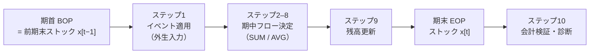

# シナリオ時間軸の意味論

> 関連 Issue: #168（本書）・#125（ロードマップ）
> 前提: [分析契約](../models/capex_credit_cycle_analysis_contract.md)（四半期・分析ホライズン・ショックの `timing` / `shape` / `duration`）・[ストック・フロー会計表](../models/capex_credit_cycle_stock_flow.md)（時点規約・期内処理順序）・[部門境界と変数定義](../models/capex_credit_cycle_sectors_variables.md)（`EOP` / `SUM` / `AVG` / `BOP` の時点基準）
> 対になる設計: [マクロイベント変換契約](macro_event_contract.md)（概念階層・属性・イベント型マッピング・競合規則）
> 決定記録: [ADR 0010](../adr/0010-macro-event-scenario-contract.md)
> 後続設計: #169（動学方程式）・#170（[観測方程式・識別戦略・検証方針](../models/capex_credit_cycle_empirical_strategy.md)）・#171（統合）

---

## メタ情報

| 項目 | 内容 |
|---|---|
| **対象** | 四半期モデル（`CapexCreditCycleModel` 相当、未実装。以下 `CCC`）におけるシナリオ・イベントの時間軸 |
| **ステータス** | 意味論のみ確定。Julia 型・時刻ユーティリティの実装は未着手（#171） |
| **time semantics version** | `scenario-time-semantics/1.0.0` |
| **上位契約** | `capex-credit-cycle-contract/1.0.0`・`capex-credit-cycle-accounting/1.0.0`・`capex-credit-cycle-vars/1.0.0`・`macro-event-contract/1.0.0` |
| **基準経済・頻度** | 米国・四半期（`Δt = 0.25` 年） |

> **LLM向け要約**: 本書は四半期モデルの内部時刻を**整数インデックス `t` + 起点四半期 `period_zero`** で表し、
> 暦日付を持つイベントを `t` へ写す規則を固定する。**すべてのイベントは期首（[会計表](../models/capex_credit_cycle_stock_flow.md) §2.5 の
> 期内処理順序ステップ 1）に適用され、期中適用・期内按分を行わない**（§3）。日付から適用四半期への割当は
> `:same_quarter` / `:next_quarter` / `:cutoff` の 3 規則に限り、`:cutoff` の既定境界は当該四半期の第 2 月末日とする（§4.3）。
> 公表日 `announced_at`・経済的有効日 `effective_from`・判明時刻 `known_at` を別属性として区別し、
> 過去データの改定では `period`（対象期）と `known_at`（判明時刻）を混同しない（§6）。持続・減衰の時間形状は
> 6 種の**離散式として明示**し、後続 Issue が関数形を再判断しないようにする（§5）。

---

## 1. 本書の位置づけ

[マクロイベント変換契約](macro_event_contract.md)が「観測イベントをどの層でどのモデル変数へ写すか」を固定した。本書はその**時間軸側**、すなわち「四半期モデルの内部時刻をどう表し、暦日付のイベントをどの期へ割り当て、どの形状で持続させ、過去データの改定をどう扱うか」を固定する。

| 本書が固定するもの | 本書が固定しないもの |
|---|---|
| 内部時刻表現と暦四半期との対応（§2） | Julia の日付型・ユーティリティ関数名（#171） |
| 期首・期中・期末の更新順と、イベント適用の位置（§3） | 各ステップ内の方程式（#169） |
| 日付 → 適用四半期の割当規則（§4） | 個別イベントの実データ上の日付（#170） |
| 持続・減衰の時間形状の離散定義（§5） | 形状パラメータの較正値（#170） |
| `period` と `known_at` の区別・as-of 規則（§6） | vintage 付きデータ取得の実装（#170） |
| 履歴再生の時間軸契約（§7） | 標本期間の確定（#170） |

**規律（契約）**

1. **新たな時点を設けない**。期首は前期末と同一時点である（[会計表](../models/capex_credit_cycle_stock_flow.md) §2.4）。
2. **期内の暦日を保持しない**。イベントの暦日は適用四半期の決定にのみ用い、モデル内部へ持ち込まない（§3）。
3. **時間形状を後続 Issue が再定義しない**。§5 の 6 種以外の形状を使う場合は本書を改訂する。
4. **確定値（最新 vintage）で行った分析を「その時点で判断できた」と述べない**（§6.4）。

---

## 2. 内部時刻表現

### 2.1 モデル期インデックス

| 記号 | 定義 |
|---|---|
| `t` | モデル期インデックス（整数）。1 期 = 1 四半期 = `Δt = 0.25` 年 |
| `t = 0` | ショック適用の起点（[分析契約](../models/capex_credit_cycle_analysis_contract.md) §2.1） |
| `t = -8 … -1` | 助走区間（8 四半期）。baseline からの乖離が生じてはならない |
| `t = 0 … 19` | 評価区間（20 四半期）。判定問題・診断はこの区間の出力に対して評価する |
| `period_zero` † | `t = 0` に対応する暦四半期（例 `2026Q1`）。純粋な理論シナリオでは省略可、日付付きイベントを含む場合は**必須** |

**契約**:

- モデル内部は `t` のみを用いる。`SimulationResult.variables` は `Vector{Float64}` であり暦情報を持たないため、暦との対応は `metadata["period_zero"]`† と `metadata["period_labels"]`†（`["2024Q1", …]` の形式）に置く（[責務境界](../models/capex_credit_cycle_model_boundaries.md) §5.7 の `metadata` 予約キー方式を継承）。
- 系列の添字順序は `t = -8` から昇順とし、`t = 0` の位置を `metadata["shock_origin_index"]`† に記録する。系列の先頭が `t = 0` であると仮定した比較・可視化を行わない。

### 2.2 暦四半期の表現

| 項目 | 規約 |
|---|---|
| 四半期の識別 | `(year, quarter ∈ 1:4)`。表示形式は `"YYYYQn"`（例 `"2026Q1"`） |
| 暦区間 | `Q1` = 1/1–3/31、`Q2` = 4/1–6/30、`Q3` = 7/1–9/30、`Q4` = 10/1–12/31（暦年基準） |
| 会計年度 | **用いない**。企業の会計年度四半期は暦四半期へ写してから扱う（§4.5） |
| タイムゾーン | 日付は UTC 基準の暦日として扱う（[ADR 0008](../adr/0008-real-rate-model-artifact-export.md) の UTC 固定方針を継承） |
| インデックス変換 | `t = 4·(year − year₀) + (quarter − quarter₀)`（`(year₀, quarter₀)` は `period_zero`） |

### 2.3 他モデルの時間表現との関係

| モデル | 時間表現 | `CCC` との対応 |
|---|---|---|
| `Keen` | 連続時間 ODE（年） | `Δt = 0.25` で四半期へ整列する既存契約（[ADR 0004](../adr/0004-keen-empirical-calibration-strategy.md)）を継承。ただし**同一時間軸に並べることは比較可能性を意味しない**（[責務境界](../models/capex_credit_cycle_model_boundaries.md) §5.4 の `frequency_difference` 記録義務） |
| `SIM` | 離散期（暦単位を持たない） | 暦との対応を持たないため、`period_zero` を共有しない |
| `NK` | 静学解に基づく四半期 IRF | IRF の期インデックスは「ショックからの経過期」であり、`CCC` の `t` と原点は一致するが `measure` が異なる（対数偏差 vs 水準） |

---

## 3. 期首・期中・期末とイベント適用の位置

### 3.1 期内処理順序

[会計表](../models/capex_credit_cycle_stock_flow.md) §2.5 が固定した 10 ステップを、時間軸の観点から再掲する。**本書はこの順序を変更しない**。

| # | ステップ | 参照する時点 |
|---|---|---|
| 1 | **外生入力の適用（イベント適用はここ）** | — |
| 2 | 金融条件の決定 | 期首ストック・前期内生値 |
| 3 | 計画 | 期首 `cap_s`・`plan_carry_s1` |
| 4 | 資金制約と実行 | 期首 `cash_s`・`debt_s`、前期 `ocf_s` |
| 5 | 受注配分 | 当期 `capex_exec_s1`・`invest_s`、前期 `y_s5` |
| 6 | 生産・出荷 | 期首 `cap_s`・`backlog_s`・`inv_s` |
| 7 | 所得・支出 | 当期 `y_s`・`capex_exec_s1` |
| 8 | 収益・分配 | 当期フロー、期首 `debt_s` |
| 9 | 残高更新 | 期首ストック + 当期フロー |
| 10 | 会計検証・診断 | 期首・期末・当期フロー |



### 3.2 イベント適用位置の決定

**決定: すべてのイベントは適用四半期の期首（ステップ 1）に適用する。期中適用・期内按分を行わない。**

| 検討した方式 | 内容 | 採否 |
|---|---|---|
| 期首一括適用 | 暦日をどの四半期の期首へ割り当てるかだけを決め、期内では位置を持たない | **採用** |
| 期中適用 | ステップ 2–8 の途中で外生値を差し替える | 不採用。ステップ 4 の資金制約が事前制約として働く条件（[会計表](../models/capex_credit_cycle_stock_flow.md) §2.5 の契約）が崩れ、同一四半期でも適用位置により結果が変わる |
| 期内按分（pro-rata） | 四半期の残り日数に比例して magnitude を縮小 | 不採用。四半期フローは `SUM`、レートは `AVG` であり、按分の意味が変数の時点基準ごとに異なる。按分係数が観測に基づかない自由度になる |

**契約**:

- 期首一括適用により、**「期中のどこで起きたか」は適用四半期の決定（§4.3）へ完全に還元される**。イベントの暦日はモデル内部へ入らない。
- 按分を行わないため、四半期の末日に公表されたイベントも、その四半期へ割り当てられた場合は当該四半期の全期間に作用する。この粗さは §4.4 の割当規則（`:cutoff`）と §4.6 の感応度併記で補う。
- ステップ 1 より前に外生入力が確定していることを要件とする。ステップ 2 以降の内生値へ依存する外生入力（例: 「産出が閾値を下回ったら緩和する」）は**イベントではなく政策反応関数**であり、初期MVPの範囲外（因果グラフ `X05` は `EXT`）。

---

## 4. 日付から適用四半期への割当

### 4.1 3 つの日付の区別

| 属性 | 意味 | 例 |
|---|---|---|
| `announced_at` | 公表日。情報が市場・分析者へ到達した日 | 決算発表日、FOMC 声明日、格付発表日 |
| `effective_from` | **経済的効力の開始日**。事象が経済主体の意思決定・価格へ作用し始める日 | 新ガイダンスが適用される会計期間の開始日、政策金利の適用開始日 |
| `known_at` | 分析系（本リポジトリ）が知り得た時刻。履歴再生の as-of 判定に用いる | データ取得時刻、記事の収集時刻 |

**契約**:

- 適用四半期の決定に用いるのは **`effective_from` のみ**である。`announced_at` は導出（§4.2）と監査に、`known_at` は as-of 判定（§6）に用いる。
- 3 つが一致することは多いが、一致を前提にした実装を行わない。

### 4.2 `effective_from` が未指定のときの導出

`effective_from` は `L3`（Scenario Assumption）で必須である（[イベント変換契約](macro_event_contract.md) §3.1）。`L1`・`L2` に無い場合、次の既定オフセットで `announced_at` から導出し、`effective_from_source = :derived`† と警告 `timing_derived` を記録する。

| `event_type` | 既定の導出 | 根拠 |
|---|---|---|
| `:DemandOutlookRevision` | `effective_from = announced_at` | 期待は公表時点で改定される |
| `:CapexGuidanceRevision` | `effective_from = announced_at` | 計画の改定は公表時点で意思決定済みとみなす |
| `:OrderCancellation` | `effective_from = announced_at` | 取消は公表時点で発生済みとみなす |
| `:PriceOrMarginShock` | `effective_from = announced_at` | 価格改定日が明示されない限り公表日を用いる |
| `:CreditSpreadShock` | `effective_from = observed_at` | 市場価格の変化は観測日そのものが効力日 |
| `:RefinancingOrRatingEvent` | `effective_from = announced_at` | 格付変更は公表時点で市場価格へ作用する |
| `:PolicyRateChange` | `effective_from` = 決定の適用開始日。不明なら `announced_at` | 政策金利は決定日と適用開始日がずれうる |

**契約**: 導出した `effective_from` を観測値として扱わない。`timing_derived` を含むイベントが結果を左右する場合、§4.6 の感応度併記の対象とする。

### 4.3 適用四半期の決定規則

```
q        = quarter_of(effective_from)          … effective_from が属する暦四半期
t_raw    = index_of(q)                          … §2.2 のインデックス変換
t_apply  = t_raw + offset(rule, effective_from, q)

offset(:same_quarter, ·, ·) = 0
offset(:next_quarter, ·, ·) = 1
offset(:cutoff, d, q)       = 0  if d ≤ cutoff_date(q)
                            = 1  otherwise

cutoff_date(q) = q の第 2 月の末日（既定。設定値として外部化する）
```

| 規則 | 意味 | 適用するイベントの性質 |
|---|---|---|
| `:same_quarter` | `effective_from` が属する四半期へ適用 | 市場価格・制度的に即時作用するもの（スプレッド・政策金利・確定した取消） |
| `:next_quarter` | 翌四半期へ適用 | 効力の発生に明示的な準備期間があるもの（初期MVPでは既定として用いない） |
| `:cutoff` | 四半期の前 2/3 までなら当期、それ以降は翌期 | 期首の意思決定（計画・期待）に作用するもの |

**`:cutoff` を置く根拠**: 計画 CAPEX・期待は[会計表](../models/capex_credit_cycle_stock_flow.md) §2.5 のステップ 3 で**期首に決まる**。四半期の終盤に公表された情報は、その四半期の計画へは反映されず翌期の計画から反映される、という構図を離散モデルで表現するには、四半期内の位置に応じた割当が必要になる。境界を第 2 月末日に置くのは、四半期の 2/3 が経過した後の情報は当期の意思決定へ間に合わないという**暫定既定値**であり、理論から導かれた値ではない。

**契約**:

1. `cutoff_date` は**モデル方程式へハードコードしない**。時間軸設定として外部化し、識別子とバージョンを出力へ含める（[分析契約](../models/capex_credit_cycle_analysis_contract.md) §4.4 の閾値外部化と同型）。
2. 規則は上記 3 種に限る。四半期内の連続的な重み付け（按分）を導入しない（§3.2）。
3. `t_apply` が分析ホライズン外（`t < -8` または `t > 19`）になる場合、適用せず `out_of_horizon` を記録する（[イベント変換契約](macro_event_contract.md) §5.4）。無音で切り捨てない。

### 4.4 イベント型別の既定規則

| `event_type` | 既定規則 | 理由 |
|---|---|---|
| `:DemandOutlookRevision` | `:cutoff` | 期待は計画（ステップ 3）へ作用する |
| `:CapexGuidanceRevision` | `:cutoff` | 同上 |
| `:OrderCancellation` | `:same_quarter` | 取消は既に発生した事実であり、計画の改定を待たない |
| `:PriceOrMarginShock` | `:cutoff` | 価格は `AVG` であり、四半期後半の改定は当期平均への寄与が小さい |
| `:CreditSpreadShock` | `:same_quarter` | 市場価格は即時に金融条件（ステップ 2）へ入る |
| `:RefinancingOrRatingEvent` | `:same_quarter` | 同上 |
| `:PolicyRateChange` | `:same_quarter` | 政策金利は `AVG` だが、金融条件（ステップ 2）への作用は当期から始まる |

**契約**: イベント個別に規則を上書きしてよいが、上書きしたことを `timing_rule_override`† として記録する。既定と異なる規則を無記録で用いない。

### 4.5 会計年度・非暦四半期の扱い

企業開示は会計年度四半期（例: 6 月決算企業の `FY2026 Q1` = 暦 `2025Q3`）を用いることがある。

| 状況 | 規則 |
|---|---|
| 会計年度四半期のガイダンス | **暦四半期へ写してから** `effective_from` を確定する。写像の根拠（会計年度末月）を記録する |
| 年度ガイダンス（通期） | 四半期へ按分する根拠が無い場合は**適用しない**（[イベント変換契約](macro_event_contract.md) §4.4 の適用不能条件）。按分する場合は按分方式を必須 metadata に記録 |
| 月次・日次の市場系列 | 四半期平均（`AVG`）へ集約してから用いる（[変数定義](../models/capex_credit_cycle_sectors_variables.md) §5.1）。集約方式を記録 |

### 4.6 割当の感応性と併記義務

| 状況 | 検出 | 義務 |
|---|---|---|
| `effective_from` が `cutoff_date` の前後 2 週間以内 | `timing_sensitive`† | 適用四半期を ±1 期ずらした結果を併記する |
| `effective_from` が `:derived`（§4.2） | `timing_derived` | 導出規則を明示し、同上の併記対象とする |
| 同一シナリオ内で複数イベントが cutoff 近傍 | 両方 | ずらしの組み合わせではなく、**全イベントを一律に ±1 期ずらした 2 ケース**を併記する（組合せ爆発を避ける） |

**契約**: 併記なしに単一の割当結果のみを提示しない。時点差が結論を変える場合、それは結果の頑健性の問題であり、隠さずに報告する（[分析契約](../models/capex_credit_cycle_analysis_contract.md) §4.4 と同型の義務）。

---

## 5. 持続・減衰の時間形状

### 5.1 記号

| 記号 | 意味 |
|---|---|
| `a_t` | 期 `t` におけるショック値（`magnitude` と同一単位） |
| `t₀` | 適用開始期（`t_apply`、§4.3） |
| `m` | `magnitude` |
| `D` | `duration`（四半期数）。欠測は恒久を意味する |
| `h` | `half_life`（四半期数）。`AR1_decay` でのみ用いる |
| `t₁` | `effective_until` に対応する期。欠測は打ち切りなし |

### 5.2 形状の離散定義

| `shape` | 定義（`t ≥ t₀`。`t < t₀` では `a_t = 0`） | 用途 |
|---|---|---|
| `pulse` | `a_t = m` if `t = t₀`、else `0` | 単期の一過性事象 |
| `step` | `a_t = m` if `t₀ ≤ t < t₀ + D`、else `0`（`D` 欠測なら恒久） | 水準の持続的シフト（`SH-EASING`） |
| `ramp` | `a_t = m · (t − t₀ + 1)/D_up` if `t < t₀ + D_up`、`a_t = m` otherwise | 段階的に効いていく事象 |
| `step_then_ramp` | `a_t = m` if `t₀ ≤ t < t₀ + D_hold`；`a_t = m · (1 − (t − t₀ − D_hold + 1)/D_down)` if `t₀ + D_hold ≤ t < t₀ + D_hold + D_down`；else `0` | 一時的な削減が段階的に解消（`SH-CAPEX`: `D_hold = 4`・`D_down = 4`） |
| `AR1_decay` | `a_t = m · ρ^(t − t₀)`、`ρ = 0.5^(1/h)` | 減衰する恒久ショック（`SH-EXP`: `h = 6`、`SH-CREDIT`: `h = 4`） |
| `path` | `a_t = m_k`（明示的に与えた系列） | 実データ由来の外生パス（履歴再生） |

**打ち切り**: `t₁` が指定されている場合、`t > t₁` では `a_t = 0` とする（形状によらず適用）。

**契約**:

1. 形状は上記 6 種に限る。追加する場合は本書を改訂する（§1 の規律 3）。
2. `AR1_decay` の `ρ` は `half_life` から一意に決まる。`ρ` を直接指定しない（単位の解釈が半減期より曖昧なため）。
3. **打ち切りと減衰を混同しない**。`AR1_decay` は恒久ショックの減衰であり、`effective_until` による打ち切りとは別の指定である。両方を指定してよいが、両方が記録される。
4. `path` は `magnitude_source` が `:observed` または `:derived` の場合のみ許可する。`:assumed_default` の `path` を作らない（自由度が大きすぎ、感応度の定義ができない）。

### 5.3 モデル変数への反映式

`x_t^{base}` を baseline 値、`a_t` を §5.2 の合成済みショック値（[イベント変換契約](macro_event_contract.md) §5.2 で合成済み）とする。

| `application_mode` | 反映式 | 単位 |
|---|---|---|
| `:multiplicative` | `x_t = x_t^{base} · (1 + a_t/100)` | `a_t` は `"%"` |
| `:additive` | `x_t = x_t^{base} + a_t` | `a_t` は `"bp"` / `"%pt"` / 絶対額 |
| `:absolute` | `x_t = a_t` | 変数と同一単位 |

**契約**:

- `spread_shock_ex` は bp、`policy_rate` は年率 % である。**bp と %pt の換算（`100bp = 1%pt`）を暗黙に行わない**。単位はイベント側で明示し、換算した場合は換算式を記録する。
- 四半期モデルにおける年率金利の期間換算（年率 % → 四半期）は #169 の責務であり、イベント層では年率のまま渡す。イベント層で四半期換算しない。

---

## 6. 改定（revision）と vintage

### 6.1 2 つの時間軸

| 軸 | 意味 | 例 |
|---|---|---|
| `period` | 観測値が**どの期を対象とするか** | 2025Q2 の実質 GDP |
| `known_at` | その値が**いつ判明したか**（vintage） | 2025-07-30 の速報値、2025-08-28 の改定値 |

**契約**:

- 同一 `period` の複数 vintage は**別レコード**として保持する。上書きしない。
- 系列の値を参照するときは、必ず `(period, known_at)` の 2 軸で特定する。`period` のみで特定した参照を「その時点のデータ」と述べない。

### 6.2 as-of 規則

履歴再生・backtest では、実行モードを 2 種に分け、**どちらを用いたかを必ず記録する**。

| モード | 使用するデータ | 用途 | 記録 |
|---|---|---|---|
| `:as_of` | `known_at ≤ as_of_date` を満たす最新 vintage | 「その時点で判断できたか」を問う分析 | `metadata["data_as_of"]`† |
| `:latest` | 最新 vintage（確定値） | モデル構造の妥当性検証・較正 | `metadata["data_vintage"] = "latest"`† |

**契約**:

- `:latest` で得た結果を「その時点で予測できた」と述べない（§6.4）。
- `:as_of` モードでは**イベントにも同じ規則を適用する**。`known_at > as_of_date` のイベントをシナリオに含めない（[イベント変換契約](macro_event_contract.md) §3.1 の `known_at` はこのために必須である）。
- 混在させない。同一実行内でデータは `:as_of`、イベントは `:latest` という組み合わせを許可しない。

### 6.3 現行データ層との差分

`DataSeries`（[DataSeries / MacroDataset 利用ガイド](../data/data_series_guide.md)）は `dates` / `values` / `metadata` を持つが、**vintage 軸（`known_at`）を型として持たない**。

| 項目 | 現状 | 本書の要求 |
|---|---|---|
| vintage の保持 | 型に無い | `metadata` に `known_at` / `vintage_id` を保持するか、vintage ごとに別 `DataSeries` として取得するかを #170 が決める |
| 改定の追跡 | 無い | 同一系列の複数 vintage を並べる構造が必要 |
| 既存モデルへの影響 | — | **`DataSeries` 型を変更しない**。既存モデル・前処理・比較 API への非破壊を優先する（[ADR 0007](../adr/0007-sfc-integration-contract.md) の非破壊方針を継承） |

**契約**: 本書は要求のみを固定し、実装方式は #170 が決める。vintage を扱えないまま `:as_of` モードを実装したと申告しない。

### 6.4 改定に関する説明上の禁止事項

1. 最新 vintage（確定値）で較正・検証した結果を「その時点で判断できた」と述べない。
2. 改定によって過去の診断ラベルが変わった場合、**変わった事実を報告する**。最新 vintage での結果のみを提示しない。
3. イベント自体の改定（企業がガイダンスを再改定した等）は、旧イベントを削除せず `supersedes` で連結する（[イベント変換契約](macro_event_contract.md) §5.5）。改定後の値だけを提示しない。

---

## 7. 履歴再生の時間軸契約

| 項目 | 規約 |
|---|---|
| `period_zero` の決定 | 履歴再生では、分析対象の起点事象が属する暦四半期を `period_zero` とする。決定根拠を記録する |
| 助走区間 | `period_zero` の 8 四半期前までのデータが必要（[分析契約](../models/capex_credit_cycle_analysis_contract.md) §2.1） |
| 評価区間 | `period_zero` から 20 四半期。区間末が最新データを超える場合、超過分は評価対象外として明示する |
| 標本期間 | 必須系列の共通利用可能期間から決定論的に算出する（#170 が方式を定める） |
| 頻度整列 | 月次・日次系列は四半期へ集約してから用いる（§4.5） |

**契約**: 履歴再生の結果と公式景気後退判定の時期的一致は、**記述的に報告するにとどめる**。一致率を較正の目的関数にしない（[分析契約](../models/capex_credit_cycle_analysis_contract.md) §4.1）。

---

## 8. 再現性への含意

[イベント変換契約](macro_event_contract.md) §6.5 の再現契約に、本書が加える要素は次のとおり。

| 項目 | 内容 |
|---|---|
| `period_zero` | 暦との対応。日付付きイベントを含むシナリオでは再現キーに含める |
| `timing_rule_set`† | §4.3 の割当規則と `cutoff_date` の設定値・バージョン |
| `data_as_of` / `data_vintage` | §6.2 の実行モード |
| `shape` パラメータ | §5.2 の形状と `D` / `h` / `D_hold` / `D_down` |

**契約**: 上記が一致すれば、同一環境で同一の適用四半期・同一の外生パスが生成されることを要件とする。`cutoff_date` の既定値を変更した場合は `timing_rule_set` のバージョンを上げる（既定値の変更が無記録で結果を変えることを防ぐ）。

---

## 9. 限界

1. **四半期粒度は、期内のタイミングの差を表現しない**。同一四半期に割り当てられた 2 つのイベントは、暦日が 2 か月離れていても同時に扱われる。
2. **`cutoff_date` の既定（第 2 月末日）は理論から導かれていない**。暫定既定値であり、感応度の併記（§4.6）が必須なのはこのためである。
3. **按分を行わないため、四半期末のイベントの効果が過大に出る場合がある**。`:cutoff` により多くは翌期へ送られるが、`:same_quarter` を既定とするイベント型（スプレッド・政策金利）ではこの粗さが残る。
4. **`period_zero` を持たないシナリオでは日付付きイベントを扱えない**。理論シナリオと履歴再生で扱いが分かれることを実装が明示する必要がある。
5. **vintage を型として扱えない**（§6.3）。`:as_of` モードの実効性は #170 の実装に依存する。
6. **時間形状 6 種は現実のショックの形状を近似したものである**。実際の CAPEX 削減が `step_then_ramp` に従う保証はない。形状の妥当性は #170 の履歴再生で初めて評価される。
7. **本書は実装・実データによる検証を経ていない**。§4 の既定規則と §5 の既定パラメータは設計上の判断であり、較正結果により変更されうる。

LLM による説明生成時は、上記を [llm_safety.md](../llm_safety.md) の必須記載事項と併せて提示する。

---

## 10. 対象外

| 対象外 | 扱い |
|---|---|
| Julia の日付型・時刻ユーティリティの実装 | #171 |
| vintage 付きデータ取得の実装 | #170（§6.3 は要求のみ） |
| 形状パラメータ・`cutoff_date` の較正 | #170 |
| 期中適用・期内按分 | 行わない（§3.2） |
| 日次・月次モデルへの拡張 | 行わない（基準頻度は四半期） |
| 政策反応関数（内生の時点決定） | 因果グラフ `X05`（`EXT`） |
| イベント属性・概念階層・合成規則 | [マクロイベント変換契約](macro_event_contract.md) |

---

## 11. 改訂履歴

| version | 日付 | 変更 |
|---|---|---|
| `scenario-time-semantics/1.0.0` | 2026-07-30 | 初版（#168）。内部時刻表現（整数 `t` + `period_zero`）と暦四半期の対応・イベント適用を期首（期内処理順序ステップ 1）へ統一し期中適用/按分を行わない決定・`announced_at` / `effective_from` / `known_at` の区別と導出規則・適用四半期の割当規則 3 種と `:cutoff` の既定境界・イベント型別の既定・割当の感応度併記義務・持続/減衰の時間形状 6 種の離散定義と反映式・`period` と `known_at` の 2 軸と as-of 規則・`DataSeries` に vintage 軸が無いことの明示・履歴再生の時間軸契約・再現キーへの追加要素を固定 |
