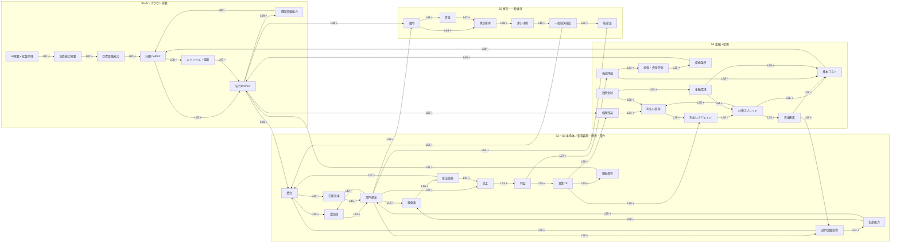

# 部門別CAPEX・信用循環モデル 因果グラフ・増幅/遮断仮説

> 関連 Issue: #164（本書）・#163（分析契約）・#125（ロードマップ）
> 前提: [部門別CAPEX・信用循環モデル 分析契約](capex_credit_cycle_analysis_contract.md)（基準ユースケース・判定問題 Q1–Q5・シナリオ `Sc0`–`Sc4`・診断ラベル）
> 後続設計: #165（[部門境界と変数定義](capex_credit_cycle_sectors_variables.md)）・#166（会計表）・#167（責務境界）・#168（イベント変換）・#169（動学方程式）・#170（観測・検証）・#171（統合）

---

## メタ情報

| 項目 | 内容 |
|---|---|
| **対象** | 部門別CAPEX・信用循環モデル（`CapexCreditCycleModel` 相当、未実装） |
| **ステータス** | 因果契約のみ確定。方程式・パラメータ値・実装は未着手 |
| **graph version** | `capex-credit-cycle-graph/1.0.0` |
| **上位契約** | `capex-credit-cycle-contract/1.0.0`（[分析契約](capex_credit_cycle_analysis_contract.md)）。本書は契約 §2.2 起点事象・§2.3 部門・§3 判定問題を入力とする |

> **LLM向け要約**: 本書は「AI 需要・収益期待の下方修正が総産出へ至る経路」を有向グラフとして固定する。
> ノード 36 個・エッジ 59 本を定義し、各エッジに**型**（行動 / 会計 / 定義 / 制度）・**符号**・**時間差**・
> **関数形候補**・**観測可能性**・**根拠**・**逆因果/交絡の注意**・**実装優先度**（`MVP` / `EXT`）を与える。
> 増幅ループ 4 本（`R1`–`R4`）と減衰・遮断経路 7 本（`B1`–`B7`）を名前付きで登録し、
> 「産業内調整」と「広範な景気悪化」の分岐を**ループ利得が 1 を跨ぐ状態条件**として定式化する。
> 株式評価から総産出・消費への直接エッジは置かない。媒介は資本コスト・担保/借換条件・経営者期待の 3 経路のみ（§6）。
> 本書は方程式・パラメータ値を定めず、実データによる因果推論も行わない（§9）。

---

## 1. 本書の位置づけと グラフ規律

### 1.1 位置づけ

[分析契約](capex_credit_cycle_analysis_contract.md)は「何を問うか」（判定問題 Q1–Q5）と「何を比較するか」（`Sc0`–`Sc4`）を固定した。
本書はその間を埋める**因果契約**であり、後続 Issue が因果関係を追加解釈することなく部門・状態変数・会計表・方程式へ落とし込める粒度で経路を固定する。

| 本書が固定するもの | 本書が固定しないもの |
|---|---|
| ノード集合と部門帰属（§2） | 状態/制御/外生/観測の分類（#165） |
| エッジの存在・型・符号・時間差・関数形候補（§3） | 関数形の確定・パラメータ値（#169・#170） |
| 増幅ループと減衰・遮断経路の登録（§4・§5） | ループ利得の数値評価（#169・#170） |
| 株式評価の媒介経路の限定（§6） | 資産効果の将来実装可否（#125 後段） |
| 分岐条件候補と診断ラベルへの対応（§7） | 閾値の較正（#170） |
| 実装優先度 `MVP` / `EXT`（§3） | 実装配置・API 名（#171） |

### 1.2 グラフ規律（契約）

1. **媒介なしのエッジを置かない**。特に資産価格・期待・センチメントから実体変数への直接エッジを禁止する。必ず資金調達・担保・所得・受注のいずれかの経路を介す（§6）。
2. **相関のみに基づくエッジを置かない**。各エッジは理論・会計・制度のいずれかの根拠を §3 の「根拠」に記載する。記載できないエッジはグラフに含めない。
3. **会計恒等式由来のエッジ（`会計` / `定義`）と行動方程式由来のエッジ（`行動`）を区別する**。前者は #166 のストック・フロー会計表へ、後者は #169 の行動方程式へ渡す。両者を同じ「推定対象」として扱わない。
4. **循環を許容するが、無名の循環を残さない**。すべての有向閉路は §4（増幅）または §5（減衰）に名前付きループとして登録する。
5. **逆因果が疑われるエッジを双方向にしない**。時間差（`遅れ ≥ 1`）で識別できる形にするか、潜在状態を介す。同時決定が避けられない場合は §3 の「注意」に明記し、#170 の識別可能性の検討対象とする。
6. **`EXT` エッジを初期MVPの実装に含めない**。含める必要が生じた場合は本書を改訂してから行う（§10）。
7. **エッジの追加・符号の変更は本書の改訂を伴う**。後続 Issue の設計文書で暗黙に追加しない。

### 1.3 表記

| 記法 | 意味 |
|---|---|
| `s ∈ {S2, S3}` | 半導体設計・製造（`S2`）と製造装置・建設・電力（`S3`）に共通のエッジ。両部門へ同一構造で適用する |
| 型 `行動` | 経済主体の意思決定に由来する関係。推定・較正の対象 |
| 型 `会計` | ストック・フローの残高更新式に由来する関係。推定対象にしない |
| 型 `定義` | 変数の定義式（比率・集計）。推定対象にしない |
| 型 `制度` | 契約・規制・技術的制約に由来する関係（建設リードタイム・LTV 制約等） |
| 符号 `+` / `−` | 原因ノードが**増加**したとき結果ノードが増加（`+`）／減少（`−`） |
| 遅れ | 四半期数。`0` = 同一四半期、`1` = 1 四半期後、`2–4` = 2〜4 四半期に分布 |
| 観測 `O` / `P` / `L` | 直接観測可能 / proxy 観測 / 潜在状態（直接の公表系列がない） |
| 実装 `MVP` / `EXT` | 初期MVPで実装 / 将来拡張 |

**符号の読み方の注意**: ノードによっては値の増加が「悪化」を意味する（`SPREAD`・`COST_CAPITAL`・`INT_BURDEN`・`CANCEL`・`INV`）。符号は常に**値の増減**で定義し、良し悪しでは定義しない。各ノードの「増加の意味」は §2 の表に記載する。

---

## 2. ノード

部門 ID は[分析契約](capex_credit_cycle_analysis_contract.md) §2.3 に従う（`S1` AI・クラウド需要 / `S2` 半導体設計・製造 / `S3` 製造装置・建設・電力 / `S4` 金融・信用 / `S5` 家計・一般経済）。

### 2.1 S1: AI・クラウド需要部門

| ID | 名称 | 増加の意味 | 観測 | 起点事象 |
|---|---|---|---|---|
| `AI_EXP` | AI サービス需要・収益期待 | 期待の上方 | `L` | `E1` の適用先 |
| `COMPUTE_DEM` | hyperscaler の計算能力需要 | 需要増 | `P` | — |
| `TARGET_CAP` | 目標設備能力（計算資源・データセンター） | 目標増 | `L` | — |
| `CAP_S1` | 既存設備能力 | 能力増 | `P` | — |
| `CAPEX_PLAN` | 計画 CAPEX | 計画増 | `P` | `E2` の適用先 |
| `CAPEX_EXEC` | 実行 CAPEX | 実行増 | `O` | — |
| `CANCEL` | キャンセル・延期率 | **悪化** | `L` | — |

### 2.2 S2 / S3: 半導体・製造装置・建設・電力

`s ∈ {S2, S3}` で共通のノード構造をとる。

| ID | 名称 | 増加の意味 | 観測 |
|---|---|---|---|
| `ORDER_s` | 受注 | 受注増 | `O`（`S2`）/ `P`（`S3`） |
| `BACKLOG_s` | 受注残 | 残高増 | `P` |
| `INV_s` | 在庫（在庫比率） | **悪化**（積み上がり） | `O` |
| `CAP_s` | 生産能力 | 能力増 | `P` |
| `UTIL_s` | 稼働率 | 稼働増 | `O` |
| `PRICE_s` | 産出価格 | 価格上昇 | `O` |
| `Y_s` | 部門産出 | 産出増 | `O` |
| `SALES_s` | 売上 | 売上増 | `O` |
| `PROFIT_s` | 利益 | 利益増 | `O` |
| `OCF_s` | 営業キャッシュフロー | CF 増 | `O` |
| `CASH_s` | 現金・自己資金保有 | 手元流動性増 | `P` |
| `INVEST_s` | 部門自身の設備投資 | 投資増 | `O` |

### 2.3 S4: 金融・信用部門

| ID | 名称 | 増加の意味 | 観測 |
|---|---|---|---|
| `EQUITY_VAL` | 株式評価 | 評価上昇 | `O` |
| `COLLATERAL` | 担保・資産評価額 | 評価上昇 | `P` |
| `SPREAD` | 社債スプレッド | **悪化**（拡大） | `O` |
| `ROLLOVER` | 借換（ロールオーバー）条件 | 条件改善 | `P` |
| `LEND_STANCE` | 銀行貸出態度 | 緩和方向 | `O`（SLOOS 等） |
| `DEBT_s` | 部門別債務残高 | 残高増 | `O` |
| `INT_BURDEN_s` | 利払い負担 | **悪化**（増加） | `P` |
| `COVERAGE_s` | 利払いカバレッジ比率 | 余裕拡大 | `P` |
| `COST_CAPITAL_s` | 資本コスト | **悪化**（上昇） | `L` |
| `POLICY_RATE` | 政策金利 | 引き上げ | `O` |
| `FIN_COND` | 金融環境（金融条件） | **悪化**（引き締め方向を正とする） | `P` |

### 2.4 S5: 家計・一般経済

| ID | 名称 | 増加の意味 | 観測 |
|---|---|---|---|
| `EMP` | 雇用（部門別・合計） | 雇用増 | `O` |
| `WAGE` | 賃金 | 賃金上昇 | `O` |
| `HH_INCOME` | 家計所得（実質可処分所得） | 所得増 | `O` |
| `CONS` | 家計消費 | 消費増 | `O` |
| `Y_S5` | 一般経済部門の産出 | 産出増 | `P` |
| `Y_TOT` | 総産出 | 産出増 | `O` |

**契約**: `L`（潜在状態）のノードは、単独では検証に使えない。`AI_EXP`・`TARGET_CAP`・`CANCEL`・`COST_CAPITAL_s` は観測系列を持たず、#170 で proxy と観測方程式を定める。潜在ノードの値そのものを分析結果として提示しない。

---

## 3. 因果グラフ

### 3.1 全体図



> 図では `S2`・`S3` を 1 組のノードとして描いている。実際には `s ∈ {S2, S3}` の各部門に同一構造が存在し、
> `L09`・`L19`・`L50` の受注エッジは部門別の需要構成比で分配される。`EXT` エッジ（§3.8）は図に含めていない。

### 3.2 ブロック A: 期待 → 計画 → 実行 CAPEX（`S1`）

| ID | 原因 → 結果 | 型 | 符号 | 遅れ | 関数形候補 | 観測 | 実装 |
|---|---|---|---|---|---|---|---|
| `L01` | `AI_EXP` → `COMPUTE_DEM` | 行動 | `+` | 0 | linear | `L`→`P` | MVP |
| `L02` | `COMPUTE_DEM` → `TARGET_CAP` | 行動 | `+` | 0 | linear（資本係数） | `P`→`L` | MVP |
| `L03` | `TARGET_CAP` → `CAPEX_PLAN` | 行動 | `+` | 1 | 部分調整（linear、調整速度 `α`） | `L`→`P` | MVP |
| `L04` | `CAP_S1` → `CAPEX_PLAN` | 行動 | `−` | 0 | linear（設備ギャップ） | `P`→`P` | MVP |
| `L05` | `CAPEX_PLAN` → `CAPEX_EXEC` | 制度 | `+` | 1–2 | state-dep（建設リードタイム・下方非対称） | `P`→`O` | MVP |
| `L06` | `CAPEX_PLAN` → `CANCEL` | 行動 | `−` | 0–1 | threshold（計画下方修正幅が閾値超で発現） | `P`→`L` | MVP |
| `L07` | `CANCEL` → `CAPEX_EXEC` | 行動 | `−` | 0 | linear | `L`→`O` | MVP |
| `L08` | `CAPEX_EXEC` → `CAP_S1` | 会計 | `+` | 2–4 | 資本蓄積（遅れ付き、減耗控除） | `O`→`P` | MVP |

**根拠・注意**

- `L01`–`L03`: 加速度原理（accelerator）に基づく投資決定。期待需要から導かれる目標資本ストックへ部分調整する標準形。`L03` の調整速度が R1 のループ利得を規定する。
- `L04`: 設備ギャップ `(TARGET_CAP − CAP_S1)` を投資の駆動力とする。過剰設備（`CAP_S1 > TARGET_CAP`）は計画 CAPEX を押し下げる。**§7 の分岐条件「過剰設備率」の所在**。
- `L05`: **下方非対称**。建設中案件・発注済み設備は即時には止められないため、計画減少が実行減少へ伝わるのに遅れがある（B3）。上方修正の遅れ（能力制約）とは別の非対称性であり、両方を関数形に持たせる。
- `L06`: 計画の小幅修正ではキャンセルは発生せず、修正幅が閾値を超えたときに発現する。閾値の存在が §7 の非線形性の一つ。
- `L08`: 会計エッジ。減耗率・稼働開始までのラグは #166 で確定する。
- 逆因果・交絡: `AI_EXP` は `PROFIT_s` の実績にも反応しうる（期待の内生化）。初期MVPでは `AI_EXP` を**外生**（`E1` の適用先）とし、実績からのフィードバックを置かない。置くと `E1` ショックの識別が困難になるため。この制約は §9 の限界に記載する。

### 3.3 ブロック B: CAPEX → 受注・生産（`s ∈ {S2, S3}`）

| ID | 原因 → 結果 | 型 | 符号 | 遅れ | 関数形候補 | 観測 | 実装 |
|---|---|---|---|---|---|---|---|
| `L09` | `CAPEX_EXEC` → `ORDER_s` | 行動 | `+` | 0–1 | linear（部門別需要構成比） | `O`→`O`/`P` | MVP |
| `L10` | `ORDER_s` → `BACKLOG_s` | 会計 | `+` | 0 | 残高更新 | `O`→`P` | MVP |
| `L11` | `BACKLOG_s` → `Y_s` | 行動 | `+` | 0–1 | saturating（能力上限 `CAP_s`） | `P`→`O` | MVP |
| `L12` | `Y_s` → `BACKLOG_s` | 会計 | `−` | 0 | 残高更新（出荷による取り崩し） | `O`→`P` | MVP |
| `L13` | `Y_s` → `UTIL_s` | 定義 | `+` | 0 | `Y_s / CAP_s` | `O`→`O` | MVP |
| `L14` | `ORDER_s` → `INV_s` | 会計 | `−` | 1 | 残高更新（需要減で在庫比率上昇） | `O`→`O` | MVP |
| `L15` | `INV_s` → `Y_s` | 行動 | `−` | 1–2 | threshold（目標在庫比率超で減産） | `O`→`O` | MVP |
| `L16` | `UTIL_s` → `PRICE_s` | 行動 | `+` | 1–2 | saturating | `O`→`O` | MVP |
| `L17` | `PRICE_s` → `ORDER_s` | 行動 | `−` | 2–4 | saturating（価格弾力性） | `O`→`O` | MVP |
| `L18` | `Y_s` → `INVEST_s` | 行動 | `+` | 1–2 | 部分調整（部門内の加速度原理） | `O`→`O` | MVP |
| `L19` | `INVEST_s` → `ORDER_{s'}` | 行動 | `+` | 1 | linear（`S2` の投資が `S3` の受注へ） | `O`→`P` | MVP |
| `L57` | `INVEST_s` → `CAP_s` | 会計 | `+` | 2–4 | 資本蓄積（遅れ付き、減耗控除） | `O`→`P` | MVP |
| `L58` | `CAP_s` → `UTIL_s` | 定義 | `−` | 0 | `Y_s / CAP_s` | `P`→`O` | MVP |
| `L59` | `CAP_s` → `Y_s` | 制度 | `+` | 0 | saturating（能力上限） | `P`→`O` | MVP |

**根拠・注意**

- `L11` の saturating が **B1（受注残による短期吸収）**の所在。受注残が厚いとき、受注（`ORDER_s`）の減少は当期の産出へ直ちに伝わらない。受注残の水準が初期条件として経路を分ける（§7）。
- `L14`–`L15`: 在庫循環。需要減 → 意図せざる在庫積み上がり → 目標在庫比率を超えた時点で減産、という 2 段階を経る。`L15` の閾値が **Q1（産業内収束）の主要な非線形性**。
- `L16`–`L17`: **B6（価格低下による数量回復）**の所在。稼働率低下 → 値下げ圧力 → 数量需要の部分回復。遅れが 2–4 四半期と長いため、短期では減衰が効かない。
- `L19`: 部門間の投資需要連関。`S2`（半導体）の設備投資が `S3`（製造装置）の受注を生む。`s'` は相手部門を表し、初期MVPでは `S2 → S3` の一方向のみ実装する（`S3 → S2` は `EXT`）。
- `L57`–`L59`: 生産能力 `CAP_s` の流入と流出。`L57` が資本蓄積（`L08` の `S1` 版に対応）、`L58` が稼働率の定義（`UTIL_s = Y_s / CAP_s` の分母側）、`L59` が `L11` の saturating の上限として働く能力制約。`L59` を明示するのは、能力が動かないと `UTIL_s` の低下が過大に評価され、B6（`L16`–`L17` の値下げ→数量回復）の作動時期が歪むため。`L58` と `L13` は同一の定義式の分母側・分子側であり、片方だけを実装してはならない。
- 逆因果・交絡: `ORDER_s` と `PRICE_s` は同時決定（需要曲線と供給曲線）。`L17` の遅れを `2–4` としているのは同時決定を避け、識別を時間差に依存させるため。#170 で識別可能性を検討する。
- 交絡: `CAPEX_EXEC` 以外の半導体需要（スマートフォン・自動車等）は本グラフの外にあり、`ORDER_s` の変動をすべて AI CAPEX に帰属させられない。#170 の観測方程式で外生需要成分を分離する。

### 3.4 ブロック C: 生産 → 収益 → 金融（`s` → `S4`）

| ID | 原因 → 結果 | 型 | 符号 | 遅れ | 関数形候補 | 観測 | 実装 |
|---|---|---|---|---|---|---|---|
| `L20` | `Y_s` → `SALES_s` | 定義 | `+` | 0 | `PRICE_s × Y_s` | `O`→`O` | MVP |
| `L21` | `PRICE_s` → `SALES_s` | 定義 | `+` | 0 | 同上 | `O`→`O` | MVP |
| `L22` | `SALES_s` → `PROFIT_s` | 行動 | `+` | 0 | state-dep（固定費レバレッジにより非線形） | `O`→`O` | MVP |
| `L23` | `PROFIT_s` → `OCF_s` | 会計 | `+` | 0–1 | 運転資本調整付き | `O`→`O` | MVP |
| `L24` | `OCF_s` → `CASH_s` | 会計 | `+` | 0 | 残高更新 | `O`→`P` | MVP |
| `L25` | `CAPEX_EXEC` → `DEBT_s` | 会計 | `+` | 0 | 資金不足の債務調達 | `O`→`O` | MVP |
| `L26` | `OCF_s` → `DEBT_s` | 会計 | `−` | 0 | 同上（内部資金による代替） | `O`→`O` | MVP |
| `L27` | `PROFIT_s` → `EQUITY_VAL` | 行動 | `+` | 0 | linear（期待利益の資本化） | `O`→`O` | MVP |
| `L28` | `OCF_s` → `COVERAGE_s` | 定義 | `+` | 0 | `OCF_s / INT_BURDEN_s` | `O`→`P` | MVP |
| `L29` | `INT_BURDEN_s` → `COVERAGE_s` | 定義 | `−` | 0 | 同上 | `P`→`P` | MVP |
| `L30` | `COVERAGE_s` → `SPREAD` | 行動 | `−` | 1 | threshold（カバレッジ低下で急拡大） | `P`→`O` | MVP |
| `L31` | `EQUITY_VAL` → `COLLATERAL` | 行動 | `+` | 0–1 | linear | `O`→`P` | MVP |
| `L32` | `COLLATERAL` → `ROLLOVER` | 制度 | `+` | 1 | threshold（LTV・財務制限条項） | `P`→`P` | MVP |
| `L33` | `SPREAD` → `LEND_STANCE` | 行動 | `−` | 1 | linear | `O`→`O` | MVP |
| `L34` | `DEBT_s` → `INT_BURDEN_s` | 会計 | `+` | 0 | 残高 × 実効金利 | `O`→`P` | MVP |
| `L35` | `SPREAD` → `INT_BURDEN_s` | 会計 | `+` | 1–4 | 借換分のみに作用（満期構成に依存） | `O`→`P` | MVP |

**根拠・注意**

- `L22`: **固定費レバレッジ**により、売上減少は利益をより大きく減少させる。これが R1・R2 の利得を 1 に近づける主要因であり、線形化してはならない。
- `L25`–`L26`: 資金制約の会計エッジ。`DEBT` の増分は `CAPEX_EXEC + 配当等 − OCF` として閉じる。厳密な形は #166 のストック・フロー会計表で確定し、本書はエッジの存在と符号のみ固定する。
- `L30`: **利払いカバレッジの閾値効果**。カバレッジが十分高い領域ではスプレッドはほぼ反応せず、閾値近傍で急拡大する。`Sc3` の信用ショック（`SH-CREDIT`）はこのエッジの外生シフトとして入る。§7 の分岐条件「営業CF / 利払い負担」の所在であり、契約 Q5 の走査変数 (ii) に対応する。
- `L35`: **満期構成に依存する遅れ**。スプレッド拡大は既発債の利払いを直ちに増やさず、借換時にのみ作用する。遅れを `1–4` と幅で置くのはこのため。満期構成を明示的に持つかは #166 で決める（初期MVPは平均満期による近似を想定）。
- 逆因果・交絡: `EQUITY_VAL` は `PROFIT_s` の関数（`L27`）であると同時に、`COST_CAPITAL_s`（`L38`）を通じて投資へ作用する。株価と利益の**同時決定**が存在する。初期MVPでは `EQUITY_VAL` を**内生のみ**とし、外生の株価ショックを入力に持たない（§6）。
- 交絡: `SPREAD` は本モデルの内生要因（`COVERAGE`）だけでなく、金融環境（`FIN_COND`、`L54`）や本グラフ外のリスク選好にも反応する。`Sc3` の `SH-CREDIT` は後者を外生ショックとして表現したものであり、内生成分と外生成分を分離して出力する（#169）。

### 3.5 ブロック D: 金融 → 投資（`S4` → `S1`–`S3`）

このブロックが**信用チャネル**であり、契約 Q2 の `credit-off` 反実仮想で弾性を `0` に固定する対象である。

| ID | 原因 → 結果 | 型 | 符号 | 遅れ | 関数形候補 | 観測 | 実装 |
|---|---|---|---|---|---|---|---|
| `L36` | `SPREAD` → `COST_CAPITAL_s` | 定義 | `+` | 0 | 加重合成 | `O`→`L` | MVP |
| `L37` | `LEND_STANCE` → `COST_CAPITAL_s` | 行動 | `−` | 0–1 | linear | `O`→`L` | MVP |
| `L38` | `EQUITY_VAL` → `COST_CAPITAL_s` | 行動 | `−` | 0–1 | linear（株式調達コスト） | `O`→`L` | MVP |
| `L39` | `COST_CAPITAL_s` → `CAPEX_PLAN` | 行動 | `−` | 1 | state-dep（`CASH_s` 依存、`L41` と相互作用） | `L`→`P` | MVP |
| `L40` | `ROLLOVER` → `CAPEX_EXEC` | 制度 | `+` | 0–1 | threshold（条件悪化で投資延期） | `P`→`O` | MVP |
| `L41` | `CASH_s` → `CAPEX_EXEC` | 行動 | `+` | 0–1 | saturating（手元流動性による信用ショック耐性） | `P`→`O` | MVP |
| `L42` | `LEND_STANCE` → `INVEST_s` | 行動 | `+` | 1 | linear | `O`→`O` | MVP |

**根拠・注意**

- `L39`・`L40`・`L42` が **Q2 の増幅度 `A` を生む本体**。`credit-off` 反実仮想では `L39`・`L40`・`L42` の弾性を `0` に固定する（`L41` は信用チャネルではなく内部資金チャネルなので固定しない）。この対応関係を #169 の実装契約へ渡す。
- `L41`: **B2（自己資金による信用ショック耐性）**の所在。現金が厚い部門では `COST_CAPITAL_s` 上昇が実行 CAPEX へ伝わりにくい。`L39` の state-dep はこの相互作用を表す。
- `L40`: 借換条件の悪化は資本コストの連続的な上昇ではなく、**投資の延期という離散的な反応**を生む。閾値型にするのはこのため。
- 逆因果・交絡: `LEND_STANCE`（SLOOS 等の調査系列）は貸し手の供給要因と借り手の需要要因の両方を反映し、供給要因のみを取り出せない。#170 で proxy の限界として明記する。`COST_CAPITAL_s` は潜在ノードであり、単独の値を分析結果として提示しない。

### 3.6 ブロック E: 実体 → 雇用・所得・消費（`S5`）

| ID | 原因 → 結果 | 型 | 符号 | 遅れ | 関数形候補 | 観測 | 実装 |
|---|---|---|---|---|---|---|---|
| `L43` | `Y_s` → `EMP` | 行動 | `+` | 1–2 | saturating（労働退蔵により当初は鈍い） | `O`→`O` | MVP |
| `L44` | `CAPEX_EXEC` → `EMP` | 行動 | `+` | 0–1 | linear（建設・据付雇用） | `O`→`O` | MVP |
| `L45` | `EMP` → `WAGE` | 行動 | `+` | 2–4 | linear（フィリップス型） | `O`→`O` | MVP |
| `L46` | `EMP` → `HH_INCOME` | 会計 | `+` | 0 | 雇用 × 賃金 | `O`→`O` | MVP |
| `L47` | `WAGE` → `HH_INCOME` | 会計 | `+` | 0 | 同上 | `O`→`O` | MVP |
| `L48` | `HH_INCOME` → `CONS` | 行動 | `+` | 0–1 | linear（限界消費性向） | `O`→`O` | MVP |
| `L49` | `CONS` → `Y_S5` | 会計 | `+` | 0 | 最終需要の集計 | `O`→`P` | MVP |
| `L50` | `Y_S5` → `ORDER_s` | 行動 | `+` | 1–2 | linear（一般需要から産業への還流） | `P`→`O` | MVP |
| `L51` | `Y_s` → `Y_TOT` | 定義 | `+` | 0 | 部門別付加価値の集計 | `O`→`O` | MVP |
| `L52` | `Y_S5` → `Y_TOT` | 定義 | `+` | 0 | 同上 | `P`→`O` | MVP |

**根拠・注意**

- `L43`: **労働退蔵（labor hoarding）**により、産出減少の初期は雇用が減らず、持続すると調整が始まる。saturating かつ遅れ `1–2` とするのはこのため。この鈍さが **B7（資本集約構造による家計波及の小ささ）**と合わさり、Q3 の判定を分ける。
- `L44`: データセンター建設・据付は `S3` の雇用を通じて所得へ直接効く。CAPEX 削減が半導体経由よりも早く家計へ届く経路であり、遅れを `0–1` としている。
- `L50`: **R4（所得・消費ループ）を閉じるエッジ**。一般需要の減少が産業側の受注へ戻る。このエッジの弾性が §7 の「一般需要への乗数」に対応する。
- `L48`: 初期MVPでは所得のみを消費の駆動要因とし、資産効果・家計信用を含めない（§3.8 の `EXT`、§6）。
- 逆因果・交絡: `EMP` と `Y_s` は同時決定に近い（生産関数と労働需要）。遅れ `1–2` で識別する。`WAGE` → `HH_INCOME` → `CONS` → `Y` → `EMP` → `WAGE` の循環は R4 に含まれ、無名の循環ではない。

### 3.7 ブロック F: 政策・金融環境

| ID | 原因 → 結果 | 型 | 符号 | 遅れ | 関数形候補 | 観測 | 実装 |
|---|---|---|---|---|---|---|---|
| `L53` | `POLICY_RATE` → `FIN_COND` | 行動 | `+` | 0–1 | linear | `O`→`P` | MVP |
| `L54` | `FIN_COND` → `SPREAD` | 行動 | `+` | 1 | linear | `P`→`O` | MVP |
| `L55` | `FIN_COND` → `COST_CAPITAL_s` | 行動 | `+` | 0–1 | linear | `P`→`L` | MVP |
| `L56` | `POLICY_RATE` → `INT_BURDEN_s` | 会計 | `+` | 1–2 | 変動金利・借換分に作用 | `O`→`P` | MVP |

**根拠・注意**

- `L53`–`L55` が **B5（金融緩和による遮断）**の経路であり、契約 `Sc4` の `SH-EASING` はここから R2 の利得を下げる。契約 Q4 の「規模 × 適用遅延」の 2 次元スイープは、この経路の遅れ（`L53` の `0–1` + `L54` の `1`）と `SH-EASING` の `timing` の合成として現れる。
- **政策反応関数（`Y_TOT`・`EMP`・`SPREAD` → `POLICY_RATE`）は初期MVPで実装しない**（`EXT`、§3.8）。契約 §5.3 では緩和を外生ショック `SH-EASING` として与えており、内生の政策反応を同時に置くと Q4 の「緩和の規模と遅延」を制御変数として走査できなくなるため。

### 3.8 将来拡張エッジ（`EXT`）

初期MVPでは実装しない。含める場合は本書の改訂を先に行う（§1.2-6）。

| ID | 原因 → 結果 | 符号 | 除外理由 |
|---|---|---|---|
| `X01` | `EQUITY_VAL` → `CONS`（資産効果） | `+` | 家計純資産ノードを介さない直接エッジになり、§6 の規律に反する。所得駆動の消費と資産価格駆動の消費を分離できる会計（#166）が整うまで置かない |
| `X02` | `LEND_STANCE` → `CONS`（家計信用） | `+` | 家計の借入・返済を扱う会計が初期MVPの範囲外 |
| `X03` | `ROLLOVER` → 資産売却 → `COLLATERAL`（fire-sale） | `+` | 部門内異質性・流動性市場が必要（#125 後段）。R3 の利得を大きく高めるため、根拠なく入れない |
| `X04` | `PROFIT_s` → `AI_EXP`（期待の内生化） | `+` | `E1` ショックの識別が困難になる（§3.2 の注意） |
| `X05` | `Y_TOT`・`EMP`・`SPREAD` → `POLICY_RATE`（政策反応関数） | `−` | Q4 の政策変数としての走査が不能になる（§3.7 の注意） |
| `X06` | `INVEST_S3` → `ORDER_S2`（装置→半導体の逆連関） | `+` | 初期MVPは `S2 → S3` の一方向のみ。双方向にすると部門間ループが追加され、ループ登録（§4）の見直しが必要 |
| `X07` | 国際波及（輸出入・海外 CAPEX） | — | 契約 §6 の対象外 |

---

## 4. 増幅ループ

各ループを**有向閉路のエッジ列**として登録する。ループ利得 `g` は 1 周あたりの弾性の積として定義し、`|g| > 1` のとき発散的増幅、`|g| < 1` のとき収束的増幅（初期ショックを定数倍に拡大するが発散しない）となる。

**すべてのループは符号が正のフィードバックである**（負のショックを増幅する）。ループを構成するエッジに `−` が偶数個含まれるため、1 周の符号は `+` になる。

### R1: 内部資金・受注の産業内増幅ループ

```
CAPEX_EXEC --L09--> ORDER_s --L10--> BACKLOG_s --L11--> Y_s --L20--> SALES_s
  --L22--> PROFIT_s --L23--> OCF_s --L24--> CASH_s --L41--> CAPEX_EXEC
```

| 項目 | 内容 |
|---|---|
| 経路の意味 | 期待需要低下 → CAPEX 削減 → 受注減 → 利益悪化 → 内部資金減 → 追加 CAPEX 削減 |
| 符号 | 全エッジ `+` → 1 周 `+`（正のフィードバック） |
| 利得を規定する主因 | `L22`（固定費レバレッジ）・`L41`（現金の投資への感応度）・`L11`（受注残の吸収度） |
| 非線形性 | `L22` の state-dep と `L11` の saturating。利得は状態依存であり定数ではない |
| 遮断 | B1（受注残）・B2（現金）・B6（価格→数量） |
| 対応する判定問題 | Q1（このループのみで収束するか） |
| 信用チャネル | **含まない**。Q2 の `credit-off` 反実仮想でも生き残るループ |

### R2: 信用増幅ループ

```
PROFIT_s --L23--> OCF_s --L28--> COVERAGE_s --L30--> SPREAD --L36--> COST_CAPITAL_s
  --L39--> CAPEX_PLAN --L05--> CAPEX_EXEC --L09--> ORDER_s --L10--> BACKLOG_s
  --L11--> Y_s --L20--> SALES_s --L22--> PROFIT_s
```

| 項目 | 内容 |
|---|---|
| 経路の意味 | 利益悪化 → カバレッジ低下 → スプレッド拡大 → 資本コスト上昇 → 投資削減 → 受注・利益悪化 |
| 符号 | `L30`（`−`）・`L39`（`−`）の 2 本が負 → 1 周 `+` |
| 利得を規定する主因 | `L30`（カバレッジ閾値の急峻さ）・`L39`（投資の資本コスト弾性）・`L22`（レバレッジ） |
| 非線形性 | `L30` の threshold が支配的。カバレッジが閾値から離れている間は利得がほぼ 0、近づくと急上昇 |
| 副経路 | `SPREAD --L33--> LEND_STANCE --L37--> COST_CAPITAL_s`（貸出態度経由）、`SPREAD --L35--> INT_BURDEN_s --L29--> COVERAGE_s`（利払い増による自己強化） |
| 遮断 | B2（現金）・B5（金融緩和） |
| 対応する判定問題 | Q2（増幅度 `A`）・Q4（遮断） |
| `credit-off` での扱い | `L39`・`L40`・`L42` の弾性を `0` に固定すると、このループは切断される |

**注記**: `SPREAD --L35--> INT_BURDEN_s --L29--> COVERAGE_s --L30--> SPREAD` は R2 の内部に埋め込まれた**より短い閉路**であり、実体側を経由せずに信用条件だけで自己強化する。この短絡ループの利得が単独で 1 を超えると、産出が回復しても信用条件が悪化し続ける経路が生じる。#169 でこの短絡ループの利得を独立に評価することを設計要件とする。

### R3: 担保・借換ループ

```
PROFIT_s --L27--> EQUITY_VAL --L31--> COLLATERAL --L32--> ROLLOVER
  --L40--> CAPEX_EXEC --L09--> ORDER_s --L10--> BACKLOG_s --L11--> Y_s
  --L20--> SALES_s --L22--> PROFIT_s
```

| 項目 | 内容 |
|---|---|
| 経路の意味 | 利益悪化・株価下落 → 担保・資産評価低下 → 借換条件悪化 → 投資延期 → 受注・利益悪化 |
| 符号 | 全エッジ `+` → 1 周 `+` |
| 利得を規定する主因 | `L32`（LTV・財務制限条項の閾値）・`L40`（延期の離散性） |
| 非線形性 | `L32`・`L40` がともに threshold。担保余裕がある間は利得ほぼ 0、制約に達すると急に効く |
| 遮断 | B2（現金）・B5（緩和による資産価格・借換条件の改善） |
| 対応する判定問題 | Q2（増幅度への寄与）・Q5（閾値の所在） |
| 株価の扱い | `EQUITY_VAL` から実体への作用は本ループ（担保）と `L38`（株式調達コスト）に限定する（§6） |
| 将来拡張 | `X03`（fire-sale）を加えると利得が大幅に上がる。根拠なく追加しない |

### R4: 所得・消費ループ

```
Y_s --L43--> EMP --L46--> HH_INCOME --L48--> CONS --L49--> Y_S5
  --L50--> ORDER_s --L10--> BACKLOG_s --L11--> Y_s
```

| 項目 | 内容 |
|---|---|
| 経路の意味 | 産出減 → 雇用削減 → 所得・消費減少 → 一般需要低下 → 産業側の受注減 → 追加雇用削減 |
| 符号 | 全エッジ `+` → 1 周 `+` |
| 利得を規定する主因 | `L43`（雇用弾性）・`L48`（限界消費性向）・`L50`（一般需要から産業への還流係数） |
| 非線形性 | `L43` の saturating（労働退蔵）。ショックが浅い・短いうちは利得がほぼ 0 |
| 副経路 | `CAPEX_EXEC --L44--> EMP`（建設雇用の直接経路。R1・R2 の CAPEX 減少を家計へ短い遅れで伝える）、`EMP --L45--> WAGE --L47--> HH_INCOME`（賃金経由の遅い経路） |
| 遮断 | B7（資本集約構造による小さい雇用弾性） |
| 対応する判定問題 | Q3（家計経路による波及）・§4 の `broad_downturn` 判定における `G3`（家計）指標群 |

**契約**: `broad_downturn`（契約 §4.2）は、R4 が作動していることを実質的な要件とする。R1–R3 のみが作動し R4 が作動していない状態は `sectoral_downturn` に対応する。この対応関係を #169 の診断実装へ渡す。

### 4.1 ループ間の相互作用

| 組み合わせ | 相互作用 |
|---|---|
| R1 × R2 | R1 の利益悪化が R2 のカバレッジ低下を生む。R2 の投資削減が R1 の受注減を深める。**両者は `PROFIT_s`・`ORDER_s` を共有し、合成利得は各利得の和より大きくなりうる** |
| R2 × R3 | ともに `PROFIT_s` を起点とし、資本コストと担保という別の制約を通じて `CAPEX` へ作用する。片方が閾値に達していなくても他方が達していれば増幅が始まる |
| R1–R3 × R4 | R1–R3 の産出減少が R4 の入口（`L43`・`L44`）となる。R4 の作動は R1–R3 より遅い（`L43` の遅れ + 労働退蔵）ため、**波及は時間差をもって家計へ届く**。契約 Q3 の判定条件 (c)（消費の悪化開始が投資の悪化開始より後）はこの時間差の最小確認である |

**契約**: 合成利得を「各ループ利得の単純和」として計算・提示しない。ループはノードを共有しており、和は正しい合成にならない。#169 でヤコビアンの固有値または数値的なインパルス比として評価する方式を定める。

---

## 5. 減衰・遮断経路

各経路について、**どのループの利得を下げるか**・**どのエッジ/パラメータに宿るか**・**どの判定問題に対応するか**を固定する。

| ID | 経路 | 作用先 | 所在（エッジ / 状態） | 実装 | 対応 |
|---|---|---|---|---|---|
| `B1` | 高い受注残による短期吸収 | R1・R2・R4 の入口 | `L11`（saturating）と `BACKLOG_s` の初期水準 | MVP | Q1・Q5 |
| `B2` | 自己資金・現金保有による信用ショック耐性 | R2・R3 | `L41`（saturating）と `CASH_s` の初期水準、`L39` の state-dep | MVP | Q2・Q5 |
| `B3` | CAPEX の不可逆性・建設中案件による調整遅延 | R1・R2（遅らせる） | `L05`（下方非対称・リードタイム） | MVP | Q1 |
| `B4` | 他用途需要への設備転用 | R1（目標設備能力の下落を緩和） | `L02` の資本係数、`CAP_S1` の陳腐化率 | MVP（転用率パラメータのみ） | Q1・Q5 |
| `B5` | 政策金利低下・信用供給回復 | R2・R3 | `L53`–`L55`、`SH-EASING`（契約 §5.3） | MVP | **Q4** |
| `B6` | 価格低下による数量需要の回復 | R1 | `L16`–`L17`（saturating、遅れ 2–4） | MVP | Q1 |
| `B7` | 家計所得への波及が小さい資本集約産業構造 | R4 | `L43` の雇用弾性、`L44` の建設雇用比率、`L50` の還流係数 | MVP | **Q3** |

**根拠・注意**

- `B1`・`B3` は**利得を下げるのではなく作動を遅らせる**経路である。評価期間（契約 §2.1 の 20 四半期）内では収束に見えても、期間を延ばすと増幅が始まりうる。診断で `contained_adjustment` と判定された場合も、遅延型の遮断か真の収束かを区別して報告する（#169 の診断出力要件）。
- `B4` は初期MVPでは**転用率という単一パラメータ**に集約する。AI 用途の設備が汎用クラウド用途へ転用できる程度を表す。用途別の設備分割は行わない（#125 後段）。
- `B6` は遅れが `2–4` 四半期と長く、20 四半期の評価期間の後半でのみ効く。短期の分岐判定（Q1・Q5）では B1・B2・B3 が支配的である。
- `B5` の効果は**適用遅延に強く依存する**（`L53`+`L54` の遅れに `SH-EASING` の `timing` が加わる）。契約 Q4 の 2 次元スイープ（規模 × 遅延）はこの依存を出力するためのものである。
- `B7` は「AI・半導体は資本集約的で雇用が少ないため、CAPEX 調整が家計へ届きにくい」という仮説を表す。ただし `L44`（建設・据付雇用）はこの仮説の**例外**であり、データセンター建設の雇用は労働集約的である。両者の相対的な大きさが Q3 の判定を分ける。#170 で `L43` と `L44` の弾性を分けて評価することを検証要件とする。

**契約**: 減衰・遮断経路を「モデルが安定である根拠」として提示しない。B1–B7 はいずれも状態依存であり、初期条件・ショックの深さによって作動しない。遮断が効いた結果を報告する際は、どの経路がどの状態で効いたかを併記する。

---

## 6. 株式評価の扱い

契約と本書の規律のうち、最も誤用されやすい箇所として独立に記す。

### 6.1 禁止する接続

`EQUITY_VAL`（株式評価）から次のノードへの**直接エッジを置かない**。

- `Y_TOT`（総産出）
- `Y_s`・`Y_S5`（部門産出）
- `CONS`（家計消費）
- `EMP`（雇用）

株価下落と産出低下の同時発生は、共通要因（利益期待の悪化）による相関であり、株価から産出への因果ではない。直接エッジを置くと、`L27`（`PROFIT_s` → `EQUITY_VAL`）と合わせて利益悪化の効果を二重計上する。

### 6.2 許容する媒介経路（3 経路のみ）

| 経路 | エッジ列 | 意味 | 実装 |
|---|---|---|---|
| (a) 株式調達コスト | `EQUITY_VAL --L38--> COST_CAPITAL_s --L39--> CAPEX_PLAN` | 株価下落は株式による資金調達コストを上げ、投資計画を抑制する | MVP |
| (b) 担保・財務制約 | `EQUITY_VAL --L31--> COLLATERAL --L32--> ROLLOVER --L40--> CAPEX_EXEC` | 株価・資産評価の下落は担保価値を下げ、借換条件を悪化させ、投資を延期させる（R3） | MVP |
| (c) 経営者期待 | `EQUITY_VAL → 経営者期待 → CAPEX_PLAN` | 株価下落が経営者の期待・規律を通じて計画を抑制する | **MVP では独立ノードを置かず (a) に統合** |

(c) について: 経営者期待を独立の潜在ノードとして置くと、`AI_EXP`（`E1` の適用先）と識別できない。初期MVPでは (a) の資本コスト経路に統合し、独立ノードを置かない。将来 (c) を分離する場合は、`AI_EXP` との識別戦略を #170 の枠組みで示してから行う。

### 6.3 株価を外生ショックにしない

`EQUITY_VAL` は初期MVPで**内生変数のみ**とし、外生の株価ショックをシナリオ入力に持たない（契約 §5.3 のショック一覧に株価ショックが無いことと整合）。

理由: `EQUITY_VAL` は `PROFIT_s` の関数（`L27`）であり、外生ショックとして与えると利益悪化による内生的な下落と二重に効く。結果として R2・R3 の利得が過大評価される。株価の変動を分析に取り込みたい場合は、その原因（需要期待 `E1` または信用条件 `SH-CREDIT`）をショックとして与え、`EQUITY_VAL` を内生的に動かす。

### 6.4 説明生成時の規律

LLM による説明では、「株価下落が景気を悪化させる」という表現を用いない。「株価下落は、資金調達コストと担保価値を通じて投資を抑制する経路としてモデル化されている」のように**媒介経路を明示**する。[llm_safety.md](../llm_safety.md) の必須記載事項と併せて適用する。

---

## 7. 分岐条件と診断候補

「産業内調整」（`contained_adjustment`）と「広範な景気悪化」（`broad_downturn`）を分ける条件を、**ループ利得を 1 に近づける状態条件**として整理する。

### 7.1 分岐条件候補

| # | 条件 | 操作的定義（形） | 主に効くループ | 効き方 | 契約 Q5 の走査変数 |
|---|---|---|---|---|---|
| 1 | 過剰設備率 | `(CAP_S1 − TARGET_CAP) / TARGET_CAP` | R1 | 高いほど `L04` により CAPEX 削減が深く長くなる | 追加候補 |
| 2 | CAPEX 削減率と持続期間 | `SH-CAPEX` の規模 × `duration` | R1・R4 | 深く長いほど B1・B3 の吸収を超え、`L43` の労働退蔵を突破する | 追加候補（契約 §5.3 のショック規模） |
| 3 | 営業CF / 利払い・返済負担 | `COVERAGE_s = OCF_s / INT_BURDEN_s` | R2 | 閾値に近いほど `L30` の利得が急上昇 | **(ii) 利払いカバレッジ比率** |
| 4 | 初期債務比率 | `DEBT_s / SALES_s` または `DEBT_s / CAP_s` | R2 | 高いほど `L34` を通じて `COVERAGE_s` が閾値に近い | **(i) 初期債務比率** |
| 5 | 信用スプレッド / 貸出態度 | `SPREAD` の水準と `L30` の感応パラメータ | R2 | 感応度が高いほど R2 の利得が大きい | **(v) スプレッド感応パラメータ** |
| 6 | 初期稼働率 | `UTIL_s` | R1・B6 | 低いほど `L15` の減産閾値・`L16` の値下げ圧力に早く到達 | **(iii) 初期稼働率** |
| 7 | 初期在庫比率 | `INV_s` | R1・B1 | 高いほど `L15` の減産閾値に早く到達し、B1 の吸収余地が小さい | **(iv) 初期在庫比率** |
| 8 | 雇用所得への波及強度 | `L43` の雇用弾性 + `L44` の建設雇用比率 | R4 | 高いほど R4 が早く作動し `broad_downturn` へ近づく | 追加候補 |
| 9 | 一般需要への乗数 | `L48`（限界消費性向）× `L50`（還流係数） | R4 | 高いほど R4 の利得が大きい | 追加候補 |
| 10 | 金融緩和の反応速度 | `SH-EASING` の `timing` と `L53`+`L54` の遅れ | B5 | 遅いほど R2 が先に作動し遮断が効かない | **Q4 の 2 次元スイープ（遅延軸）** |

**契約**: 本表は契約 §3 Q5 が定める**必須走査変数 5 個を減らさない**。#1・#2・#8・#9 は追加候補であり、必須化するかは #169・#170 が判断する。追加候補を必須へ格上げする場合は契約 §3 Q5 を改訂する（契約 §7.2）。

### 7.2 診断ラベルとループ作動状態の対応

| 診断ラベル（契約 §4.3） | 作動しているループ | 判定の観点 |
|---|---|---|
| `contained_adjustment` | R1 のみ（かつ B1・B3・B6 が吸収） | 産業内で収束。`S4`・`S5` へ波及していない |
| `sectoral_downturn` | R1（+ R2 または R3） | 信用経路まで作動するが R4 が作動していない |
| `broad_downturn` | R1 + （R2 または R3）+ **R4** | 家計経路が作動し、広がり・深さ・持続性の 3 条件を満たす |
| `indeterminate` | 判定不能 | ループ作動状態から自動的にラベルを推論しない |

**契約**: 上表は**対応関係の設計意図**であり、診断ラベルの判定式ではない。判定は契約 §4.2 の指標・閾値によって行う。ループ作動状態からラベルを直接決定しない（潜在ノードに依存し検証できないため）。#169 では両者が整合するかを確認し、整合しない場合はラベル判定を優先して差異を報告する。

### 7.3 診断出力候補

§7.1 の条件を実行時に観測するための診断量候補。最終的な指標セットは #169 が確定する。

| 診断量 | 定義の形 | 用途 |
|---|---|---|
| ループ作動フラグ（R1–R4） | 各ループの構成エッジの寄与が閾値を超えたか | §7.2 の整合確認 |
| 短絡信用ループ利得 | `L35 → L29 → L30` の 1 周利得 | R2 の注記（実体を経由しない自己強化）の検出 |
| 遮断寄与（B1–B7） | 各遮断経路を無効化した反実仮想との差 | 「どの経路が効いたか」の説明（§5 の契約） |
| 波及到達時点 | `S4`・`S5` の主要変数が閾値を超えた最初の `t` | 波及の時間差（R4 の遅れ）の確認 |
| 遅延型遮断の識別 | 評価期間を延長した場合の再悪化の有無 | `B1`・`B3` の注記（真の収束との区別） |

---

## 8. 後続 Issue への引き渡し

| Issue | 本書から受け取るもの |
|---|---|
| #165 部門・変数 | §2 のノード集合と部門帰属・観測可能性コード。潜在ノード（`L`）の proxy 設計要件 |
| #166 会計表 | §3 の型 `会計` / `定義` エッジ（`L08`・`L10`・`L12`–`L14`・`L20`・`L21`・`L23`–`L26`・`L28`・`L29`・`L34`・`L35`・`L46`・`L47`・`L49`・`L51`・`L52`・`L56`–`L58`）。特に `L25`・`L26` の資金過不足と債務の関係、`L13`/`L58` の定義式の一体性 |
| #167 責務境界 | R2・R3 が Keen モデルの集計的信用循環と概念的に対応するが同一ではないこと。同名変数（債務比率・信用条件）の非同一視（[ADR 0006](../adr/0006-cross-model-reasoning-contract.md)） |
| #168 イベント変換 | 契約 §5.3 の各ショックが本書のどのノード・エッジへ入るか（`SH-EXP`→`AI_EXP`、`SH-CAPEX`→`CAPEX_PLAN`、`SH-CREDIT`→`L30` の外生シフト、`SH-EASING`→`POLICY_RATE`） |
| #169 動学方程式 | §3 の型 `行動` エッジの関数形候補と遅れ。R1–R4 の利得評価方式。§7.3 の診断量。`credit-off` で固定するエッジ（`L39`・`L40`・`L42`） |
| #170 観測・検証 | §3 各ブロックの「逆因果・交絡」の注意。潜在ノードの proxy。`L43`/`L44` の弾性分離の検証要件 |
| #171 統合 | 全節。契約・因果グラフ・会計・方程式の整合確認 |

---

## 9. 限界

1. **本書は因果推論の結果ではない**。エッジは理論・会計・制度上の根拠に基づく**仮説**であり、実データによる因果識別を経ていない。実データ検証は #170 の範囲であり、そこでも識別できるのは一部のエッジに限られる。
2. **潜在ノードを含むグラフは全体としては検証不能**。`AI_EXP`・`TARGET_CAP`・`CANCEL`・`COST_CAPITAL_s` は観測系列を持たない。検証できるのは観測ノード間の含意（reduced form）のみである。
3. **期待の内生化を行っていない**（`X04`）。実際には利益・株価の実績が需要期待を修正するが、初期MVPでは `AI_EXP` を外生に固定する。このため、ショック後の期待の自己修復・自己悪化を表現できない。
4. **政策反応関数を持たない**（`X05`）。緩和は外生シナリオとしてのみ入る。実際の政策は状態に反応するため、`Sc3`（緩和なし）は「政策が反応しない反実仮想」であり、現実の無政策シナリオではない。
5. **本グラフ外の需要・供給要因を扱わない**。半導体需要のうち AI CAPEX 以外の成分、財政、海外需要、供給制約（`S2` の技術的能力制約以外）は外生または対象外である。
6. **ループ利得は状態依存であり、単一の数値で特徴づけられない**。§4 の「利得」は説明のための概念であり、線形システムの意味での固定値ではない。
7. **エッジの遅れは候補であり確定値ではない**。`0`・`1`・`2–4` は四半期モデルとしての粒度であり、実際の調整はより連続的でありうる。

---

## 10. 対象外

[Issue #164](https://github.com/Yuki-Watanabe7/DME/issues/164) の対象外に加え、本書で明示する。

| 対象外 | 扱い |
|---|---|
| 各方程式の最終パラメータ値決定 | #169（関数形）・#170（較正） |
| 実データによる因果推論の実施 | 行わない。#170 は観測方程式と検証であり、因果識別ではない（§9-1） |
| 個別企業ネットワークの確定 | #125 後段。`X03`（fire-sale）を含む |
| イベント型・Julia API の実装 | #168・#169・#171 |
| `EXT` エッジの実装 | §3.8。実装には本書の改訂が必要 |

---

## 11. 改訂履歴

| version | 日付 | 変更 |
|---|---|---|
| `capex-credit-cycle-graph/1.0.0` | 2026-07-28 | 初版（#164）。ノード 36 個・エッジ 59 本（+ `EXT` 7 本）・増幅ループ R1–R4・減衰/遮断経路 B1–B7・株式評価の媒介経路限定・分岐条件候補 10 個と診断ラベル対応を固定 |
