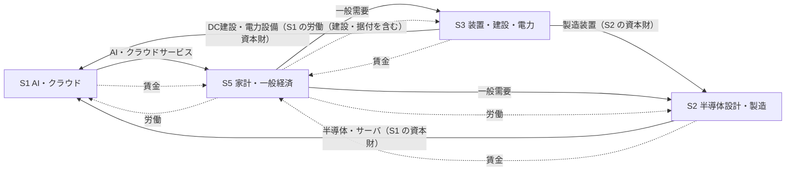
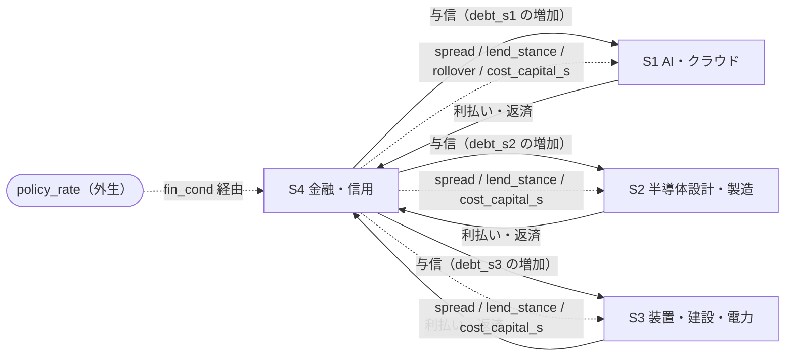
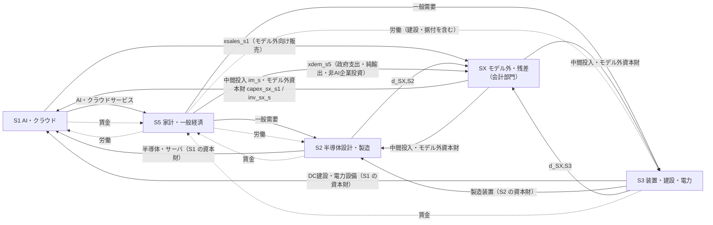
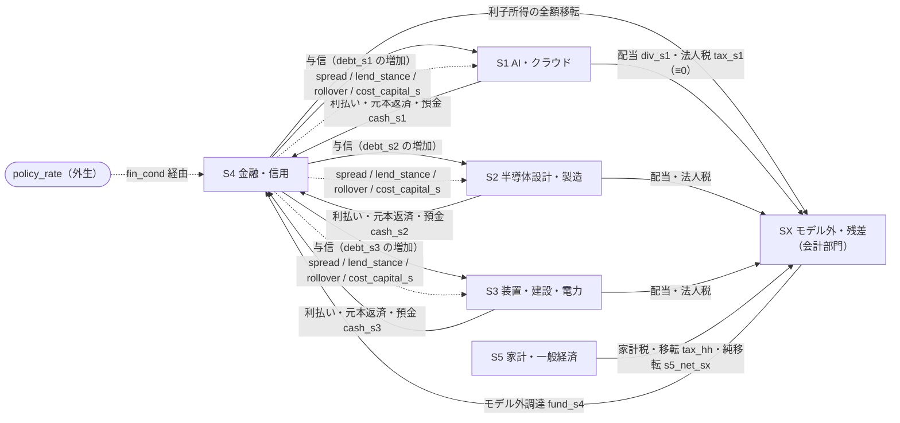

# 部門別CAPEX・信用循環モデル 部門境界と変数定義

> 関連 Issue: #165（本書）・#163（分析契約）・#164（因果グラフ）・#169（`1.1.0` の改訂要求元）・#125（ロードマップ）
> 前提: [分析契約](capex_credit_cycle_analysis_contract.md)（基準ユースケース・判定問題 Q1–Q5・シナリオ `Sc0`–`Sc4`・診断ラベル）・[因果グラフ](capex_credit_cycle_causal_graph.md)（ノード・エッジ・増幅ループ `R1a`・`R1b`・R2–R4・遮断経路 B1–B7）
> 後続設計: #166（[ストック・フロー会計表](capex_credit_cycle_stock_flow.md)）・#167（[責務境界](capex_credit_cycle_model_boundaries.md)）・#168（[イベント変換契約](../architecture/macro_event_contract.md)・[シナリオ時間軸](../architecture/scenario_time_semantics.md)）・#169（[動学方程式](capex_credit_cycle_equations.md)）・#170（[観測方程式・識別戦略・検証方針](capex_credit_cycle_empirical_strategy.md)）・#171（統合）

---

## メタ情報

| 項目 | 内容 |
|---|---|
| **対象** | 部門別CAPEX・信用循環モデル（`CapexCreditCycleModel` 相当、未実装） |
| **ステータス** | 部門境界・変数定義のみ確定。パラメータ値・実装は未着手 |
| **vars version** | `capex-credit-cycle-vars/1.2.0` |
| **上位契約** | `capex-credit-cycle-contract/1.0.0`（[分析契約](capex_credit_cycle_analysis_contract.md)）・`capex-credit-cycle-graph/1.1.0`（[因果グラフ](capex_credit_cycle_causal_graph.md)） |
| **基準経済・頻度** | 米国・四半期（契約 §2.1 を継承） |
| **改訂の優先関係** | **§11（#171 統合レビューによる改訂）が本書の正本である。§3・§4.2・§5.4・§5.5・§5.7 の一部は §11 で上書きされている。実装・較正の前に §11 を読むこと。** |

> **LLM向け要約**: 本書は初期MVPの**部門区分を 5 部門（`S1`–`S5`）に確定**し、因果グラフの 37 ノードを
> 部門 × 変数の適用行列へ展開したうえで、各変数を **役割**（`state` / `control` / `exogenous` / `diagnostic`）へ
> **排他的に**分類する。観測は役割と直交する属性として別軸で与える。役割は因果グラフのエッジ型
> （行動 / 会計 / 定義 / 制度）から機械的に決まる判定規則（§4.2）で導出し、後続 Issue が個別に判断しない。
> 変数辞書（§5）は記号・Julia 名・単位・stock/flow・時点基準・符号制約・恒等関係・観測候補・優先度を与える。
> §5.7 は会計項目の変数（#166 が追加提案した 43 項目 + 既登録の再掲 1 項目 + 本書の追加 2 項目 = 46）とパラメータ 11 系統を正式に登録する。
> DME 共通 API へは **平坦キー + 部門接尾辞**の名前空間で公開する（§6）。
> 本書は方程式・パラメータ値・実データ取得実装を定めない（§10）。`1.0.0` の差し戻し事項 `A1`・`A2` は
> 因果グラフ `1.1.0` で解決済みである（§7）。
> **`1.2.0` では #171 の統合レビューにより、部門責務への `SX` の追加・`S4` の複式計上・役割判定規則 5 の追加・
> `r_eff_s` の単位確定・`int_burden_s` の `Δt`・`hh_income` の式・`funding_pressure_s` の登録を §11 で改訂している。**

---

## 1. 本書の位置づけと確定範囲

### 1.1 位置づけ

[分析契約](capex_credit_cycle_analysis_contract.md)は「何を問うか」を、[因果グラフ](capex_credit_cycle_causal_graph.md)は「どの経路で伝わるか」を固定した。
本書はその上で「**どの部門が何を持ち、各量がモデル内でどういう役割の変数か**」を固定する。
これにより #166（会計表）・#169（動学方程式）は、部門境界・変数の意味・単位・時点を再判断せずに設計へ入れる。

| 本書が固定するもの | 本書が固定しないもの |
|---|---|
| 部門区分の採否と採用理由（§2） | 部門の追加分割（#125 後段） |
| 各部門の生産・需要・支出・資産負債・意思決定（§3） | 部門間の取引額・係数（#166・#170） |
| 実物/金融フローの相手部門（§3.6） | ストック・フロー会計表の残高更新式（#166） |
| 変数の役割分類とその判定規則（§4） | 各変数を生成する方程式（[動学方程式](capex_credit_cycle_equations.md)） |
| 変数辞書（記号・単位・時点・制約・恒等関係・観測候補・優先度）（§5・§5.7） | 観測方程式・系列 ID の確定・単位変換の実装（#170） |
| DME 共通 API への公開範囲と命名規則（§6） | Julia `struct` の本実装・API 名（#171） |

### 1.2 規律（契約）

1. **本書に無い変数を後続 Issue が追加しない**。追加が必要な場合は本書を改訂してから行う（§11）。
2. **役割分類は §4.2 の判定規則から機械的に導く**。個別変数について後続 Issue が独自に判断しない。判定規則で決まらない変数は本書の改訂対象とする。
3. **部門を跨いで同名の変数を持たない**。部門別変数は必ず部門接尾辞を持ち、接尾辞なしの名前は部門横断の単一系列に限る（§6.4）。
4. **単位・時点基準を変数ごとに明示する**。明示のない変数を実装対象としない。
5. **初期MVPは水準でシミュレートする**。対数偏差・ハット変数をモデル内部で用いない（§5.1）。診断は baseline 比乖離（契約 §2.4）で行い、それは比較層が生成する。
6. **因果グラフに存在しないノードを新設する場合、それが「実装状態」（既存エッジの遅れ・パイプラインを表現するための内部状態）であることを明示する**。新たな因果関係を含意する変数は §7 の差し戻し事項として登録し、本書では確定しない。

### 1.3 表記

| 記法 | 意味 |
|---|---|
| `s ∈ SP` | 生産部門集合 `SP = {S2, S3}`。受注・生産・在庫・能力の構造を共有する |
| `s ∈ SF` | 財務主体集合 `SF = {S1, S2, S3}`。債務・現金・資本コストを持つ借り手部門 |
| `s ∈ SR` | 実体部門集合 `SR = {S1, S2, S3, S5}`。契約 §4.2 の `breadth`（広がり）の分母 |
| 役割 `state` | 前期末残高から更新されるストック・内部状態 |
| 役割 `control` | 当期に行動方程式・制度制約で決まるフロー・価格・条件 |
| 役割 `exogenous` | モデル外またはシナリオから与える入力 |
| 役割 `diagnostic` | 定義式・フロー間会計恒等式のみから当期の他変数へ一意に決まる量 |
| 観測 `O` / `P` / `L` | 直接観測可能 / proxy 観測 / 潜在（公表系列なし）。因果グラフ §1.3 と同一 |
| 優先度 `必須` / `任意` / `EXT` | 初期MVPで必須 / 初期MVPで任意 / 将来拡張（初期MVPで実装しない） |
| 時点 `EOP` / `SUM` / `AVG` / `BOP` | 期末値 / 四半期合計 / 四半期平均 / 期首値（＝前期末） |

---

## 2. 部門境界の決定

### 2.1 候補案

| 案 | 部門構成 | 実体部門数 |
|---|---|---|
| **案A（5部門）** | `S1` AI・クラウド需要 / `S2` 半導体設計・製造 / `S3` 製造装置・データセンター建設・電力 / `S4` 金融・信用 / `S5` 家計・一般経済 | 4（`S1`・`S2`・`S3`・`S5`） |
| **案B（7部門）** | AI・クラウド / 半導体設計 / 半導体製造 / 製造装置 / 建設・電力インフラ / 金融・信用 / 家計・一般経済 | 6 |
| **案C（3部門、下限チェック）** | 関連産業（AI・半導体・装置を統合）/ 金融・信用 / 家計・一般経済 | 2 |

案C は「案A の 5 部門が本当に必要か」を確認するための下限ケースとして比較に含める。

### 2.2 比較表

| 比較軸 | 案A（5部門） | 案B（7部門） | 案C（3部門） |
|---|---|---|---|
| **区別できる波及経路** | CAPEX を出す部門（`S1`）と受ける部門（`S2`・`S3`）を分離。装置・建設・電力を 1 部門に束ねるため、半導体経由と建設経由の雇用波及の**遅れの差**は `L43`/`L44` のパラメータ差として表現する | 設計/製造の分離により、在庫を持たない fabless と設備を持つ foundry の調整速度差を経路として区別できる。建設・電力の分離により `L44` の建設雇用を独立部門の雇用として扱える | `L09`（CAPEX → 受注）が部門内に消える。Q1（産業内の在庫・稼働率調整で収束するか）が**定義できない** |
| **方程式・パラメータ数（概算）** | 内生変数 ≈ 60、状態 ≈ 16（遅延バッファ除く）、行動パラメータ ≈ 45、部門間需要配分 2×2 | 内生変数 ≈ 100、状態 ≈ 30、行動パラメータ ≈ 80、部門間需要配分 4×4 | 内生変数 ≈ 30、状態 ≈ 8、行動パラメータ ≈ 20 |
| **利用可能な観測系列（米国・四半期）** | BEA 産業別実質付加価値・FRB 産業別稼働率・Census 受注/在庫/受注残・Census 建設支出が、`S2`（NAICS 334 系）・`S3`（NAICS 333 + 建設 + 公益）の粒度で揃う | **半導体設計と半導体製造を分離する四半期公表系列が無い**。NAICS 3344 は設計・製造を統合した区分であり、稼働率・在庫・受注残はいずれも統合ベースでしか公表されない | 部門別系列を使わないため制約は最小。ただし判定問題が解けない |
| **識別可能性** | `S2`・`S3` の稼働率・在庫・受注残が観測でき、`L11`・`L15`・`L16` の調整パラメータを部門別に較正できる | fabless は自社工場を持たず稼働率・在庫が定義できないため、`UTIL`・`INV`・`CAP` を持つ部門と持たない部門が混在する。設計部門の投資関数を識別する観測量が実質的に存在しない | 産業内調整と産業間波及が区別できないため、Q1・Q2 の増幅度 `A` の解釈が失われる |
| **二重計上リスク** | `S2 → S1`・`S3 → S1`・`S3 → S2` の資本財フローを持つ。付加価値ベース集計（§3.7）で回避する | 設計 → 製造 → 装置の中間投入が 3 段になり、受注・受注残・在庫を総額ベースで持つ変数（付加価値ベースで定義できない）の重複が増える。特に設計部門の「受注」と製造部門の「受注」が同一需要を二重に表す | 産業内取引が消えるため二重計上は起きない |
| **初期実装量** | 生産部門テンプレート 1 種を 2 部門へ適用。テンプレートの正しさを 2 部門で検証すればよい | 生産部門テンプレートが 3 種（在庫あり製造 / 在庫なし設計 / 受注残主導の建設）に分岐する | 最小。ただし目的を満たさない |
| **`breadth` の粒度**（契約 §4.2） | 実体部門 4 → `breadth` は 0.25 刻み。`breadth ≥ 0.60` は実質「4 部門中 3 部門以上」 | 実体部門 6 → 0.167 刻み。閾値を連続的に較正できる | 実体部門 2 → 0.5 刻み。`breadth ≥ 0.60` は「2 部門とも」を意味し、閾値として機能しない |
| **ネットワーク・企業異質性への拡張性** | `SP = {S2, S3}` という**部門集合のパラメータ化**で構造を共有しているため、集合を拡張するだけで案B へ移行できる。部門内異質性は後段で `SP` の要素を細分化して追加する | 案A の上位互換だが、テンプレートが 3 種に分岐するため、後段の企業異質性導入時に分岐が掛け算で増える | 拡張時に判定問題の定義から作り直しになる |

### 2.3 採用案と理由

**採用: 案A（5部門）**。

理由を優先順に示す。

1. **案B は観測系列が存在しないため識別できない**。半導体設計と半導体製造を分離した四半期系列（稼働率・在庫・受注残・部門別投資）が米国の公表統計に無い。分離すれば部門は増えるが、増えた部門のパラメータを較正・検証する手段が無く、#170 の検証契約を満たせない。部門を増やして識別不能な自由度を作ることは、契約 §8-2（閾値は理論から導かれていない）の限界をさらに広げる。
2. **案B の分離が生む分析上の利得は、案A のパラメータで代替できる**。建設・電力を装置から分離する主な利得は「建設雇用の労働集約性」（因果グラフ `B7` の例外、`L44`）だが、これは `S3` 内の**建設・据付雇用比率パラメータ**として表現できる。部門を割らずに Q3 の判定に必要な差は表現できる。
3. **案C は判定問題 Q1 を定義できない**。Q1 は「CAPEX 調整が関連産業内の在庫・稼働率調整で収束する条件」を問う。CAPEX の出し手と受け手が同一部門になると `L09` が部門内へ消え、「産業内で収束したか」を「産業間へ波及したか」と区別できない。契約 §3 の必須判定問題を満たさないため採用不能。
4. **案A は案B への移行経路を壊さない**。生産部門を集合 `SP` としてパラメータ化するため、`SP = {S2, S3}` を `SP = {S2a, S2b, S3a, S3b}` へ拡張すれば案B に到達する。初期MVPで案A を採る判断は、案B を将来放棄する判断ではない。

**採用に伴う制約（後続へ引き渡す）**

- 実体部門が 4 のため、契約 §4.2 の `breadth ≥ 0.60` は 0.25 刻みの離散値に対する判定となり、実質「4 部門中 3 部門以上」を意味する。**`breadth` の閾値を 0.60 前後で連続的に較正することはできない**。この粒度制約を #170 の閾値較正へ引き渡す（§8）。
- `S3` が装置・建設・電力を束ねるため、`S3` の稼働率・価格は異質な活動の加重平均になる。`S3` の稼働率パラメータを単一の技術的意味で解釈しない（§9-2）。

### 2.4 部門集合の記法と将来分割の余地

| 部門 ID | 名称 | 集合への所属 | 将来分割の候補 |
|---|---|---|---|
| `S1` | AI・クラウド需要 | `SF`・`SR` | ハイパースケーラ / AI 専業 / 企業内 IT（`EXT`） |
| `S2` | 半導体設計・製造 | `SP`・`SF`・`SR` | 設計（fabless）/ 製造（foundry・IDM）（案B、`EXT`） |
| `S3` | 製造装置・データセンター建設・電力 | `SP`・`SF`・`SR` | 製造装置 / 建設・電力インフラ（案B、`EXT`） |
| `S4` | 金融・信用 | — | 銀行 / 社債市場 / 非銀行金融（`EXT`） |
| `S5` | 家計・一般経済 | `SR` | 家計 / 非 AI 企業部門 / 政府（`EXT`） |

**契約**: `SP`・`SF`・`SR` は実装上も集合として保持し、部門 ID をコードへ直接埋め込まない。集合の要素を増やす変更が本書の改訂のみで済む状態を保つ（§2.3-4 の拡張性の根拠）。

---

## 3. 部門の経済的責務

各部門について、生産・需要・支出・資産負債・意思決定・フロー相手を定義する。ここで挙げる意思決定は、因果グラフ §3 の型 `行動` エッジに対応する。

### 3.1 `S1` AI・クラウド需要部門

| 項目 | 内容 |
|---|---|
| **何を生産・供給するか** | AI・クラウドの計算サービス。実質サービス産出 `y_s1` |
| **誰から需要を受けるか** | `S5`（家計・一般経済の最終需要および企業の IT 支出）。初期MVPでは AI 需要期待 `ai_exp` を外生とし、そこから計算能力需要 `compute_dem` を導く |
| **誰へ支出するか** | `S2`（アクセラレータ・サーバ等の半導体系資本財）・`S3`（データセンター建設・電力設備）・`S5`（賃金）・`S4`（利払い） |
| **どの資産・負債を保有するか** | 資産: 設備能力 `cap_s1`・建設中CAPEX `capex_pipe_s1`・現金 `cash_s1`。負債: 債務 `debt_s1` |
| **何を意思決定するか** | 目標設備能力 `target_cap_s1`（`L02`）・計画CAPEX `capex_plan_s1`（`L03`・`L04`・`L39`）・実行CAPEX `capex_exec_s1`（`L05`・`L07`・`L40`・`L41`）・キャンセル/延期 `cancel_s1`（`L06`）・雇用 `emp_s1`（`L43`・`L44`） |
| **実物フローの相手** | `S2`・`S3`（資本財の買い手）・`S5`（サービスの売り手、労働の買い手） |
| **金融フローの相手** | `S4`（借入・利払い・資本コスト・借換条件） |

**注意**: `S1` の産出・売上を生成する因果エッジは因果グラフ `1.0.0` に存在しない（§7 差し戻し `A1`）。本書は `S1` が産出・売上・利益・営業CF・現金を持つことを**変数として確定**するが、その生成方程式は `A1` の解決後に #169 が定める。

### 3.2 `S2` 半導体設計・製造部門

| 項目 | 内容 |
|---|---|
| **何を生産・供給するか** | 半導体・アクセラレータ・関連電子部品。実質産出 `y_s2` |
| **誰から需要を受けるか** | `S1`（AI 用資本財需要、`L09`）・`S5`（一般需要、`L50`）。本モデル外の需要（スマートフォン・自動車等）は観測方程式で外生成分として分離する（因果グラフ §3.3 の交絡注意） |
| **誰へ支出するか** | `S3`（製造装置、`L19`）・`S5`（賃金）・`S4`（利払い） |
| **どの資産・負債を保有するか** | 資産: 生産能力 `cap_s2`・建設中投資 `capex_pipe_s2`・在庫 `inv_s2`・現金 `cash_s2`。負債: 債務 `debt_s2`。受注残 `backlog_s2` は資産ではなく**受注済み未履行の契約残高**として別建てで保持する |
| **何を意思決定するか** | 産出 `y_s2`（`L11`・`L15`・`L59`）・価格 `price_s2`（`L16`）・自部門投資 `invest_s2`（`L18`・`L42`）・雇用 `emp_s2`（`L43`） |
| **実物フローの相手** | `S1`・`S5`（売り手）・`S3`（買い手）・`S5`（労働の買い手） |
| **金融フローの相手** | `S4` |

### 3.3 `S3` 製造装置・データセンター建設・電力部門

| 項目 | 内容 |
|---|---|
| **何を生産・供給するか** | 半導体製造装置、データセンター建設・据付、電力インフラ設備。実質産出 `y_s3` |
| **誰から需要を受けるか** | `S1`（データセンター建設・電力設備、`L09`）・`S2`（製造装置、`L19`）・`S5`（一般需要、`L50`） |
| **誰へ支出するか** | `S5`（賃金。**建設・据付雇用の比率が高く、`L44` を通じて家計へ最も早く波及する**）・`S4`（利払い） |
| **どの資産・負債を保有するか** | `S2` と同型（`cap_s3`・`capex_pipe_s3`・`inv_s3`・`cash_s3`・`debt_s3`・`backlog_s3`） |
| **何を意思決定するか** | `S2` と同型（`y_s3`・`price_s3`・`invest_s3`・`emp_s3`） |
| **実物フローの相手** | `S1`・`S2`・`S5` |
| **金融フローの相手** | `S4` |

**注意**: `S3` は受注残主導（建設・装置のリードタイムが長い）であり、在庫よりも受注残 `backlog_s3` が調整の主役になる。`inv_s3` は保持するが、初期MVPでは `S2` より小さい役割を想定する（#169 でパラメータとして表現し、変数としては両部門に持たせる）。

### 3.4 `S4` 金融・信用部門

| 項目 | 内容 |
|---|---|
| **何を生産・供給するか** | 与信（貸出・社債引受）と信用条件。実物産出を持たないため `SR`（実体部門）に含めず、契約 §4.2 の `breadth` の分母に入れない |
| **誰から需要を受けるか** | `S1`・`S2`・`S3`（資金需要） |
| **誰へ支出するか** | 初期MVPでは `S4` の費用・雇用・利益を明示的に持たない（`EXT`） |
| **どの資産・負債を保有するか** | 資産: `SF` 各部門への与信（`debt_s` の対応資産）。初期MVPでは `S4` 側の貸借対照表を独立に持たず、`debt_s` の反対側として扱う。完全な複式計上は #166 が決める |
| **何を意思決定するか** | 社債スプレッド `spread`（`L30`・`L54`）・貸出態度 `lend_stance`（`L33`）・借換条件 `rollover`（`L32`）・部門別資本コスト `cost_capital_s`（`L36`–`L38`・`L55`） |
| **実物フローの相手** | なし（初期MVP） |
| **金融フローの相手** | `S1`・`S2`・`S3`（与信・利払い・返済）。政策金利 `policy_rate` は外生入力 |

**契約**: `equity_val`・`collateral`・`rollover`・`spread`・`lend_stance`・`fin_cond` は**部門横断の単一系列**とする（因果グラフ §2.3 に部門添字が無いことと整合）。部門別化は `EXT`。一方 `debt_s`・`int_burden_s`・`coverage_s`・`cost_capital_s` は `s ∈ SF` の部門別変数である。単一系列である `spread` が部門別の `coverage_s` に反応する（`L30`）ため、集約カバレッジ `coverage_agg`（§5.4）を定義して媒介する。

### 3.5 `S5` 家計・一般経済部門

| 項目 | 内容 |
|---|---|
| **何を生産・供給するか** | 一般経済の産出 `y_s5`（`S1`–`S3` 以外の付加価値）と労働供給 |
| **誰から需要を受けるか** | 家計消費 `cons`（`L49`） |
| **誰へ支出するか** | `S1`（AI・クラウドサービス）・`S2`・`S3`（一般需要、`L50`）・自部門（`y_s5` を構成する一般的な消費） |
| **どの資産・負債を保有するか** | 初期MVPでは家計の金融資産・負債を持たない。家計信用は `EXT`（因果グラフ `X02`）、資産効果も `EXT`（`X01`） |
| **何を意思決定するか** | 消費 `cons`（`L48`）。労働供給は非制約（雇用は企業側の `emp_s` で決まる） |
| **実物フローの相手** | `S1`（サービス購入・労働供給）・`S2`・`S3`（一般需要・労働供給） |
| **金融フローの相手** | なし（初期MVP） |

**注意**: `S5` は「家計」と「AI 関連以外の企業部門」を束ねた残差部門である。`y_s5` は総産出から `S1`–`S3` の付加価値を除いた残差として定義する（§5.5）。したがって `y_s5` の変動を家計行動のみへ帰属させない（§9-3）。

### 3.6 部門間フロー概略図

**図 1: 実物フロー**（実線 = 財・サービス、点線 = 労働と賃金）



**図 2: 金融フロー**（実線 = 資金、点線 = 条件・価格シグナル）



**契約**: `S5` は初期MVPで `S4` と金融フローを持たない（家計信用は `EXT`）。図 2 に `S5` が現れないことは、この設計判断の帰結である。

### 3.7 二重計上を避ける集計規約

部門を分割したことにより、同一取引が複数部門の変数へ現れる。集計時の規約を固定する。

| 規約 | 内容 |
|---|---|
| **R-1: 総産出は付加価値の和** | `y_tot = Σ_{s ∈ {S1,S2,S3}} va_s + y_s5`。`va_s = st_va_share_s × sales_s`（産出額ベース。`st_va_share_s` は構造パラメータ。#166 §4.2 で確定）。`sales_s` の和を総産出としない |
| **R-2: 受注・受注残・在庫は総額ベース** | `order_s`・`backlog_s`・`inv_s` は中間投入を含む総額であり、付加価値ベースへ変換しない。これらを部門横断で合計しない |
| **R-3: 資本財の売り手と買い手を区別する** | `capex_exec_s1` は `S1` の支出であり、同額が `order_s2` + `order_s3` の一部として `S2`・`S3` の需要に現れる。両者を独立した需要として二重に加算しない（配分比率は #166 が定める） |
| **R-4: `invest_s2` と `order_s3` の関係** | `L19` により `S2` の投資は `S3` の受注になる。`invest_s2` を `y_tot` の投資項として計上する際は、`S3` の産出としての計上と重複させない |
| **R-5: `y_s5` は残差** | `y_s5 = y_tot − Σ va_s` を定義とせず、`y_s5` を独立に生成して `y_tot` を集計する（`L49`・`L52`）。残差として逆算すると `y_tot` の恒等式が自明になり検証が効かなくなる |

**契約**: 上記の規約に整合する会計表の構築は #166 の責務である。本書は規約と変数の定義のみを固定し、勘定科目・行列形式は定めない。R-1 の `st_va_share_s` は初期MVPで**定数**とする（[動学方程式](capex_credit_cycle_equations.md) §11.1 の決定。中間投入比率を内生化すると産業連関構造の推定が必要になり、初期MVPの識別可能性を超える）。

---

## 4. 変数分類

### 4.1 分類軸の定義

Issue #165 は「状態・制御・外生・観測・診断へ重複なく分類する」ことを要求する。しかし**観測は他の 4 分類と直交する属性**である（ある状態変数が同時に観測変数でもありうる）。そこで次のように 2 軸へ分ける。

| 軸 | 値 | 排他性 |
|---|---|---|
| **役割（role）** | `state` / `control` / `exogenous` / `diagnostic` | **排他**。各変数はちょうど 1 つを持つ |
| **観測属性（obs）** | 観測コード `O` / `P` / `L` と、観測用途 `compare` / `estimate` / `calibrate` / `none` | 役割と直交。役割によらず付与される |

「観測変数」とは **`obs` 用途が `none` でない変数**を指し、役割の 1 つとしては扱わない。これにより「重複なく分類する」という要求を、意味を歪めずに満たす。

「診断変数」は役割 `diagnostic` に対応する。診断変数は**独立な自由度を持たない**（当期の他変数から一意に決まる）ため、状態ベクトル・制御ベクトルのいずれにも入らない。

### 4.2 役割分類の判定規則

役割は、因果グラフ §3 の**エッジ型から機械的に決まる**。後続 Issue は個別に判断しない（§1.2-2）。

変数 `x` の入力エッジ（`x` を結果ノードとするエッジ）の型集合を `T(x)` とするとき:

| # | 条件 | 役割 |
|---|---|---|
| 1 | `T(x) = ∅`（入力エッジなし）、またはシナリオ入力の適用先 | `exogenous` |
| 2 | `T(x)` に `行動` または `制度` を 1 つ以上含む | `control` |
| 3 | `T(x)` が `会計` のみからなり、その会計関係が**前期末残高からの残高更新式**である | `state` |
| 4 | `T(x)` が `会計` / `定義` のみからなり、当期のフロー・水準のみから決まる | `diagnostic` |

- 規則 2 が規則 3・4 に優先する（行動が 1 本でも入れば `control`）。
- 規則 3 と 4 の区別は「前期末の自分自身の値を参照するか」で決まる。参照するものが `state`。
- シナリオショックの適用先（契約 §5.3 の `target`）は、規則 1 により `exogenous` になるか、`control` 変数への外生シフト項として入る。後者の場合、変数の役割は `control` のまま変えず、**外生シフト項を別変数として登録する**（例: `spread` は `control`、`SH-CREDIT` は `spread_shock_ex` という `exogenous` 変数）。

**適用例**（因果グラフのエッジ ID を根拠として示す）

| 変数 | 入力エッジと型 | 適用規則 | 役割 |
|---|---|---|---|
| `ai_exp` | なし（`E1` の適用先） | 1 | `exogenous` |
| `policy_rate` | なし（`X05` により政策反応関数を持たない） | 1 | `exogenous` |
| `capex_plan_s1` | `L03` 行動 / `L04` 行動 / `L39` 行動 | 2 | `control` |
| `capex_exec_s1` | `L05` 制度 / `L07` 行動 / `L40` 制度 / `L41` 行動 | 2 | `control` |
| `cap_s1` | `L08` 会計（資本蓄積、前期末 `cap_s1` を参照） | 3 | `state` |
| `backlog_s2` | `L10` 会計 / `L12` 会計（残高更新） | 3 | `state` |
| `inv_s2` | `L14` 会計（残高更新） | 3 | `state` |
| `cash_s2` | `L24` 会計（残高更新） | 3 | `state` |
| `debt_s2` | `L25` 会計 / `L26` 会計（残高更新） | 3 | `state` |
| `y_s2` | `L11` 行動 / `L15` 行動 / `L59` 制度 | 2 | `control` |
| `y_s1` | `L60` 行動 / `L61` 制度 | 2 | `control` |
| `util_s2` | `L13` 定義 / `L58` 定義 | 4 | `diagnostic` |
| `sales_s2` | `L20` 定義 / `L21` 定義 | 4 | `diagnostic` |
| `profit_s2` | `L22` **会計**（当期フローのみ） | 4 | `diagnostic` |
| `ocf_s2` | `L23` 会計（当期フローのみ） | 4 | `diagnostic` |
| `r_eff_s2` | 会計（自身の前期値を参照する満期加重平均） | 3 | `state` |
| `int_burden_s2` | `L34` 会計 / `L35` 会計 / `L56` 会計（前期末 `debt` を参照するが自身の前期値は参照しない） | 4 | `diagnostic` |
| `coverage_s2` | `L28` 定義 / `L29` 定義 | 4 | `diagnostic` |
| `spread` | `L30` 行動 / `L54` 行動 | 2 | `control` |
| `hh_income` | `L46` 会計 / `L47` 会計（当期フロー） | 4 | `diagnostic` |
| `cons` | `L48` 行動 | 2 | `control` |
| `y_tot` | `L51` 定義 / `L52` 定義 | 4 | `diagnostic` |

**注意**: `int_burden_s` は前期末 `debt_s` を参照するが、自身の前期値を参照しないため `state` ではなく `diagnostic` である（規則 3 の「自分自身の前期値」条件）。この区別は #166 の会計表で残高更新式を書く対象を決めるため重要である。ただし `int_burden_s = r_eff_s · Δt · debt_s[t−1]` の `r_eff_s`（実効金利）は自身の前期値を参照するため `state` である（#166 §5.4）。実効金利を状態として分離することで `int_burden_s` の `diagnostic` 判定が維持される。

**`1.1.0` での変更（#166 差し戻し `B6` の解決）**: `profit_s` の役割を `control` → `diagnostic` へ変更した。因果グラフ `1.1.0` は `L22`（`SALES_s → PROFIT_s`）の型を `行動` → `会計` へ変更しており（因果グラフ §3.4・§10.1）、判定規則 4 が適用される。`profit_s = va_s − wagebill_s − dep_s` は会計残差であり、行動方程式で独立に生成しない（#166 §4.2）。固定費レバレッジの非線形性は `wagebill_s`（労働退蔵により産出に対して固定的）と `dep_s`（完全固定費）の性質から導出される。

### 4.3 遅延・パイプラインの状態表現

因果グラフには遅れ `1`・`2–4` を持つエッジが多数ある。遅れの表現方法を 2 種に固定する。

| 方式 | 対象 | 状態の持ち方 |
|---|---|---|
| **遅延バッファ** | 遅れ `k ≥ 1` を持つ通常のエッジ（`L03`・`L15`・`L17`・`L30`・`L33`・`L42`・`L43`・`L45`・`L50` 等） | 被参照変数の過去 `k` 期分を保持する。命名は `<var>_lag<k>`。変数辞書に個別行を設けず、基礎変数の属性 `lag_depth` として記載する |
| **パイプライン状態** | 資本蓄積の遅れ（`L05` の実行ラグ・`L08`・`L57` の稼働開始ラグ） | 「発注済み・建設中で未稼働の CAPEX 残高」を独立の状態変数 `capex_pipe_s` として保持する |

**パイプライン状態を置く理由**: `L05` は下方非対称（計画減少が実行減少へ伝わるのに遅れがある、因果グラフ §3.2）であり、遮断経路 `B3`（CAPEX の不可逆性）の所在でもある。単純な遅延バッファでは「既に着工した案件は止められない」という非対称性を表現できない。`capex_pipe_s` を持てば、`B3` の強さを「パイプライン残高のうち取消不能な比率」というパラメータとして表現でき、`cancel_s1`（`L06`）との関係も明示できる。

**契約**:

- `capex_pipe_s` は**実装状態**であり、因果グラフの新規ノードではない（§1.2-6）。既存エッジ `L05`・`L08`・`L57` の遅れを状態空間で表現したものである。新たな因果関係を含意しない。
- 遅延バッファの深さ `k` は因果グラフの「遅れ」欄の**上限値**を既定とする（`2–4` なら `k = 4`）。幾何ラグ等の低次元近似を採る場合は #169 で選択し、その際も本書の `lag_depth` を上限として扱う。
- 遅延バッファは `state_variables` に含める（§6.1）。含めないと状態ベクトルからの決定論的再現ができなくなる。

### 4.4 分類一覧

Issue #165 が分類対象として列挙した各項目について、対応変数と役割を示す。

| Issue の項目 | 対応変数 | 役割 |
|---|---|---|
| 期待需要・需要見通し | `ai_exp` | `exogenous` |
| 〃 | `compute_dem` | `control` |
| 目標設備能力 | `target_cap_s1` | `control` |
| 実設備能力 | `cap_s1`・`cap_s2`・`cap_s3` | `state` |
| 稼働率 | `util_s2`・`util_s3` | `diagnostic` |
| 在庫 | `inv_s2`・`inv_s3`（残高） | `state` |
| 〃 | `inv_ratio_s2`・`inv_ratio_s3` | `diagnostic` |
| 受注残 | `backlog_s2`・`backlog_s3`（残高） | `state` |
| 〃 | `backlog_ratio_s2`・`backlog_ratio_s3` | `diagnostic` |
| 計画CAPEX | `capex_plan_s1` | `control` |
| 実行CAPEX | `capex_exec_s1` | `control` |
| 〃（建設中残高） | `capex_pipe_s1`・`capex_pipe_s2`・`capex_pipe_s3` | `state`（実装状態） |
| キャンセル率 | `cancel_s1` | `control` |
| 売上 | `sales_s`（`s ∈ SF`） | `diagnostic` |
| 価格 | `price_s2`・`price_s3` | `control` |
| 〃 | `price_s1` | `exogenous`（初期MVP。内生化は `EXT`） |
| 利益率 | `profit_s`（水準）・`margin_s`（比率） | `diagnostic` / `diagnostic` |
| 営業CF | `ocf_s` | `diagnostic` |
| 現金 | `cash_s` | `state` |
| 債務 | `debt_s` | `state` |
| 利払い | `int_burden_s` | `diagnostic` |
| 返済負担 | `debt_service_s` | `diagnostic` |
| 株式評価 | `equity_val` | `control` |
| 信用スプレッド | `spread` | `control` |
| 〃（外生シフト） | `spread_shock_ex` | `exogenous`（`SH-CREDIT` の適用先） |
| 貸出態度 | `lend_stance` | `control` |
| 雇用 | `emp_s1`・`emp_s2`・`emp_s3`・`emp_s5` | `control` |
| 〃（合計） | `emp_tot` | `diagnostic` |
| 賃金 | `wage` | `control` |
| 所得 | `hh_income` | `diagnostic` |
| 消費 | `cons` | `control` |
| 政策金利 | `policy_rate` | `exogenous` |
| 金融条件 | `fin_cond` | `control` |
| 部門別産出 | `y_s1`・`y_s2`・`y_s3`・`y_s5` | `control` |
| 〃（生産能力・数量換算） | `ycap_s2`・`ycap_s3` | `diagnostic` |
| 〃（付加価値） | `va_s1`・`va_s2`・`va_s3` | `diagnostic` |
| 出荷・引渡 | `ship_s2`・`ship_s3` | `control` |
| 〃 | `deliv_s2`・`deliv_s3` | `diagnostic` |
| 総産出 | `y_tot` | `diagnostic` |
| 実効金利 | `r_eff_s1`・`r_eff_s2`・`r_eff_s3` | `state` |
| 繰越計画残高 | `plan_carry_s1` | `state` |

会計項目の変数（資金調達・引渡・分配・診断の 45 項目）は §5.7 に登録する。

**役割別の内訳（必須変数のみ、概算）**

| 役割 | 個数 | 備考 |
|---|---|---|
| `state` | 20 | `cap_s`×3、`capex_pipe_s`×3、`backlog_s`×2、`inv_s`×2、`cash_s`×3、`debt_s`×3、`r_eff_s`×3、`plan_carry_s1`×1。`advance_s`（MVP `≡ 0`）を含めると 22。遅延バッファは別途 |
| `control` | 約 45 | 部門別に展開後（§5.7 の追加を含む） |
| `exogenous` | 記号 6 種・部門展開後 7 | `ai_exp`・`price_s1`・`policy_rate`・`spread_shock_ex`・`capex_plan_shock_ex`・`ext_demand_s`（`s ∈ SP`、本モデル外の半導体・装置需要）。`ext_demand_s` のみ 2 変数へ展開される。**この 7 個がイベント適用先の全体である**（[イベント変換契約](../architecture/macro_event_contract.md) §4.1） |
| `diagnostic` | 約 50 | 恒等式・定義式のみで決まる（§5.7 の追加を含む） |

---

## 5. 変数辞書

### 5.1 共通規約

| 項目 | 規約 |
|---|---|
| **通貨・実質化** | 実質、10 億ドル（2017 年連鎖ドル基準）。名目系列は観測方程式（#170）で実質化する |
| **水準 / 比率 / 対数偏差** | **モデル内部はすべて水準または比率で保持する**。対数偏差・ハット変数を用いない（§1.2-5）。baseline 比乖離（契約 §2.4 の `dx_t`）は比較層が生成し、モデル出力には含めない |
| **指数の基準** | `index` 型の変数は baseline 定常値 = `1.0` を基準とする |
| **金利・スプレッド** | 金利は年率 %、スプレッドは bp。四半期モデルへの換算は #169 が定める（契約 §2.1 の `Δt = 0.25`） |
| **ストックの時点** | すべてのストックは**期末値**（`EOP`）で保持する。`x_t` は `t` 期末残高を表す。期中の意思決定が参照するのは `x_{t-1}`（前期末＝当期期首、`BOP`） |
| **フローの時点** | 四半期合計（`SUM`）。年率換算しない |
| **レート・比率の時点** | 四半期平均（`AVG`）。ただし当期フロー同士の比（`coverage_s`・`margin_s`）は四半期値そのものを用いる |
| **符号制約** | 表の「範囲・符号」欄に記す。制約違反はモデルの誤りとして検出対象にする（自動クリップしない。契約 §4.2 の「不整合を自動補正しない」方針と同型） |
| **観測候補の確度** | 表 B の観測候補は**候補**であり、系列 ID・vintage・単位変換の確定は #170 が行う。FRED 系列 ID を明記した項目も #170 で存在・定義を再確認する |
| **資本ストックと生産能力の区別**（`1.1.0`） | `cap_s`（`s ∈ {S1, S2, S3}`）は**資本ストック**であり単位は 10億ドルである。生産能力（数量ベース、10億ドル/四半期）は `ycap_s = cap_s / st_cor_s` として別変数で保持する。稼働率は `util_s = y_s / ycap_s[t−1]` である |
| **数量と価値額の区別**（`1.1.0`） | `order_s`・`backlog_s`・`inv_s`・`ship_s`・`y_s` は baseline 価格で評価した**実質数量**（10億ドル基準）。価値額は `sales_s = price_s · y_s`（産出額）・`deliv_s = price_s · ship_s`（引渡額）・`invval_s = st_invprice_s · inv_s`（在庫価値額）である（#166 §2.2・§4.4） |

### 5.2 `S1` AI・クラウド需要部門

**表 A: 識別・型・役割・単位・時点・制約**

| 記号 | Julia 名 | 表示名 | 型 | 役割 | 単位 | 表現 | 時点 | 範囲・符号 | `lag_depth` |
|---|---|---|---|---|---|---|---|---|---|
| `AI_EXP` | `:ai_exp` | AI需要・収益期待 | index | `exogenous` | — | 指数 | `AVG` | `> 0` | 0 |
| `COMPUTE_DEM` | `:compute_dem` | 計算能力需要 | flow | `control` | 10億ドル/四半期 | 水準 | `SUM` | `≥ 0` | 0 |
| `TARGET_CAP_S1` | `:target_cap_s1` | 目標設備能力 | stock | `control` | 10億ドル | 水準 | `EOP` | `≥ 0` | 0 |
| `CAP_S1` | `:cap_s1` | 既存設備能力 | stock | `state` | 10億ドル | 水準 | `EOP` | `> 0` | 0 |
| `CAPEX_PIPE_S1` | `:capex_pipe_s1` | 建設中CAPEX残高 | stock | `state` | 10億ドル | 水準 | `EOP` | `≥ 0` | 0 |
| `CAPEX_PLAN_S1` | `:capex_plan_s1` | 計画CAPEX | flow | `control` | 10億ドル/四半期 | 水準 | `SUM` | `≥ 0` | 2（`L05`） |
| `CAPEX_EXEC_S1` | `:capex_exec_s1` | 実行CAPEX | flow | `control` | 10億ドル/四半期 | 水準 | `SUM` | `≥ 0` | 1（`L09`） |
| `CANCEL_S1` | `:cancel_s1` | キャンセル・延期率 | ratio | `control` | — | 比率 | `AVG` | `0 ≤ x ≤ 1` | 0 |
| `Y_S1` | `:y_s1` | AI・クラウド産出（数量） | flow | `control` | 10億ドル/四半期 | 水準 | `SUM` | `≥ 0` | 2（`L43`） |
| `YCAP_S1` | `:ycap_s1` | 供給能力（数量） | flow | `diagnostic` | 10億ドル/四半期 | 水準 | `SUM` | `> 0` | 0 |
| `UTIL_S1` | `:util_s1` | 稼働率 | ratio | `diagnostic` | — | 比率 | `AVG` | `0 ≤ x ≤ 1.2` | 0 |
| `PRICE_S1` | `:price_s1` | AI・クラウドサービス価格 | index | `exogenous` | — | 指数 | `AVG` | `> 0` | 0 |
| `SALES_S1` | `:sales_s1` | 売上 | flow | `diagnostic` | 10億ドル/四半期 | 水準 | `SUM` | `≥ 0` | 0 |
| `PROFIT_S1` | `:profit_s1` | 利益 | flow | `diagnostic` | 10億ドル/四半期 | 水準 | `SUM` | 符号制約なし | 0 |
| `OCF_S1` | `:ocf_s1` | 営業キャッシュフロー | flow | `diagnostic` | 10億ドル/四半期 | 水準 | `SUM` | 符号制約なし | 1（`L41`） |
| `CASH_S1` | `:cash_s1` | 現金・自己資金 | stock | `state` | 10億ドル | 水準 | `EOP` | `≥ 0` | 0 |
| `VA_S1` | `:va_s1` | 付加価値 | flow | `diagnostic` | 10億ドル/四半期 | 水準 | `SUM` | `≥ 0` | 0 |
| `EMP_S1` | `:emp_s1` | 雇用 | stock | `control` | 百万人 | 水準 | `AVG` | `≥ 0` | 0 |
| `PLAN_CARRY_S1` | `:plan_carry_s1` | 繰越計画残高 | stock | `state` | 10億ドル | 水準 | `EOP` | `≥ 0` | 0 |
| `CAPEX_PLAN_SHOCK_EX` | `:capex_plan_shock_ex` | 計画CAPEX外生シフト | flow | `exogenous` | baseline比 % | 比率 | `SUM` | 符号制約なし | 0 |

**`1.1.0` での変更（§7 の差し戻し `A1` の解決）**: `1.0.0` は `y_s1`・`sales_s1`・`profit_s1`・`ocf_s1`・`cash_s1`・`va_s1` に「生成エッジが因果グラフに無い」ことを示す `†` を付していた。因果グラフ `1.1.0` がノード `Y_S1` とエッジ `L60`・`L61` を追加し、収益ブロック（`L20`–`L28`）の添字集合を `SF = {S1, S2, S3}` と明記したため、`†` を解除する。`profit_s1` の役割は `control` → `diagnostic` へ変更（`L22` の型変更、§4.2）。`ycap_s1`（供給能力）と `plan_carry_s1`（繰越計画残高）を追加した。`cap_s1` は `1.0.0` から資本ストック（10億ドル）であり単位変更はない。

**表 B: 恒等関係・観測候補・優先度**

| 記号 | 恒等・集計関係 | 観測 | 観測候補 / proxy | 用途 | 優先度 |
|---|---|---|---|---|---|
| `AI_EXP` | — | `L` | 直接の系列なし。hyperscaler の設備投資ガイダンス、AI 関連受注見通しの proxy を #170 で設計 | `calibrate` | 必須 |
| `COMPUTE_DEM` | — | `P` | クラウド事業者のセグメント売上（企業開示の集計） | `compare` | 必須 |
| `TARGET_CAP_S1` | `target_cap_s1 = st_cor_s1 · compute_dem / bh_util_tgt_s1`（資本産出比率 ÷ 目標稼働率、`L02`） | `L` | なし | `none` | 必須 |
| `CAP_S1` | 資本蓄積: `cap_s1 = (1−δ_s1)·cap_s1[t−1] + 稼働開始分`（`L08`） | `P` | BEA 固定資産統計の情報処理装置・ソフトウェア資本ストック | `calibrate` | 必須 |
| `CAPEX_PIPE_S1` | `capex_pipe_s1 = capex_pipe_s1[t−1] + capex_exec_s1 − 稼働開始分` | `L` | Census 建設支出のデータセンター区分（着工〜完工の差） | `calibrate` | 必須 |
| `CAPEX_PLAN_S1` | — | `P` | 主要 hyperscaler の四半期 CAPEX ガイダンス（企業開示） | `compare` | 必須 |
| `CAPEX_EXEC_S1` | `Σ_{s∈SP} (資本財配分比 × capex_exec_s1) = capex 起因の order_s`（R-3） | `O` | 主要 hyperscaler の四半期 CAPEX 実績合計（企業開示）、BEA NIPA の情報処理機器・構築物投資 | `compare` | 必須 |
| `CANCEL_S1` | — | `L` | なし。受注取消・納期延期の報道・企業開示を定性 proxy とする | `none` | 必須 |
| `Y_S1` | `y_s1 = min(compute_dem, ycap_s1 の上限)`（`L60`・`L61`）。`va_s1 = st_va_share_s1 × sales_s1`（R-1） | `P` | BEA GDP by Industry の情報（NAICS 51）のうちデータ処理・ホスティング関連 | `compare` | 必須 |
| `YCAP_S1` | `ycap_s1 = cap_s1 / st_cor_s1` | `L` | なし | `none` | 必須 |
| `UTIL_S1` | `util_s1 = y_s1 / ycap_s1[t−1]`。`R1a`（`S1` の内部資金ループ）の作動判定に用いる | `L` | なし。`S1` の稼働率に対応する公表系列が無い | `none` | 必須 |
| `PRICE_S1` | `sales_s1 = price_s1 × y_s1` | `P` | クラウドサービス価格指数（BLS PPI のデータ処理・ホスティング） | `calibrate` | 必須 |
| `SALES_S1` | `sales_s1 = price_s1 × y_s1`（`L20`・`L21`） | `O` | 上記の企業開示セグメント売上 | `compare` | 必須 |
| `PROFIT_S1` | `profit_s1 = va_s1 − wagebill_s1 − dep_s1`（会計残差）。`margin_s1 = profit_s1 / sales_s1` | `O` | 企業開示の営業利益、BEA NIPA 表 6.16 の産業別法人利益 | `compare` | 必須 |
| `OCF_S1` | `ocf_s1 = profit_s1 + dep_s1`（在庫を持たないため `Δwc_s1 ≡ 0`、#166 §4.4） | `O` | 企業開示の営業CF | `compare` | 必須 |
| `CASH_S1` | `cash_s1 = cash_s1[t−1] + ocf_s1 − int_burden_s1 − tax_s1 − div_s1 − capex_exec_s1 + newdebt_s1 − repay_s1 + equity_issue_s1`（#166 §5.4） | `P` | FRB Z.1（Financial Accounts）表 B.103 の非金融法人企業の現金・短期資産 | `calibrate` | 必須 |
| `VA_S1` | `y_tot = Σ va_s + y_s5`（R-1） | `P` | 上記 BEA GDP by Industry | `compare` | 必須 |
| `EMP_S1` | `emp_tot = Σ_{s∈SR} emp_s` | `P` | BLS CES の情報（NAICS 51）雇用 | `compare` | 任意 |
| `PLAN_CARRY_S1` | `plan_carry_s1 = plan_carry_s1[t−1] + capex_defer_s1 − 復活分`（#166 §6.1） | `L` | なし | `none` | 必須 |
| `CAPEX_PLAN_SHOCK_EX` | `SH-CAPEX`（契約 §5.3）の適用先 | — | — | `none` | 必須 |

### 5.3 `S2`・`S3` 生産部門（`s ∈ SP`）

`S2`・`S3` は同一のテンプレートを持つ。以下の記号 `_s` は `_s2` / `_s3` へ展開する。

**表 A: 識別・型・役割・単位・時点・制約**

| 記号 | Julia 名 | 表示名 | 型 | 役割 | 単位 | 表現 | 時点 | 範囲・符号 | `lag_depth` |
|---|---|---|---|---|---|---|---|---|---|
| `ORDER_s` | `:order_s2` / `:order_s3` | 受注 | flow | `control` | 10億ドル/四半期 | 水準 | `SUM` | `≥ 0` | 1（`L14`） |
| `BACKLOG_s` | `:backlog_s2` / `:backlog_s3` | 受注残 | stock | `state` | 10億ドル | 水準 | `EOP` | `≥ 0` | 1（`L11`） |
| `BACKLOG_RATIO_s` | `:backlog_ratio_s2` / `_s3` | 受注残比率 | ratio | `diagnostic` | 四半期 | 比率 | `EOP` | `≥ 0` | 0 |
| `INV_s` | `:inv_s2` / `:inv_s3` | 在庫残高 | stock | `state` | 10億ドル | 水準 | `EOP` | `≥ 0` | 0 |
| `INV_RATIO_s` | `:inv_ratio_s2` / `_s3` | 在庫比率 | ratio | `diagnostic` | 四半期 | 比率 | `EOP` | `≥ 0` | 2（`L15`） |
| `CAP_s` | `:cap_s2` / `:cap_s3` | 資本ストック | stock | `state` | **10億ドル** | 水準 | `EOP` | `> 0` | 0 |
| `YCAP_s` | `:ycap_s2` / `:ycap_s3` | 生産能力（数量） | flow | `diagnostic` | 10億ドル/四半期 | 水準 | `SUM` | `> 0` | 0 |
| `CAPEX_PIPE_s` | `:capex_pipe_s2` / `_s3` | 建設中投資残高 | stock | `state` | 10億ドル | 水準 | `EOP` | `≥ 0` | 0 |
| `UTIL_s` | `:util_s2` / `:util_s3` | 稼働率 | ratio | `diagnostic` | — | 比率 | `AVG` | `0 ≤ x ≤ 1.2` | 2（`L16`） |
| `PRICE_s` | `:price_s2` / `:price_s3` | 産出価格 | index | `control` | — | 指数 | `AVG` | `> 0` | 4（`L17`） |
| `Y_s` | `:y_s2` / `:y_s3` | 部門産出（総額・数量） | flow | `control` | 10億ドル/四半期 | 水準 | `SUM` | `≥ 0` | 2（`L18`・`L43`） |
| `SHIP_s` | `:ship_s2` / `:ship_s3` | 出荷（需要充足量・数量） | flow | `control` | 10億ドル/四半期 | 水準 | `SUM` | `≥ 0` | 0 |
| `DELIV_s` | `:deliv_s2` / `:deliv_s3` | 引渡額 | flow | `diagnostic` | 10億ドル/四半期 | 水準 | `SUM` | `≥ 0` | 0 |
| `VA_s` | `:va_s2` / `:va_s3` | 付加価値 | flow | `diagnostic` | 10億ドル/四半期 | 水準 | `SUM` | `≥ 0` | 0 |
| `SALES_s` | `:sales_s2` / `:sales_s3` | 売上（産出額） | flow | `diagnostic` | 10億ドル/四半期 | 水準 | `SUM` | `≥ 0` | 0 |
| `PROFIT_s` | `:profit_s2` / `:profit_s3` | 利益 | flow | `diagnostic` | 10億ドル/四半期 | 水準 | `SUM` | 符号制約なし | 0 |
| `MARGIN_s` | `:margin_s2` / `:margin_s3` | 利益率 | ratio | `diagnostic` | — | 比率 | `AVG` | 符号制約なし | 0 |
| `OCF_s` | `:ocf_s2` / `:ocf_s3` | 営業キャッシュフロー | flow | `diagnostic` | 10億ドル/四半期 | 水準 | `SUM` | 符号制約なし | 0 |
| `CASH_s` | `:cash_s2` / `:cash_s3` | 現金・自己資金 | stock | `state` | 10億ドル | 水準 | `EOP` | `≥ 0` | 0 |
| `INVEST_s` | `:invest_s2` / `:invest_s3` | 部門設備投資 | flow | `control` | 10億ドル/四半期 | 水準 | `SUM` | `≥ 0` | 1（`L19`） |
| `EMP_s` | `:emp_s2` / `:emp_s3` | 雇用 | stock | `control` | 百万人 | 水準 | `AVG` | `≥ 0` | 0 |
| `EXT_DEMAND_s` | `:ext_demand_s2` / `_s3` | モデル外需要 | flow | `exogenous` | 10億ドル/四半期 | 水準 | `SUM` | `≥ 0` | 0 |

**表 B: 恒等関係・観測候補・優先度**

| 記号 | 恒等・集計関係 | 観測 | 観測候補 / proxy | 用途 | 優先度 |
|---|---|---|---|---|---|
| `ORDER_s` | `order_s = capex 起因分 + invest 起因分（L19）+ 一般需要分（L50）+ ext_demand_s` | `O`（`S2`）/ `P`（`S3`） | Census M3（新規受注、NAICS 334 電子製品 / NAICS 333 機械）。`S3` の建設分は Census 建設支出のデータセンター区分 | `compare` | 必須 |
| `BACKLOG_s` | `backlog_s = backlog_s[t−1] + order_s − 出荷`（`L10`・`L12`） | `P` | Census M3（受注残、NAICS 334 / 333） | `compare` | 必須 |
| `BACKLOG_RATIO_s` | `backlog_ratio_s = backlog_s / y_s` | `P` | 上記の比 | `compare` | 必須 |
| `INV_s` | `inv_s = inv_s[t−1] + y_s − 出荷`（`L14`） | `O` | Census M3（在庫、NAICS 334 / 333） | `compare` | 必須 |
| `INV_RATIO_s` | `inv_ratio_s = inv_s / y_s`。契約 Q1 の判定量、Q5 走査変数 (iv) | `O` | 上記の在庫/出荷比 | `compare` | 必須 |
| `CAP_s` | `cap_s = cap_s[t−1] + capstart_s − dep_s − retire_s`（`L57`、#166 §5.1） | `P` | BEA 固定資産統計の産業別資本ストック（`ycap_s` 側は FRB 設備能力） | `calibrate` | 必須 |
| `YCAP_s` | `ycap_s = cap_s / st_cor_s`（`st_cor_s` = 資本産出比率、四半期） | `P` | FRB 産業生産・設備能力（Capacity, NAICS 3344 / 333） | `calibrate` | 必須 |
| `CAPEX_PIPE_s` | `capex_pipe_s = capex_pipe_s[t−1] + invest_s − 稼働開始分` | `L` | なし | `none` | 必須 |
| `UTIL_s` | `util_s = y_s / ycap_s[t−1]`（`L13`・`L58` は同一定義式の分子側・分母側）。Q5 走査変数 (iii) | `O` | FRB 稼働率 `CAPUTLG3344S`（半導体・電子部品）、`CAPUTLG333S`（機械）。系列 ID は #170 で確認 | `compare` | 必須 |
| `PRICE_s` | `sales_s = price_s × y_s`（`L20`・`L21`） | `O` | BLS PPI（NAICS 334 / 333） | `compare` | 必須 |
| `Y_s` | `va_s = st_va_share_s × sales_s`（R-1、産出額ベース。#166 §4.2） | `O` | FRB 産業生産指数 `IPG3344S` / `IPG333S`（水準化は #170） | `compare` | 必須 |
| `SHIP_s` | `inv_s = inv_s[t−1] + y_s − ship_s` かつ `backlog_s = backlog_s[t−1] + order_s − ship_s`（#166 §5.3。**双方を同一の `ship_s` で減じる**） | `O` | Census M3（出荷、NAICS 334 / 333。実質化は #170） | `compare` | 必須 |
| `DELIV_s` | `deliv_s = price_s · ship_s = Σ_b d_{b,s}`（#166 §4.2） | `O` | Census M3（出荷額） | `compare` | 任意 |
| `VA_s` | `y_tot = Σ va_s + y_s5`（R-1） | `O` | BEA GDP by Industry（実質付加価値、四半期） | `compare` | 必須 |
| `SALES_s` | `sales_s = price_s · y_s` は**産出額**（在庫品増加を含む）。引渡額は `deliv_s`（#166 §4.4） | `O` | Census M3（出荷額）または企業開示集計 | `compare` | 必須 |
| `PROFIT_s` | `profit_s = va_s − wagebill_s − dep_s`（会計残差、#166 §4.2）。`margin_s = profit_s / sales_s` | `O` | BEA NIPA 表 6.16 の産業別法人利益 | `compare` | 必須 |
| `MARGIN_s` | 同上 | `P` | 上記の比 | `compare` | 任意 |
| `OCF_s` | `ocf_s = profit_s + 減価償却 − 運転資本増`（`L23`） | `O` | 企業開示の営業CF 集計 | `compare` | 必須 |
| `CASH_s` | `cash_s = cash_s[t−1] + ocf_s − invest_s − 純返済 − 配当等`（`L24`） | `P` | FRB Z.1 表 B.103 | `calibrate` | 必須 |
| `INVEST_s` | `invest_s2` は `order_s3` の一部（`L19`、R-4） | `O` | BEA 産業別設備投資、Census CapEx 調査 | `compare` | 必須 |
| `EMP_s` | `emp_tot = Σ_{s∈SR} emp_s` | `O` | BLS CES（NAICS 334 / 333、建設 23、公益 22） | `compare` | 必須 |
| `EXT_DEMAND_s` | — | `P` | `order_s` から AI CAPEX 起因分を除いた残差として #170 で分離 | `calibrate` | 必須 |

**注意**: `EXT_DEMAND_s` は因果グラフ §3.3 の交絡注意（「`CAPEX_EXEC` 以外の半導体需要は本グラフの外にある」）を変数として明示したものである。これを持たないと `order_s` の全変動を AI CAPEX へ帰属させることになり、Q1・Q2 の判定が過大になる。

### 5.4 `S4` 金融・信用部門

部門横断の単一系列（接尾辞なし）と、`s ∈ SF = {S1, S2, S3}` の部門別変数を分けて示す。

**表 A: 識別・型・役割・単位・時点・制約**

| 記号 | Julia 名 | 表示名 | 型 | 役割 | 単位 | 表現 | 時点 | 範囲・符号 | `lag_depth` |
|---|---|---|---|---|---|---|---|---|---|
| `EQUITY_VAL` | `:equity_val` | 株式評価 | index | `control` | — | 指数 | `AVG` | `> 0` | 1（`L31`・`L38`） |
| `COLLATERAL` | `:collateral` | 担保・資産評価額 | stock | `control` | 10億ドル | 水準 | `EOP` | `≥ 0` | 1（`L32`） |
| `SPREAD` | `:spread` | 社債スプレッド | rate | `control` | bp | 水準 | `AVG` | `≥ 0` | 4（`L35`） |
| `ROLLOVER` | `:rollover` | 借換条件 | index | `control` | — | 指数 | `AVG` | `0 ≤ x ≤ 1` | 1（`L40`） |
| `LEND_STANCE` | `:lend_stance` | 貸出態度 | index | `control` | 標準化 | 指数 | `AVG` | 符号制約なし | 1（`L37`・`L42`） |
| `POLICY_RATE` | `:policy_rate` | 政策金利 | rate | `exogenous` | 年率 % | 水準 | `AVG` | `≥ 0` | 2（`L56`） |
| `FIN_COND` | `:fin_cond` | 金融環境 | index | `control` | 標準化 | 指数 | `AVG` | 符号制約なし | 1（`L54`） |
| `COVERAGE_AGG` | `:coverage_agg` | 集約カバレッジ | ratio | `diagnostic` | 倍 | 比率 | `AVG` | 符号制約なし | 1（`L30`） |
| `SPREAD_SHOCK_EX` | `:spread_shock_ex` | スプレッド外生シフト | rate | `exogenous` | bp | 水準 | `AVG` | 符号制約なし | 0 |
| `DEBT_s` | `:debt_s1` / `_s2` / `_s3` | 債務残高 | stock | `state` | 10億ドル | 水準 | `EOP` | `≥ 0` | 0 |
| `INT_BURDEN_s` | `:int_burden_s1` / `_s2` / `_s3` | 利払い負担 | flow | `diagnostic` | 10億ドル/四半期 | 水準 | `SUM` | `≥ 0` | 0 |
| `DEBT_SERVICE_s` | `:debt_service_s1` / `_s2` / `_s3` | 返済負担（元本＋利払い） | flow | `diagnostic` | 10億ドル/四半期 | 水準 | `SUM` | `≥ 0` | 0 |
| `COVERAGE_s` | `:coverage_s1` / `_s2` / `_s3` | 利払いカバレッジ比率 | ratio | `diagnostic` | 倍 | 比率 | `AVG` | 符号制約なし | 0 |
| `COST_CAPITAL_s` | `:cost_capital_s1` / `_s2` / `_s3` | 資本コスト | rate | `control` | 年率 % | 水準 | `AVG` | `≥ 0` | 1（`L39`・`L64`） |
| `LEVERAGE_s` | `:leverage_s1` / `_s2` / `_s3` | 債務比率 | ratio | `diagnostic` | — | 比率 | `EOP` | `≥ 0` | 0 |
| `R_EFF_s` | `:r_eff_s1` / `_s2` / `_s3` | 実効金利 | rate | `state` | 年率 % | 水準 | `AVG` | `≥ 0` | 0 |
| `SPREAD_ENDO` | `:spread_endo` | スプレッド内生成分 | rate | `diagnostic` | bp | 水準 | `AVG` | 符号制約なし | 0 |

**表 B: 恒等関係・観測候補・優先度**

| 記号 | 恒等・集計関係 | 観測 | 観測候補 / proxy | 用途 | 優先度 |
|---|---|---|---|---|---|
| `EQUITY_VAL` | `equity_val = f(Σ_{s∈SF} profit_s)`（`L27`） | `O` | 半導体・情報技術セクターの株価指数（実質化は #170） | `compare` | 必須 |
| `COLLATERAL` | `collateral = f(equity_val)`（`L31`） | `P` | 企業純資産・担保余力の proxy | `calibrate` | 必須 |
| `SPREAD` | `spread = f(coverage_agg, fin_cond) + spread_shock_ex`（`L30`・`L54`）。契約 §4.2 の `G4` 指標群 | `O` | ICE BofA US High Yield OAS `BAMLH0A0HYM2`、US Corporate OAS `BAMLC0A0CM` | `compare` | 必須 |
| `ROLLOVER` | `rollover = f(collateral)`（`L32`）。LTV・財務制限条項の閾値型 | `P` | 社債発行額・借換比率、銀行貸出条件調査 | `calibrate` | 必須 |
| `LEND_STANCE` | `lend_stance = f(spread)`（`L33`）。契約 §4.2 の `G4` 指標群 | `O` | SLOOS `DRTSCILM`（C&I 貸出基準の引締ネット%）。符号の向きに注意（引締が正） | `compare` | 必須 |
| `POLICY_RATE` | — | `O` | `FEDFUNDS`（実効FF金利、四半期平均） | `compare` | 必須 |
| `FIN_COND` | `fin_cond = f(policy_rate)`（`L53`） | `P` | Chicago Fed `NFCI`（引締が正） | `compare` | 必須 |
| `COVERAGE_AGG` | `coverage_agg = Σ ocf_s / Σ int_burden_s`（加重は債務残高） | `P` | 上記部門別の集計 | `compare` | 必須 |
| `SPREAD_SHOCK_EX` | `SH-CREDIT`（契約 §5.3）の適用先。因果グラフ §3.4 の「内生成分と外生成分を分離して出力する」に対応 | — | — | `none` | 必須 |
| `DEBT_s` | `debt_s = debt_s[t−1] + capex_exec_s1 or invest_s − ocf_s + 配当等`（`L25`・`L26`）。厳密形は #166 | `O` | FRB Z.1 表 B.103・L.103（非金融法人の負債）、産業別は企業開示集計 | `compare` | 必須 |
| `INT_BURDEN_s` | `int_burden_s = r_eff_s × debt_s[t−1]`。`r_eff_s` は満期構成に依存（`L34`・`L35`・`L56`） | `P` | 企業開示の支払利息、BEA NIPA の企業純利子支払 | `compare` | 必須 |
| `DEBT_SERVICE_s` | `debt_service_s = int_burden_s + 元本返済`。元本返済の代理仮定は [Minsky 資金調達区分診断](minsky_regime_diagnostics.md) の方式を参照して #166 で確定 | `P` | 同上 | `compare` | 任意 |
| `COVERAGE_s` | `coverage_s = ocf_s / int_burden_s`（`L28`・`L29`）。契約 Q5 走査変数 (ii) | `P` | 上記部門別の比 | `compare` | 必須 |
| `COST_CAPITAL_s` | `cost_capital_s = g(spread, lend_stance, equity_val, fin_cond)`（`L36`–`L38`・`L55`）。`L39`（`S1` の計画）・`L64`（`SP` の投資）へ作用する | `L` | なし。**単独の値を分析結果として提示しない**（因果グラフ §3.5） | `none` | 必須 |
| `LEVERAGE_s` | `leverage_s = debt_s / sales_s`（または `debt_s / cap_s`）。契約 Q5 走査変数 (i) | `O` | 上記の比 | `compare` | 必須 |
| `R_EFF_s` | `r_eff_s = (1 − φ_s)·r_eff_s[t−1] + φ_s · r_new_s`、`φ_s = Δt / st_maturity_s`（#166 §5.4）。`int_burden_s = r_eff_s · Δt · debt_s[t−1]` | `P` | 企業開示の支払利息 ÷ 平均債務残高 | `calibrate` | 必須 |
| `SPREAD_ENDO` | `spread_endo = spread − spread_shock_ex`。因果グラフ §3.4 の「内生成分と外生成分を分離して出力する」要求への対応 | — | — | `none` | 必須 |

**契約**: `COST_CAPITAL_s` は潜在変数（`L`）であり、`SimulationResult.variables` には出力するが、LLM 説明・可視化で**単独の水準を提示しない**（因果グラフ §2 の潜在ノード契約）。この制約は #171 の出力層へ引き渡す。

### 5.5 `S5` 家計・一般経済部門

**表 A: 識別・型・役割・単位・時点・制約**

| 記号 | Julia 名 | 表示名 | 型 | 役割 | 単位 | 表現 | 時点 | 範囲・符号 | `lag_depth` |
|---|---|---|---|---|---|---|---|---|---|
| `EMP_S5` | `:emp_s5` | 一般経済部門の雇用 | stock | `control` | 百万人 | 水準 | `AVG` | `≥ 0` | 0 |
| `EMP_TOT` | `:emp_tot` | 総雇用 | stock | `diagnostic` | 百万人 | 水準 | `AVG` | `> 0` | 4（`L45`） |
| `WAGE` | `:wage` | 実質賃金 | index | `control` | — | 指数 | `AVG` | `> 0` | 0 |
| `HH_INCOME` | `:hh_income` | 実質可処分所得 | flow | `diagnostic` | 10億ドル/四半期 | 水準 | `SUM` | `≥ 0` | 1（`L48`） |
| `CONS` | `:cons` | 家計消費 | flow | `control` | 10億ドル/四半期 | 水準 | `SUM` | `≥ 0` | 0 |
| `Y_S5` | `:y_s5` | 一般経済部門の産出 | flow | `control` | 10億ドル/四半期 | 水準 | `SUM` | `≥ 0` | 2（`L50`） |
| `Y_TOT` | `:y_tot` | 総産出 | flow | `diagnostic` | 10億ドル/四半期 | 水準 | `SUM` | `> 0` | 0 |

**表 B: 恒等関係・観測候補・優先度**

| 記号 | 恒等・集計関係 | 観測 | 観測候補 / proxy | 用途 | 優先度 |
|---|---|---|---|---|---|
| `EMP_S5` | `emp_tot = Σ_{s∈SR} emp_s` | `O` | `PAYEMS` − `S1`–`S3` 該当業種の雇用 | `compare` | 必須 |
| `EMP_TOT` | 同上。契約 §4.2 の `G3` 指標群 | `O` | `PAYEMS`（非農業雇用者数） | `compare` | 必須 |
| `WAGE` | `hh_income = wage × emp_tot × (1 − τ) + 移転`（`L46`・`L47`。厳密形は #166） | `O` | `CES0500000003`（平均時給）を `GDPDEF` で実質化 | `compare` | 必須 |
| `HH_INCOME` | 同上。契約 §4.2 の `G3` 指標群 | `O` | `DSPIC96`（実質可処分個人所得） | `compare` | 必須 |
| `CONS` | `y_s5` の主要構成要素（`L49`）。契約 §4.2 の `G3` 指標群、Q3 の判定量 | `O` | `PCECC96`（実質個人消費支出） | `compare` | 必須 |
| `Y_S5` | `y_tot = Σ_{s∈{S1,S2,S3}} va_s + y_s5`（R-1・R-5） | `P` | `GDPC1` − `S1`–`S3` の実質付加価値（BEA GDP by Industry） | `compare` | 必須 |
| `Y_TOT` | 同上。契約 §4.2 の `G1` 指標群、Q1・Q4 の判定量 | `O` | `GDPC1`（実質GDP） | `compare` | 必須 |

### 5.6 契約 §4.2 の指標群と変数の対応

分析契約 §4.2 は `broad_downturn` の判定を 4 つの指標群で行うと定めた。本書はその「系列の最終確定」を担う（契約 §7.1）。

| 群 | 契約での記述 | 本書で確定する系列 |
|---|---|---|
| `G1` 総産出 | 総産出 / GDP proxy | `y_tot` |
| `G2` 部門別実体活動 | 各部門の産出・投資 | 産出: `va_s1`・`va_s2`・`va_s3`・`y_s5`／投資: `capex_exec_s1`・`invest_s2`・`invest_s3` |
| `G3` 家計 | 雇用・実質可処分所得・消費 | `emp_tot`・`hh_income`・`cons` |
| `G4` 信用条件 | 信用スプレッド・貸出態度 | `spread`・`lend_stance` |
| `breadth`（広がり） | 実体部門のうち産出乖離が閾値以下の割合 | 分母は `SR = {S1, S2, S3, S5}` の 4 部門。分子の産出は**付加価値ベース**（`va_s1`・`va_s2`・`va_s3`・`y_s5`）を用いる |

**契約**: `G2` の産出は付加価値ベース（`va_s`）、`breadth` の分母は `SR` の 4 部門とする。総額ベースの `y_s` を `breadth` 判定に用いない（R-1・R-2 との整合）。§2.3 のとおり `breadth` は 0.25 刻みの離散値しか取らない。

### 5.7 会計項目の変数（`1.1.0` で追加）

[ストック・フロー会計表](capex_credit_cycle_stock_flow.md) §10.1 は、残高更新式・取引フロー行列・資金調達恒等式を書くために必要な会計項目を**追加提案**として列挙し、正式化を本書へ差し戻した（#166 §1.2-6）。本節でそれらを正式に登録する。役割は §4.2 の判定規則を適用した結果である。単位は既定で 10億ドル（ストック）/ 10億ドル/四半期（フロー）、時点は `EOP`（ストック）/ `SUM`（フロー）/ `AVG`（レート・比率）とする。

**表 A: 状態変数**

| 記号 | Julia 名 | 表示名 | 役割 | 範囲 | 根拠 |
|---|---|---|---|---|---|
| `PLAN_CARRY_S1` | `:plan_carry_s1` | 繰越計画残高 | `state` | `≥ 0` | #166 §6.1（§5.2 に登録済み） |
| `R_EFF_s` | `:r_eff_s1` – `_s3` | 実効金利（年率 %） | `state` | `≥ 0` | #166 §5.4（§5.4 に登録済み） |
| `ADVANCE_s` | `:advance_s2` / `_s3` | 前受金 | `state` | `≥ 0` | #166 §3.5（MVP `≡ 0`。優先度 `EXT`） |

**表 B: フロー変数**

| 記号 | Julia 名 | 役割 | 定義・備考 | 優先度 |
|---|---|---|---|---|
| `SHIP_s` | `:ship_s2` / `_s3` | `control` | 出荷（需要充足量、数量）。§5.3 に登録済み | 必須 |
| `DELIV_s` | `:deliv_s2` / `_s3` | `diagnostic` | `price_s · ship_s = Σ_b d_{b,s}`。§5.3 に登録済み | 任意 |
| `DINV_s` | `:dinv_s2` / `_s3` | `diagnostic` | 在庫品増加額 `price_s · Δinv_s` | 必須 |
| `CAPEX_SX_S1` | `:capex_sx_s1` | `control` | モデル外からの資本財購入（`S1`）。`capex_exec_s1` の一部 | 必須 |
| `INV_SX_s` | `:inv_sx_s2` / `_s3` | `control` | モデル外からの資本財購入（`SP`）。`invest_s` の一部 | 必須 |
| `CONS_S1` | `:cons_s1` | `diagnostic` | 家計・`S5` 企業の `S1` 向け支出 | 必須 |
| `CONS_S5` | `:cons_s5` | `diagnostic` | `cons − cons_s1` | 必須 |
| `XSALES_S1` | `:xsales_s1` | `diagnostic` | `sales_s1 − cons_s1`（`S1` のモデル外向け販売） | 必須 |
| `XDEM_S5` | `:xdem_s5` | `control` | `S5` 産出のモデル外需要（政府支出・純輸出・非AI企業投資）。**残差として逆算しない**（#166 §4.5） | 必須 |
| `IM_s` | `:im_s1` – `:im_s3`・`:im_s5` | `diagnostic` | 中間投入 `(1 − st_va_share_s) · sales_s` | 必須 |
| `WAGEBILL_s` | `:wagebill_s1` – `:wagebill_s3`・`:wagebill_s5` | `diagnostic` | 賃金支払額 `st_wbase_s · wage · emp_s` | 必須 |
| `DEP_s` | `:dep_s1` – `:dep_s3` | `diagnostic` | 固定資本減耗 `st_delta_s · cap_s[t−1]` | 必須 |
| `CAPSTART_s` | `:capstart_s1` – `:capstart_s3` | `control` | 稼働開始額（`capex_pipe_s` からの流出、`L08`・`L57`） | 必須 |
| `RETIRE_s` | `:retire_s1` – `_s3` | `control` | 除却。MVP `≡ 0` | 必須 |
| `CAPEX_PLAN_EFF_S1` | `:capex_plan_eff_s1` | `control` | 有効計画CAPEX `capex_plan_s1 + plan_carry_s1[t−1]` | 必須 |
| `CAPEX_CANCEL_S1` | `:capex_cancel_s1` | `diagnostic` | `cancel_s1 · capex_plan_eff_s1` | 必須 |
| `CAPEX_DEFER_S1` | `:capex_defer_s1` | `control` | CAPEX延期額。資金調達恒等式の閉じ変数（#166 §6.2） | 必須 |
| `PIPE_CANCEL_s` | `:pipe_cancel_s1` – `_s3` | `control` | 着工済み案件の取消。MVP `≡ 0`（`B3` 完全不可逆） | 必須 |
| `MATUR_s` | `:matur_s1` – `_s3` | `diagnostic` | 満期到来額 `φ_s · debt_s[t−1]` | 必須 |
| `REFIN_s` | `:refin_s1` – `_s3` | `control` | 借換実行額 `rollover · matur_s` | 必須 |
| `NEWDEBT_s` | `:newdebt_s1` – `_s3` | `control` | 新規借入（借換を除く） | 必須 |
| `REPAY_s` | `:repay_s1` – `_s3` | `diagnostic` | 純元本返済 `matur_s − refin_s`（`L63`） | 必須 |
| `WRITEOFF_s` | `:writeoff_s1` – `_s3` | `control` | 貸倒償却。MVP `≡ 0`（#166 §7.1） | 必須 |
| `EQUITY_ISSUE_s` | `:equity_issue_s1` – `_s3` | `control` | 増資・外部資本。MVP `≡ 0`（#166 §6.3） | 必須 |
| `DIV_s` | `:div_s1` – `_s3` | `control` | 配当・株主還元 | 必須 |
| `TAX_s` | `:tax_s1` – `_s3` | `control` | 法人税。MVP `≡ 0` | 必須 |
| `TAX_HH` | `:tax_hh` | `diagnostic` | 家計税・移転（純）`pl_tau · Σ wagebill_s` | 必須 |
| `S5_NET_SX` | `:s5_net_sx` | `diagnostic` | `S5` のモデル外純流出（`S5` の唯一の閉じ変数、#166 §4.5） | 必須 |
| `NLB_s` | `:nlb_s1` – `:nlb_s5` | `diagnostic` | 資金過不足（ブロック境界、#166 §4.1） | 必須 |
| `VALCHG_s` | `:valchg_s1` – `_s3` | `control` | 評価差額。MVP `≡ 0`（#166 §5.7） | 必須 |

**表 C: 診断・導出ストック**

| 記号 | Julia 名 | 役割 | 定義 |
|---|---|---|---|
| `INVVAL_s` | `:invval_s2` / `_s3` | `diagnostic` | 在庫価値額 `st_invprice_s · inv_s` |
| `YCAP_s` | `:ycap_s1` – `:ycap_s3` | `diagnostic` | 生産能力（数量）`cap_s / st_cor_s`。§5.2・§5.3 に登録済み |
| `NW_s` | `:nw_s1` – `:nw_s3` | `diagnostic` | 純資産（資産 − 負債、#166 §5.6） |
| `LOANS_S4` | `:loans_s4` | `diagnostic` | `S4` 貸出資産 `Σ debt_s` |
| `DEP_S4` | `:dep_stock_s4` | `diagnostic` | `S4` 預金負債 `Σ cash_s` |
| `FUND_S4` | `:fund_s4` | `diagnostic` | `S4` モデル外調達 `loans_s4 − dep_s4` |
| `DEBT_SERVICE_s` | `:debt_service_s1` – `_s3` | `diagnostic` | `int_burden_s + repay_s`。§5.4 に登録済み |
| `DSC_s` | `:dsc_s1` – `_s3` | `diagnostic` | 返済負担カバレッジ `ocf_s / debt_service_s` |
| `ROLLOVER_GAP_s` | `:rollover_gap_s1` – `_s3` | `diagnostic` | 借換ギャップ `(1 − rollover) · matur_s` |
| `LIQUIDITY_GAP_s` | `:liquidity_gap_s1` – `_s3` | `diagnostic` | 資金調達ギャップ（#166 §7.3・[動学方程式](capex_credit_cycle_equations.md) §7.3） |
| `FUNDING_FORCED_s` | `:funding_forced_s1` – `_s3` | `diagnostic` | 事前の債務上限を超えた調達額（[動学方程式](capex_credit_cycle_equations.md) §11.3）。契約確定額が資金源を上回った場合に正になる |
| `UNMET_CAP_s` | `:unmet_cap_s2` / `_s3` | `diagnostic` | 当期に充足されなかった資本財需要（[動学方程式](capex_credit_cycle_equations.md) §9.3）。#166 §3.5 の仮定 A-2 の違反量 |

**表 D: パラメータの追加（§6.2 の接頭辞規約に従う）**

| Julia 名 | 分類 | 内容 |
|---|---|---|
| `:st_wbase_s1` – `:st_wbase_s5` | 構造 | 賃金換算係数（10億ドル/四半期/百万人） |
| `:st_cor_s1` – `:st_cor_s3` | 構造 | 資本産出比率（四半期）。`ycap_s = cap_s / st_cor_s` |
| `:st_invprice_s2` / `_s3` | 構造 | 在庫評価価格（取得時） |
| `:st_capex_share_s2` / `_s3` / `_sx` | 構造 | `S1` の CAPEX の供給元配分比（合計 1） |
| `:st_invest_share_s3` / `_sx` | 構造 | `S2` の投資の供給元配分比（合計 1） |
| `:st_gen_share_s2` / `_s3` / `_sx` | 構造 | `S5` の一般需要の供給元配分比 |
| `:st_cons_share_s1` | 構造 | `S5` の支出のうち `S1` 向けの比率 |
| `:st_cash_min_s1` – `_s3` | 構造 | 最低現金保有比率（対 `sales_s`） |
| `:st_irrev_s1` – `_s3` | 構造 | 着工済み案件の不可逆比率（MVP `= 1`） |
| `:st_payout_s1` – `_s3` | 行動 | 配当性向 |
| `:st_debt_tol` | 構造 | 無借金判定の許容値（#166 §7.4） |
| `:pl_tau_corp` | 政策 | 実効法人税率（MVP `= 0`） |

**契約**:

- `:st_cor_s1` は #166 表 4 が `:st_cor_s2` / `:st_cor_s3` のみを挙げていたが、`Y_S1` の追加（因果グラフ `1.1.0`）により `S1` にも資本産出比率が必要になる。本節で `S1` を含めて登録する。
- `:st_payout_s` は #166 表 4 が「行動」に分類しているため、§6.2 の接頭辞規約に照らすと `bh_` が整合する。しかし配当性向は取締役会の方針として観測可能であり推定対象にしないため、**`st_` を維持し、`bh_` に含めない**。この分類は §6.2 の契約（`bh_` に分類したパラメータのみが推定・較正の対象になりうる）に従った判断である。
- `d_{b,s}`（買い手別の購入額）は取引フロー行列の要素であり、買い手側の支出変数と配分比パラメータから機械的に再構成できるため、`SimulationResult.variables` の独立系列としては公開しない（#166 §10.1 の注意を継承）。
- 本節の変数のうち MVP `≡ 0` のもの（`advance_s`・`pipe_cancel_s`・`retire_s`・`writeoff_s`・`equity_issue_s`・`tax_s`・`valchg_s`）は、**恒等的ゼロの独立項として保持する**（#166 §1.2-4）。式から削除しない。
- 行動方程式（各変数を生成する式）は [動学方程式](capex_credit_cycle_equations.md) が定める。本節は変数の存在・役割・単位・時点のみを固定する。

---

## 6. DME 共通 API との適合方針

### 6.1 `state_variables` / `control_variables`

```julia
state_variables(m::CapexCreditCycleModel)   -> Vector{Symbol}
control_variables(m::CapexCreditCycleModel) -> Vector{Symbol}
```

| 関数 | 公開する変数 |
|---|---|
| `state_variables` | 役割 `state` の全変数（§4.4）＋ §4.3 の遅延バッファ。**この集合から次期状態が決定論的に再現できること**を要件とする |
| `control_variables` | 役割 `control` の全変数 |
| どちらにも含めない | 役割 `exogenous`（シナリオ入力であり、モデルの内部状態ではない）・役割 `diagnostic`（独立な自由度を持たない） |

**契約**:

- 遅延バッファを `state_variables` に含める。含めないと状態ベクトルの完全性が失われる（§4.3）。
- `exogenous` 変数は別関数（`exogenous_variables`、#171 で命名確定）で公開する。既存モデルの共通インターフェース（[モデル共通インターフェース](../architecture/model_interface.md) §4）には無い関数のため、**新設するか `parameters` へ含めるかを #171 が決める**。本書は「`state_variables` / `control_variables` へは入れない」ことのみ確定する。
- 順序は本書 §5 の表の記載順とする（可視化・比較の出力順を安定させるため）。

### 6.2 `parameters`

```julia
parameters(m::CapexCreditCycleModel) -> NamedTuple
```

**平坦な `NamedTuple` を返す**（既存モデルの規約を維持。ネストした `NamedTuple` を返さない）。`to_simulation_result` が `metadata["parameters"]` へそのまま格納するため、平坦の方が下流（比較・可視化・LLM 層・artifact 層）が分岐なしに扱える。

パラメータの分類方針を次の 4 種に固定する。分類は命名の接頭辞で表現する。

| 分類 | 接頭辞 | 内容 | 例 |
|---|---|---|---|
| **構造パラメータ** | `st_` | 技術・会計上の係数。較正対象だが行動を表さない | 資本産出比率 `:st_cor_s1`、減耗率 `:st_delta_s2`、付加価値率 `:st_va_share_s2`、資本財配分比 `:st_capex_share_s2`、平均満期 `:st_maturity_s2`、賃金換算係数 `:st_wbase_s2` |
| **行動パラメータ** | `bh_` | 主体の意思決定を表す係数。推定・較正の主対象 | 投資調整速度 `:bh_alpha_capex_s1`、目標在庫比率 `:bh_inv_target_s2`、価格弾力性 `:bh_price_elas_s2`、資本コスト弾性 `:bh_cc_elas_s1`、限界消費性向 `:bh_mpc`、雇用弾性 `:bh_emp_elas_s2`、カバレッジ閾値 `:bh_cov_threshold` |
| **政策・制度パラメータ** | `pl_` | 制度・政策の設定値 | LTV 上限 `:pl_ltv`、実効税率 `:pl_tau`、政策金利伝達係数 `:pl_pass_through` |
| **数値解法設定** | 含めない | [モデル共通インターフェース](../architecture/model_interface.md) §3.3 に従い `SolverOptions` で受け取る | — |

**`parameters` に含めないもの**

| 対象 | 理由 | 代わりの扱い |
|---|---|---|
| 診断閾値（契約 §4.2 の深さ閾値・持続性・`breadth`） | 契約 §4.4 が「モデル方程式へハードコードせず診断層の設定値として外部化する」ことを義務づけている | 診断層の閾値セット型（#169・#171） |
| 初期状態（初期債務比率・初期稼働率・初期在庫比率・初期現金比率） | 契約 Q5 の走査対象であり、パラメータではなく初期条件である | 初期状態の指定 API（#171） |
| シナリオショック（`SH-EXP` 等の規模・形状・時点） | シナリオ定義であり、モデルの属性ではない | イベント/シナリオ型（#168） |

**契約**: `bh_` に分類したパラメータのみが #170 の推定・較正の対象になりうる。`st_` は会計・技術定義から与え、`pl_` は制度から与える。この分離は [Keen 実証化戦略](keen_empirical_strategy.md) の固定/推定パラメータ分離と同方針である。

### 6.3 `SimulationResult.variables`

| 項目 | 方針 |
|---|---|
| **出力する系列** | 役割 `state` / `control` / `diagnostic` / `exogenous` の**優先度 `必須` の全変数**（水準）。遅延バッファは出力しない（基礎変数から再構成できるため） |
| **キー** | Julia 名の `String`（例: `"capex_exec_s1"`・`"spread"`・`"y_tot"`） |
| **出力しないもの** | baseline 比乖離 `d_*`（比較層が生成）・診断ラベル（`Vector{Float64}` でないため別の診断結果型で返す）・ループ利得等の診断量のうちスカラーのもの |
| **`metadata`** | `to_simulation_result` が自動設定する `"parameters"` に加えて、`"variable_roles"`（変数名 → 役割）・`"variable_sectors"`（変数名 → 部門 ID）・`"variable_units"`（変数名 → 単位）・`"vars_version"`（本書のバージョン）を格納する |

**契約**:

- `SimulationResult` の型（`Dict{String, Vector{Float64}}`）を変更しない。既存モデル・比較 API・可視化・LLM 層への非破壊を優先する（[ADR 0007](../adr/0007-sfc-integration-contract.md) の「compare v1 非破壊」と同方針）。
- 潜在変数（`cost_capital_s`・`ai_exp`・`target_cap_s1`・`cancel_s1`）も `variables` へ出力するが、`metadata["variable_roles"]` と併せて観測コードを保持し、出力層が単独提示を抑止できるようにする（§5.4 の契約）。

### 6.4 命名規則

| 規則 | 内容 |
|---|---|
| **基本形** | 小文字 snake_case。`Symbol`（Julia 名）と `String`（`SimulationResult` キー）は同一綴り |
| **部門接尾辞** | `_s1` / `_s2` / `_s3` / `_s4` / `_s5`。部門横断の単一系列は接尾辞を付けない（`spread`・`equity_val`・`wage`・`cons`・`y_tot`） |
| **全部門合計** | `_tot`（`emp_tot`・`y_tot`） |
| **集約値** | `_agg`（`coverage_agg`）。合計（`_tot`）と加重平均（`_agg`）を区別する |
| **比率** | `_ratio`（`inv_ratio_s2`・`backlog_ratio_s2`）。比率と残高を必ず別名にする |
| **外生シフト項** | `_shock_ex`（`spread_shock_ex`・`capex_plan_shock_ex`）。内生変数と外生ショックを名前で区別する（因果グラフ §3.4 の「内生成分と外生成分を分離して出力する」） |
| **遅延バッファ** | `_lag<k>`（`price_s2_lag2`） |
| **パラメータ** | `st_` / `bh_` / `pl_` 接頭辞（§6.2） |
| **予約接頭辞（モデルは使わない）** | `d_`（baseline 比乖離。比較層が生成） |
| **禁止** | `recession` を含む名前（契約 §4.1 が「景気後退」をラベル名・変数名・出力フィールド名に用いることを禁止）。悪化の診断ラベルは `broad_downturn` 等を用いる |

### 6.5 平坦キーと名前空間の決定

**決定: 平坦キー + 部門接尾辞による名前空間**を採用する。ネストした構造（`Dict{String, Dict{String, Vector{Float64}}}` や部門ごとの `NamedTuple`）を採らない。

| 判断軸 | 平坦キー + 接尾辞（採用） | ネスト構造（不採用） |
|---|---|---|
| 既存型への影響 | `SimulationResult.variables::Dict{String, Vector{Float64}}` を変更しない | 型変更またはモデル固有の別型が必要 |
| 下流の分岐 | 比較 API・可視化・LLM 層・artifact 層がモデル分岐なしに扱える | 各層に本モデル専用の分岐が必要 |
| キー数 | 必須変数を部門展開して約 60–70。`Dict` の可読性を損なう規模ではない | — |
| キー衝突 | §6.4 の接尾辞規則で機械的に防げる。実装時に「接尾辞なしの名前と `_s*` 付きの名前が同時に存在しないこと」を検査する | 構造的に衝突しないが、上記の利得を失う |
| 部門集合の拡張（§2.4） | 集合 `SP`・`SF` の要素追加でキーが増えるだけ | ネスト階層の設計変更が必要になりうる |

**契約**: 実装時に次の 2 つの整合検査を持つ（#171 でテストとして実装）。

1. **キー衝突検査**: 部門接尾辞を除いた名前が、接尾辞なしの単一系列名と衝突しないこと。
2. **辞書整合検査**: `SimulationResult.variables` のキー集合が、本書 §5 の優先度 `必須` の変数集合と一致すること。本書と実装の乖離をテストで検出する。

---

## 7. 上流ドキュメントへの差し戻し事項（`1.1.0` で解決済み）

`1.0.0` の作成過程で、因果グラフ `capex-credit-cycle-graph/1.0.0` に**本書だけでは解決できない欠落**を 2 件検出し、`A1`・`A2` として登録した。

**解決状況**: 両件は因果グラフ `capex-credit-cycle-graph/1.1.0`（同書 §10.1）で解決された。

| ID | 解決内容 | 本書 `1.1.0` での反映 |
|---|---|---|
| `A1` | ノード `Y_S1` の追加、エッジ `L60`（`COMPUTE_DEM → Y_S1`）・`L61`（`CAP_S1 → Y_S1`）の追加、収益ブロックの添字集合を `SF = {S1, S2, S3}` と明記 | §5.2 の `†` を解除。`ycap_s1` を追加 |
| `A2` | 増幅ループ `R1` を `R1a`（`S1` 内部資金）と `R1b`（`SP` の受注・内部資金）へ分割。`L41` の原因を `CASH_S1` に限定し、`L62`（`CASH_s → INVEST_s`、`s ∈ SP`）を新設 | §4.2 の適用例に `y_s1` を追加。役割分類に変更なし |

以下は登録時の記述を記録として保持する。

### `A1`: `S1` に産出・売上ノードが無い（解決済み）

| 項目 | 内容 |
|---|---|
| **検出箇所** | 因果グラフ §2.1（`S1` のノード一覧に産出・売上・利益が無い）と §3.5（ブロック D の対象が「`S4` → `S1`–`S3`」と明記され、`L39`・`L41` が `COST_CAPITAL_s`・`CASH_s` の `s` に `S1` を含む） |
| **何が起きるか** | `L41`（`CASH_s → CAPEX_EXEC`）は `s = S1` でなければ経済的に意味を成さない（供給側の現金が需要側の CAPEX を賄うことになる）。しかし `CASH_S1` を生成するには `OCF_S1 ← PROFIT_S1 ← SALES_S1 ← Y_S1` が必要で、`Y_S1` がグラフに存在しない |
| **本書での扱い** | `y_s1`・`sales_s1`・`profit_s1`・`ocf_s1`・`cash_s1`・`va_s1` を**必須変数として登録**（§5.2、† 印）。役割・単位・時点・恒等関係も確定する |
| **必要な改訂（提案）** | ノード `Y_S1` の追加と、次の 2 エッジの追加。<br>・`COMPUTE_DEM → Y_S1`（行動・`+`・遅れ 0・saturating。需要と能力の小さい方で産出が決まる）<br>・`CAP_S1 → Y_S1`（制度・`+`・遅れ 0・saturating。能力上限）<br>加えて、ブロック C（`L20`–`L28`）の添字集合が `SF = {S1, S2, S3}` であることの明記。`PRICE_S1` は初期MVPで外生とし、ノードを置かない |
| **解決しないと影響する Issue** | #169（`S1` の利益・営業CF・現金の方程式が書けない）・R1 ループの評価（`A2` と連動） |
| **解決しなくても進められる Issue** | #166（会計表。残高更新式は変数の存在が確定していれば書ける）・#167・#168・#170 の観測方程式設計 |

### `A2`: 増幅ループ R1 の閉路が部門を跨いで閉じている（解決済み）

| 項目 | 内容 |
|---|---|
| **検出箇所** | 因果グラフ §4「R1: 内部資金・受注の産業内増幅ループ」の閉路定義 |
| **何が起きるか** | R1 は `CAPEX_EXEC --L09--> ORDER_s --L10--> BACKLOG_s --L11--> Y_s --L20--> SALES_s --L22--> PROFIT_s --L23--> OCF_s --L24--> CASH_s --L41--> CAPEX_EXEC` と定義されている。`CAPEX_EXEC` は `S1` のノード、`ORDER_s`–`CASH_s` は `s ∈ {S2, S3}` のノードであるため、最後の `L41` は「`S2`・`S3` の現金が `S1` の実行 CAPEX を増やす」と読める。これは経済的に成立しない |
| **考えられる意図** | (i) `L41` の `s` は `S1` であり、閉路は `CAPEX_EXEC → CAP_S1 → Y_S1 → … → CASH_S1 → CAPEX_EXEC` という `S1` 内部のループだった（`A1` の解決が前提）／(ii) 閉路は `… → CASH_s → INVEST_s → ORDER_{s'} → …` と `S2`・`S3` 間で閉じるべきだった（`L41` ではなく `L18`・`L19` を用いる） |
| **本書での扱い** | **判断しない**。ループの定義は因果グラフの責務であり、変数定義から一意に決まらない |
| **必要な改訂（提案）** | R1 の閉路を上記 (i) / (ii) のいずれか、または両方を別ループとして再定義する。(ii) を採る場合、`B2`（自己資金による耐性）の作用先が R1 のどこかも併せて見直す |
| **解決しないと影響する Issue** | #169（R1 の利得評価方式）・契約 Q1（`contained_adjustment` は「R1 のみが作動」に対応するため、R1 の定義が判定の解釈に直結する）・因果グラフ §7.2 のループ作動状態とラベルの対応 |

**契約**: `A1`・`A2` は #164 の改訂として処理した（因果グラフ `1.1.0` §10.1）。本書 `1.1.0` はその結果を反映しており、**`A1`・`A2` を理由とする着手制限は解除されている**。#166・#167・#168・#170 は本書の変数定義を前提に着手してよい。

`1.0.0` に対して #166 が登録した差し戻し事項のうち、本書が担当するもの（`B1`・`B2`・`B6`）の解決状況は次のとおりである。

| ID | 内容 | 本書 `1.1.0` での解決 |
|---|---|---|
| `B1` | `CAP_s`（`s ∈ SP`）の単位が「10億ドル/四半期（生産能力）」であり、貸借対照表の資産として加算できない。`util_s = y_s / cap_s[t−1]` も次元が合わない | `cap_s` を**資本ストック（10億ドル）**へ変更し（§5.3 表 A）、生産能力 `ycap_s = cap_s / st_cor_s`（`diagnostic`）を新設。`util_s = y_s / ycap_s[t−1]` へ改訂（§5.3 表 B）。`st_cor_s1` – `st_cor_s3` を登録（§5.7 表 D） |
| `B2` | 「出荷」が在庫・受注残の更新式に現れながら変数化されていない。`SALES_s` が産出額か引渡額か不明 | `ship_s`（`control`）・`deliv_s`（`diagnostic`）・`dinv_s`（`diagnostic`）を登録。`sales_s = price_s · y_s` を**産出額**と確定（§5.1・§5.3） |
| `B6` | `L22` が型 `行動` であるため `PROFIT_s` が `control` になるが、会計上は残差であり行動方程式で独立に生成できない | `profit_s` の役割を `diagnostic` へ変更（§4.2・§4.4）。`L22` の型変更は因果グラフ `1.1.0` §3.4 |

`B3`・`B5`・`B7` は因果グラフ `1.1.0` §10.1 で解決済みである。`B4`（`C-01` の買い手確定）は `A1` に従属しており、`cons_s1`・`xsales_s1` を §5.7 表 B に登録することで解消した（`cons_s1 ≡ 0` の暫定運用は不要になった）。

---

## 8. 後続 Issue への引き渡し

| Issue | 本書から受け取るもの |
|---|---|
| #166 会計表 | §3 の部門責務・§3.6 のフロー相手・§3.7 の集計規約（R-1〜R-5）・§4.2 で `state` と判定した 16 変数（残高更新式を書く対象）・§5 の単位と時点基準（`EOP` / `SUM`）・`debt_service_s` の元本返済代理仮定の要検討 |
| #167 責務境界 | §2.3 の部門境界と採用理由・§3.4 の `S4` が実物産出を持たないこと・Keen の集計的信用循環と `coverage_s` / `leverage_s` が**同名概念でも同一でない**こと（[ADR 0006](../adr/0006-cross-model-reasoning-contract.md)） |
| #168 イベント変換 | 外生変数（§4.4、記号 6 種・部門展開後 7）とショックの適用先（`ai_exp` ← `SH-EXP`、`capex_plan_shock_ex` ← `SH-CAPEX`、`spread_shock_ex` ← `SH-CREDIT`、`policy_rate` ← `SH-EASING`）・§6.4 の `_shock_ex` 命名規則 |
| #169 動学方程式 | §4.2 の役割判定結果（`control` 変数が行動方程式の対象、`diagnostic` は定義式のみ）・§4.3 の遅延/パイプライン表現・§5 の符号制約（違反検出の対象）・§5.6 の指標群と変数の対応・§5.7 の会計項目変数とパラメータ・§7 の `A1`・`A2`・`B1`・`B2`・`B6` の解決内容 |
| #170 観測・検証 | §5 表 B の観測候補と観測コード・`ext_demand_s` による外生需要成分の分離要件・§2.3 の **`breadth` が 0.25 刻みしか取れない粒度制約**（閾値較正の前提）・潜在変数 4 個（`ai_exp`・`target_cap_s1`・`cancel_s1`・`cost_capital_s`）の proxy 設計 |
| #171 統合 | §6 の共通 API 適合方針・`exogenous_variables` を新設するかの判断・§6.5 の 2 つの整合検査のテスト実装・§5.4 の潜在変数の単独提示抑止 |

---

## 9. 限界

1. **部門境界の妥当性は実データで検証されていない**。§2.3 の採用理由は観測系列の利用可能性と判定問題の定義可能性に基づく設計判断であり、5 部門が現象を十分に表現することの実証ではない。検証は #170 の履歴再生で初めて行われる。
2. **`S3` は異質な活動（製造装置・建設・電力）の集約である**。`util_s3`・`price_s3`・`cap_s3` は加重平均であり、単一の技術的意味を持たない。`S3` の稼働率の水準を単独で解釈しない。
3. **`S5` は家計と AI 関連以外の企業部門を束ねた残差部門である**。`y_s5` の変動を家計行動へ帰属させない。`cons` 以外の `y_s5` 構成要素（政府支出・純輸出・非 AI 企業投資）は初期MVPで明示的に分離しない。
4. **役割分類は因果グラフのエッジ型に依存する**。因果グラフのエッジ型が改訂されれば役割も変わりうる。§4.2 の判定規則はその依存関係を明示するためのものであり、分類の恒久性を保証しない。
5. **観測候補は候補であり、系列の存在・定義・vintage を確認していない**（§5.1）。FRED 系列 ID を明記した項目も #170 で再確認する。企業開示に依拠する項目（hyperscaler の CAPEX・営業CF）は集計対象企業の選定基準が再現性に直結するが、本書では定めていない。
6. **`breadth` の粒度が粗い**（§2.3）。実体部門 4 のため 0.25 刻みとなり、契約 §4.2 の `breadth ≥ 0.60` は連続的な較正ができない。閾値感応度（契約 §4.4）の報告時にこの離散性を明示する必要がある。
7. **`S1` の内部資金ループ（`R1a`）は基準ユースケースでほぼ作動しない**（因果グラフ `1.1.0` §4 `R1a`・§9-8）。`A1` の解決により `S1` の収益ブロックは閉じたが、`y_s1 = min(compute_dem, 能力上限)` の能力側が非拘束であるため、需要主導の下方ショックでは `L61` が効かない。`S1` の CAPEX 削減が `S1` 自身の収益を通じて自己増幅する経路は能力拘束下に限られる。
8. **状態数の概算（§2.2・§4.4）は遅延バッファを含まない**。§4.3 の方式で遅れの上限値をバッファ長とすると状態数は数十まで増えうる。数値解法・計算量への影響は [動学方程式](capex_credit_cycle_equations.md) §15 と #170 が評価する。
9. **`ycap_s` の観測対応は近似である**（`1.1.0`）。`B1` の解決として `ycap_s = cap_s / st_cor_s` を導入したが、FRB の設備能力（Capacity）は物量・技術的能力の指数であり、資本ストックを一定の資本産出比率で割った量と概念的に一致しない。`st_cor_s` を定数とする仮定の妥当性は #170 の履歴再生で初めて評価される。

---

## 10. 対象外

[Issue #165](https://github.com/Yuki-Watanabe7/DME/issues/165) の対象外に加え、本書で明示する。

| 対象外 | 扱い |
|---|---|
| 最終的な方程式・パラメータ値 | [動学方程式](capex_credit_cycle_equations.md)（関数形）・#170（較正） |
| ストック・フロー会計表と残高更新式の確定 | #166 |
| データ取得実装・系列 ID の確定 | #170 |
| 個別企業の分類・集計対象企業の選定基準 | #170（再現性の要件として） |
| Julia `struct` の本実装・API 名の確定 | #171 |
| 部門の追加分割（案B への移行） | §2.4。`EXT` |
| `EXT` 変数の実装 | 本書の改訂が必要 |
| 因果グラフのエッジ・ループ定義の改訂 | #164（§7 の `A1`・`A2`） |

---

## 11. #171 統合レビューによる改訂（`1.2.0`）

本節は #171 の横断整合レビュー（[統合設計](../architecture/capex_credit_cycle_integration.md) §2）で検出された不一致のうち本書が担当する 15 件（`X-01`–`X-09`・`X-14`・`X-26`–`X-28`・`X-30`・`X-31`）の解決を記録する。**本節は本書の正本であり、本文の該当箇所と矛盾する場合は本節が優先する。**

### 11.1 部門責務と部門間フロー図（`X-04`–`X-09`）

| ID | 改訂 |
|---|---|
| `X-04` | §3.1 の注意「`S1` の産出・売上を生成する因果エッジは因果グラフ `1.0.0` に存在しない（§7 差し戻し `A1`）」を**撤回する**。`A1` は因果グラフ `1.1.0`（ノード `Y_S1`・エッジ `L60`・`L61`）で解決済みであり、`y_s1`・`ycap_s1`・`sales_s1` は §5.2 に登録済みである。生成方程式は #169 `E9-18`・`E11-02` が与える |
| `X-05` | §3.2・§3.3 の `INVEST_s` の由来エッジに **`L62`（`CASH_s → INVEST_s`、`s ∈ SP`）と `L64`（`COST_CAPITAL_s → INVEST_s`、`s ∈ SP`）を追加する**。両エッジは因果グラフ `1.1.0` で新設された。`invest_s` は `L18`・`L42`・`L62`・`L64` の 4 エッジを持つ |
| `X-06` | §3.1 の `S1` の意思決定から **`L44` を除く**。`L44`（`CAPEX_EXEC → EMP`）は `S3` の建設・据付雇用に帰属する（因果グラフ §3.6・#169 `E10-03` が `st_cshare_s3`・`st_capfrac_s3` による正規化で `L43` との二重計上を避ける実装を与えている）。§3.3 の `S3` の意思決定に `L44` を加える。`emp_s1` の由来エッジは `L43` のみである |
| `X-07` | §3.1–§3.5 の部門責務に **`SX`（モデル外・残差部門）を相手とする取引を追加する**。§3.6 の図 1・図 2 に `SX` ノードを追加する（下記 11.2）。追加する取引は次のとおり（#166 §4.2・§4.3 の該当行）: `S1` は `SX` から中間投入 `im_s1` とモデル外資本財 `capex_sx_s1` を購入し、`SX` へ `xsales_s1`（モデル外向け販売）・`div_s1`・`tax_s1`（`≡ 0`）を支払う（`C-05`・`C-01`・`C-11`・`C-08`）。`S2`・`S3` は `SX` から `im_s`・`inv_sx_s` を購入し、`SX` へ `d_{SX,s}`（`SX` 向け販売の受取）・`div_s`・`tax_s` を計上する（`C-05`・`C-02`・`C-03`・`C-11`・`C-08`）。`S5` は `SX` へ `tax_hh` と純移転 `s5_net_sx` を支払い、`SX` から `xdem_s5` の需要を受ける（`C-07`・`C-12`・`C-04`）。`S4` は利子所得の全額を `SX` へ移転し、`SX` からモデル外調達 `fund_s4` を受ける（`C-10`・`F-07`）。**`SX` は会計部門であって経済部門ではない**。`SR`（`breadth` の分母）に含めず、`SimulationResult` へ `SX` の産出・雇用を出力しない |
| `X-08` | §3.4 の「初期MVPでは `S4` 側の貸借対照表を独立に持たず `debt_s` の反対側として扱う」を**撤回する**。#166 §3.2 に従い、`S4` は貸出資産 `loans_s4 = Σ_{s∈SF} debt_s`・預金負債 `dep_stock_s4 = Σ_{s∈SF} cash_s`・モデル外調達 `fund_s4 = loans_s4 − dep_stock_s4`（残差）を持ち、`nw_s4 ≡ 0` である。3 変数は §5.7 表 C に登録済みである。`S4` 列は `:flow_column_sum` の対象外とし、代わりに `:s4_balance_sheet` を独立に検証する |
| `X-09` | §3.6 図 2 の `S2`・`S3` 向けシグナルエッジに **`rollover` を追加する**。`rollover` は部門横断の単一系列であり `L63`（`ROLLOVER → CASH_s`）は `s ∈ SF = {S1, S2, S3}` に作用する（#166 `F-03` は `S2`・`S3` にも `repay_s` を計上する） |

### 11.2 §3.6 部門間フロー概略図（改訂版）

**図 1: 実物フロー**（実線 = 財・サービス、点線 = 労働と賃金）



**図 2: 金融フロー**（実線 = 資金、点線 = 条件・価格シグナル）



**契約**: `S5` は初期MVPで `S4` と金融フローを持たない（家計信用は `EXT`）。図 2 の `S5` は `SX` 相手の移転のみを持つ。`S5` の純資産は追跡しない（#166 §12-2）。`SX` の列和は自明にゼロであるため会計検証の対象にしない。

### 11.3 役割判定規則の追加（`X-01`・`X-02`・`X-03`）

| ID | 改訂 |
|---|---|
| `X-03` | §4.2 の判定規則に**規則 5** を追加する。「**会計項目のうち、当期の他変数から一意に定まるもの、および初期MVPで恒等的ゼロと固定されるものは `diagnostic` とする**（独立な自由度を持たないため）。ただし資金制約の閉じ変数となるもの（`capex_defer_s1`）は `control` とする。」規則 5 の適用により §5.7 表 B の役割を次のとおり改める。<br>**`control` → `diagnostic` へ変更**: `:capex_plan_eff_s1`（`capex_plan_s1 + revive_s1` の定義式）・`:refin_s`（`rollover · matur_s`）・`:capstart_s`・`:retire_s`（`≡ 0`）・`:pipe_cancel_s`（`≡ 0`）・`:newdebt_s`（現金恒等式の閉じ変数だが `max(0, need_s − draw_s)` の定義式）・`:writeoff_s`（`≡ 0`）・`:equity_issue_s`（`≡ 0`）・`:div_s`（`st_payout_s · (profit_s − int_burden_s − tax_s)`）・`:tax_s`（`≡ 0`）・`:valchg_s`・`:capex_sx_s1`・`:inv_sx_s`・`:xdem_s5`（`st_xdem0` の定数）。<br>**`control` を維持**: `:capex_defer_s1`（資金制約の閉じ変数）・`:ship_s`（出荷は在庫・受注残制約下の意思決定）。<br>この変更により `control_variables(m)` の要素数が減り、`SimulationResult.variables` のキー集合は変わらない（役割は `metadata["variable_roles"]` で保持する） |
| `X-02` | §5.7 の前文に次を追加する。「**本節の変数は会計実装項目である。生成方程式は #169 §7・§10–§12 が与える。因果グラフに対応ノードが無いことは実装状態であることを意味し、新たな因果関係を含意しない。**」個別の差し戻しは登録しない（生成式が既に存在するため） |
| `X-01` | §7 に差し戻し **`A3`** を追加する。「`EMP` ノードへの入力エッジは `L43`（`Y_s → EMP`、`s ∈ SP`）と `L44`（`CAPEX_EXEC → EMP`）のみであり、`Y_S5 → EMP` が存在しない。したがって `emp_s5` の役割 `control` を §4.2 の判定規則から導けない。」**暫定扱い**: #169 `E10-04` が `emp_s5 = y_s5 / st_lprod_s5` を与えているため役割 `control` を維持し、実装は #169 に従う。因果グラフへのエッジ追加の可否は #164 の改訂事項である（#169 §17 の `E1` と同種の欠落であり、あわせて判断する） |

### 11.4 単位・定義式の修正（`X-26`・`X-27`・`X-28`）

| ID | 改訂 |
|---|---|
| `X-26` | §5.4 表 A の `R_EFF_s` の単位を「年率 %」から **「年率・小数（decimal）」**へ改める。`r_new_s = (policy_rate + spread / 100) / 100` により `r_new_s` は小数であり、`r_eff_s = (1 − φ_s) · r_eff_s[t−1] + φ_s · r_new_s` も小数である。`int_burden_s = r_eff_s · Δt · debt_s[t−1]` が 10億ドル/四半期になるためには小数でなければならない。<br>**契約（追加）**: `spread`（bp）・`policy_rate`（年率 %）・`cost_capital_s`（年率 %）・`r_eff_s`（年率・小数）は**単位が異なる**。加算する箇所で必ず換算を明示し、換算せずに加算しない。換算式は `metadata["unit_conversions"]` へ出力する（#169 §4.3） |
| `X-27` | §5.4 表 B の `INT_BURDEN_s` 行の定義式を `int_burden_s = r_eff_s × debt_s[t−1]` から **`int_burden_s = r_eff_s · Δt · debt_s[t−1]`（`Δt = 0.25`）**へ改める。`Δt` の無い版は年率フローであり、時点基準 `SUM`（四半期合計。年率換算しない）と矛盾する。年率 → 四半期の換算は単利（`r · Δt`）であり複利換算 `(1 + r)^{0.25} − 1` を用いない |
| `X-28` | §5.5 表 B の `HH_INCOME` の定義式を `hh_income = wage × emp_tot × (1 − τ) + 移転` から **`hh_income = Σ_{s∈SF} wagebill_s − tax_hh`**（`wagebill_s = st_wbase_s · wage · emp_s`、`tax_hh = pl_tau · Σ_{s∈SF} wagebill_s`）へ改める。旧式は `wage` が無次元指数・`emp_tot` が百万人であるため 10億ドル/四半期にならない。集約が `SF = {S1, S2, S3}` であり `S5` を含まない理由は、`S5` 内部の賃金支払（`wagebill_s5`）が列内で相殺され取引フロー行列に計上されないためである（#166 §4.2 `C-06`・[統合設計](../architecture/capex_credit_cycle_integration.md) §2.2 `X-17`）。#169 `E10-12` と一致する |

### 11.5 変数の登録と記号衝突（`X-30`・`X-31`）

| ID | 改訂 |
|---|---|
| `X-30` | §5.7 表 C へ **`FUNDING_PRESSURE_s` / `:funding_pressure_s`（役割 `diagnostic`、`s ∈ SF`）を追加登録する**。定義は #166 §7.4 の 5 値ラベル（`fp_invalid` / `fp_unlevered` / `fp_interest_uncovered` / `fp_rollover_dependent` / `fp_covered`）である。#166 §7.3 が必須診断量として要求しながら同書 §10.1 の追加提案表に含まれていなかった。<br>**出力の扱い**: 値が `Symbol` のラベル列であり `Vector{Float64}` で表せないため、`SimulationResult.variables` へは出力せず診断結果型（`CapexDiagnostics.funding_pressure`）で返す（[統合設計](../architecture/capex_credit_cycle_integration.md) §6.4）。<br>あわせて冒頭の LLM 向け要約の項目数を「#166 が追加提案した 43 項目 + 本書の追加 2 項目」から**「#166 が追加提案した 43 項目（`funding_pressure_s` の追加後） + 既登録の再掲 1 項目（`DEBT_SERVICE_s`） + 本書の追加 2 項目 = 46」**へ改める |
| `X-31` | 記号衝突の解消を §6.4 の命名規則へ**確定事項として記載する**。`DEP_s` = 固定資本減耗（`:dep_s1`–`:dep_s3`）、`DEP_S4` = `S4` の預金負債（**`:dep_stock_s4`**）。#166 §5.5 本文が用いていた `dep_s4` は使わない。§6.5 契約 1 のキー衝突検査（部門接尾辞を除いた名前が接尾辞なしの単一系列名と衝突しないこと）を実装時テストとして持つ（[統合設計](../architecture/capex_credit_cycle_integration.md) §7.1-3） |

### 11.6 参照する上流改訂

本節の一部は他文書の改訂に依存する。依存関係は次のとおり。

| 本節の改訂 | 依存する上流改訂 |
|---|---|
| `X-08`（`S4` の複式計上） | #166 §3.2（改訂なし。本書が #166 へ揃えた） |
| `X-28`（`hh_income`） | #166 §14 の `X-17`（`s5_net_sx` の集約を `SF` へ）・#169 §21 の `X-17` |
| `X-30`（`funding_pressure_s`） | #166 §14 の `X-30`（§10.1 表 3 への追加） |
| `X-31`（`dep_stock_s4`） | #166 §14 の `X-31`・#169 §21 の `X-31` |
| `X-03`（役割規則 5） | なし（本書単独） |

### 11.7 在庫評価の変更に伴う影響（`X-14` の参照）

[ADR 0013](../adr/0013-capex-credit-cycle-integration-contract.md) 決定 4 により在庫を当期価格で評価する。本書への影響は次のとおり。

- §5.7 表 C の `INVVAL_s` の定義を `st_invprice_s · inv_s` から **`price_s · inv_s`** へ改める。
- §5.7 表 D のパラメータから **`:st_invprice_s2`・`:st_invprice_s3` を削除する**（構造パラメータは 12 系統から 11 系統へ）。
- §5.7 表 B の `VALCHG_s` の「MVP `≡ 0`」を撤回し、**`valchg_s = (price_s − price_s[t−1]) · inv_s[t−1]`** とする。役割は `diagnostic`（規則 5）。
- `Δinvval_s = dinv_s + valchg_s` が恒等的に成立し、#166 §8.1-5 `:stock_flow` と §8.1-7 `:net_worth_update` が定常状態外でも成立する。定常状態では `price_s` が一定であるため `valchg_s = 0`。

---

## 12. 改訂履歴

| version | 日付 | 変更 |
|---|---|---|
| `capex-credit-cycle-vars/1.2.0` | 2026-07-30 | #171 の統合レビューによる改訂（§11）。部門責務・部門間フロー図へ `SX` を追加。`S4` を複式計上へ変更（`loans_s4`・`dep_stock_s4`・`fund_s4`）。図 2 の `rollover` を `SF` 全部門へ。`L62`・`L64` を `INVEST_s` の由来へ追加。`L44` の帰属を `S1` → `S3` へ。§3.1 の `A1` 注記を撤回。役割判定規則 5 を追加し §5.7 の会計項目 14 記号を `control` → `diagnostic` へ。`r_eff_s` の単位を「年率・小数」へ確定。`int_burden_s` に `Δt` を追加。`hh_income` を `wagebill_s` ベースへ。`funding_pressure_s` を §5.7 表 C へ登録。`invval_s` を当期価格評価へ変更し `st_invprice_s` を削除、`valchg_s` の `≡ 0` を撤回。差し戻し `A3`（`Y_S5 → EMP` の欠落）を追加 |
| `capex-credit-cycle-vars/1.1.0` | 2026-07-30 | #169 の要求に基づく差し戻し解決（`A1`・`A2` は因果グラフ `1.1.0` 側で解決、`B1`・`B2`・`B6` は本書で解決）。`cap_s`（`s ∈ SP`）を資本ストック（10億ドル）へ変更し `ycap_s`（生産能力・数量）を新設。`util_s = y_s / ycap_s[t−1]` へ改訂。`ship_s`・`deliv_s`・`dinv_s` を追加し `sales_s` を産出額と確定。`profit_s` の役割を `control` → `diagnostic` へ変更。`y_s1`・`ycap_s1`・`util_s1`・`plan_carry_s1`・`r_eff_s`・`spread_endo` を追加し `S1` 収益ブロックの `†` を解除。§5.7 に会計項目の変数（状態 3・フロー 30・診断ストック 12）とパラメータ 12 系統を正式登録。役割別内訳を更新（`state` 20・`control` 約 45・`diagnostic` 約 50） |
| `capex-credit-cycle-vars/1.0.0` | 2026-07-29 | 初版（#165）。部門区分（案A 5部門）の採用と理由・部門責務・実物/金融フロー図・集計規約 R-1〜R-5・役割分類の判定規則・遅延/パイプライン状態表現・変数辞書（`S1`/`S2`・`S3`/`S4`/`S5`）・契約 §4.2 指標群との対応・DME 共通 API 適合方針（平坦キー + 部門接尾辞）・因果グラフへの差し戻し事項 `A1`・`A2` を固定 |
